# Fundamentals

## 操作系统定义

操作系统是用户和硬件的中介(intermediary)，二者紧密相连。

**1.可以使硬件更方便地被使用**

**2.管理系统资源(时间和空间)，程序执行时所需的时间和空间，然而有的时候会出现冲突的目标，比如：最大化程序的吞吐量以及最小化响应时间**

**3.以一种更高效的方式使用硬件**


操作系统也可以表述为**用户应用程序和硬件之间的软件层**，**通过硬件接口抽象硬件，隐藏了运行时的大量细节**。


## CPU

基本的硬件资源有：

+ CPU：同一时间只有**一个进程**会在CPU上运行，一秒钟能运行数亿条指令，是最宝贵的资源，控制系统中所有的事物

+ Memory：容量有限，**临时**存储，是一种电子存储设备速度非常快，**所有运行在CPU上的程序必须在内存中**。

+ Storage(Disk)：近乎无限的容量，**永久**储存，速度较慢，是一种机械装置，所有的数据以**块**为单位访问

+ I/O：**Disk/SSD**属于I/O子系统，它们与CPU和内存的交互需要通过I/O总线


CPU的指令集：CPU**能执行的指令集合**，对于不同的CPU**架构**，其所对的指令集也**不同**，不过基本上都有**load和store**指令，用于在寄存器和内存之间传递数据。


CPU寄存器：

通用寄存器，General Registers，**用于储存关键变量和临时结果**

特殊寄存器包括有：程序计数器(PC)——**存储下一条将要执行的指令的地址**，指令寄存器(Instruction Register, IR)——**存储当前正在执行的指令**，处理器状态字(Processor Status Word, PSW)——**包含CPU运行状态的各种控制位，如模式位**


操作系统会将程序加载到**内存**中，并将内存地址存放到**PC**中，CPU会**取得，解码，执行指令**，然后根据PC获得下一条指令。


实际上会亏损1000

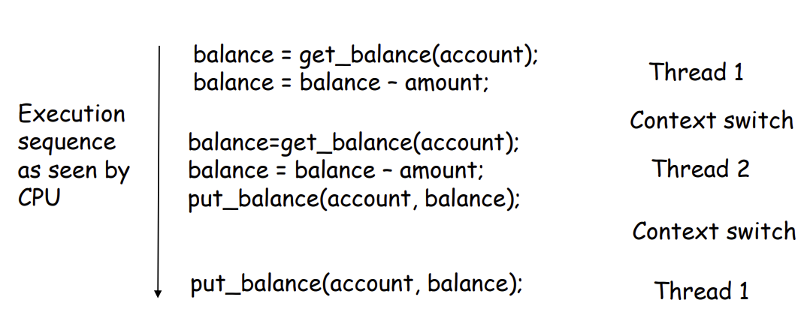


## 系统类型

系统类型：

+ Batch(批处理)：可以一次性提交大量的任务，系统决定运行那些
+ Time Sharing(分时)： 多个用户可以同时连接到同一台计算机，通过划分时间片在用户之间快速切换
+ Single User Interactive：传统的个人电脑
+ Parallel ：多处理器系统，通过多个处理器并行处理任务，提高**吞吐量（throughput）和容错能力（fault tolerance）**
+ Distributed(分布式)：多个联网计算机组成
+ Real-Time(实时系统)：对硬件和软件的**响应时间**有严格要求


单任务系统：同一时间只有一个程序运行，易于实现，利用率低 MS-DOS

多任务系统：较复杂，对系统资源的利用率更高，存在安全问题，Ubuntu, Windows 10


**操作系统一定保护自己免受用户影响**：例如操作系统会保留一部分内存区域(内核空间)为只有操作系统可以访问，防止用户程序修改或者破坏系统的核心部分。

**操作系统可能会保护用户彼此之间的安全**：即防止一个用户影响到另一个用户的数据或程序，但并非所有操作系统都实现。


## 双模式

**Dual-Mode Operation（双模式操作）** 是操作系统（OS）用于保护和安全的重要机制之一，它允许计算机区分 **用户模式（User Mode）** 和 **内核模式（Kernel/Supervisory Mode）**，以确保用户程序不会直接访问关键系统资源，从而保护操作系统的稳定性和安全性。


内核指的是在**系统调用接口之下，硬件之上的部分**。

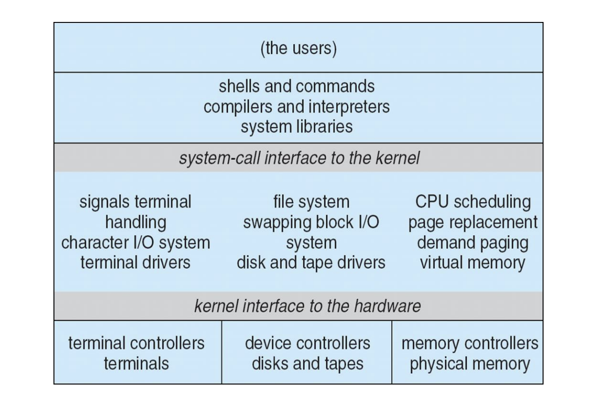

用户模式（User Mode）：**运行所有的用户应用程序，受限访问，只能执行基本的指令不能操作硬件( I/O 设备、内存管理)，如需访问受限资源需向操作系统请求服务(system call)**

内核模式（Kernel/Supervisory Mode）：**具有完全的权限**，只能在内核模式下运行的指令称为**特权指令**Privileged  Instructions，这些指令一般会影响整个机器，包括**读取/设置时间，读取文件，访问打印机**。

**用户永远不要在内核模式下操作**

# Ubuntu

Ubuntu是以桌面应用为主的**Linux发行版操作系统**，Linux发行版包括**Linux内核**(kernel负责管理**硬件资源**，如CPU，内存，磁盘网络并**提供系统调用接口**，使得应用程序可用与硬件交互)，以及其他工具。

 

# shell

命令行解释器(Command Interpreter)，它接收用户**输入的命令**，**解释并传递给操作系统执行**，最后将执行结果**返回**给用户，命令行解释器**包裹**着内核。

用户所键入的命令并不是操作系统的一部分，而是利用了系统调用的，独立的**可执行二进制文件**

shell特指正在**运行着的**命令解释器进程


shell的**运行机制**大体上如下

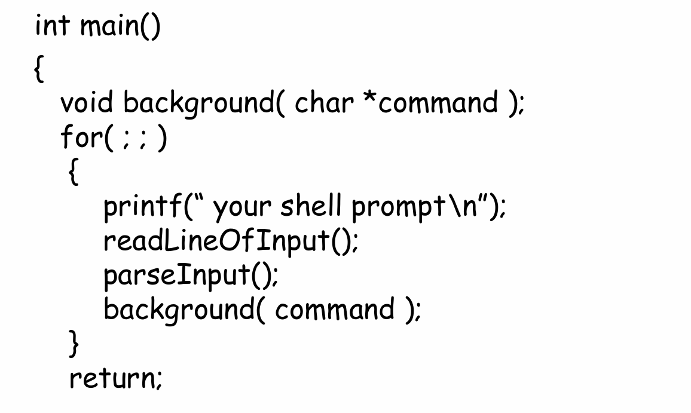

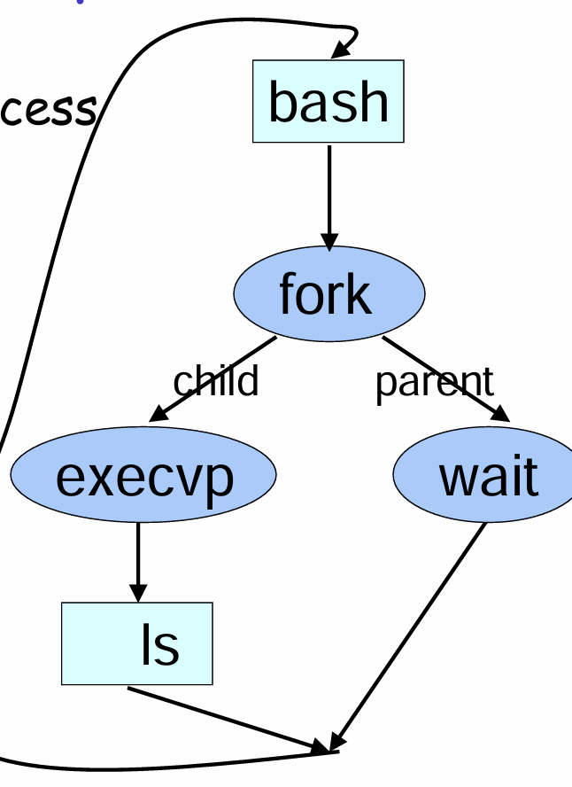

当执行命令时会创建一个**子进程**来运行该命令，**对于简单的命令，shell会等待子进程结束**

使用**&**命令，shell不会等待进程结束，而是可以继续接受新的命令


system program系统程序是一类**特殊**的程序，利用操作系统**内核**提供的系统调用来实现各种功能，shell中的**指令**就属于系统程序。


# Process


## 进程

进程process是**运行的程序**，程序不过是储存在磁盘中的**一堆指令**，当它被加载到**内存**中时便**成为了一个进程**。

所有的进程都是**init进程**的子进程	

进程有一个**程序计数器(**Program Counter)用于**追踪即将执行的下一条指令**，同时每个进程都有自己的**地址空间**(address space进程可以**读写的内存区域**)，防止进程之间相互干扰。


进程被**进程标识符(pid)**标识


注意下图只是一个演示，这些段在物理内存中的位置**可能不连续**，但操作系统通过**虚拟内存管理**，会将这些分散的段映射到进程的虚拟地址空间，使得进程**认为自己的内存是连续的**。


进程的空间可以划分为

+ 代码段：**存放可执行程序的指令代码，可共享对于频繁使用的程序只需在内存中保留一个副本，通常是只读的防止被修改**
+ 数据段：**存放已初始化的全局变量和静态变量**
+ 堆：由 `malloc`、`calloc`、`realloc` 等**动态分配函数申请**，存储动态分配的内存，**向高地址增长，大小可变**

+ 栈：**存放函数调用相关信息(其中有局部变量)，向低地址增长**


**多次调用相同的程序会创建多次不同的地址空间**


除了单进程外，还有**multiprocess**模式用于**防止崩溃**，比如浏览器。


## 僵尸进程

僵尸进程指**子进程已经终止，但父进程未回收其退出状态的进程。**而孤儿进程**orphan**指的是父进程未等待子进程就结束。 


形成过程如下：

1. **父进程调用fork创建子进程**
2. **子进程结束任务后调用exit()终止，进入终止状态(Terminated State)**
3. **此时子进程的状态还保留在PCB中，当子进程退出时，系统不会立即清空它的PCB而是保留其退出状态，直到父进程调用wait进行回收**
4. **如果父进程未调用wait回收资源，那么子进程的资源是不会被释放的**

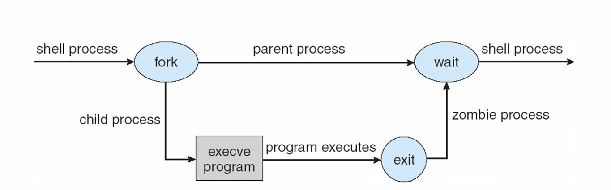

**top**指令会显示进程的信息。


## PCB

PCB 进程控制块，每个进程都会有一个对应的PCB，它是**内核中储存进程信息的数据结构**。

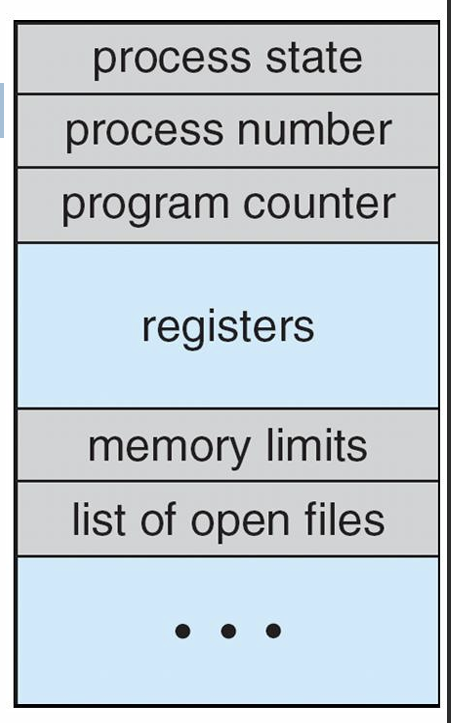


它包括的信息有

+ **进程标识符**
+ **处理机状态：通用寄存器，PC，PSW，用户栈指针**
+ **进程调度信息：进程状态，进程优先级，进程调度所需的其他信息(调度算法)，事件(阻塞原因)**
+ **进程资源：内存空间，打开的文件**


## 进程切换

下述是进程运行的状态图，suspend状态见schedules

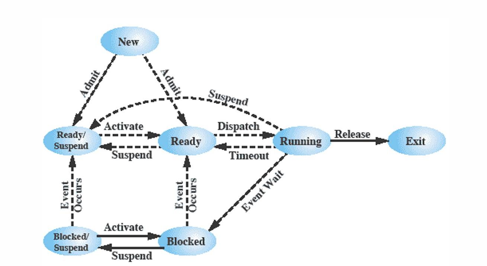

+ New: **进程首先被创建，还未被操作系统接收**
+ Ready: **进程已分配资源但尚未执行，等待CPU调度(Dispatch)**
+ Running: **进程在CPU上运行**
  + Timeout超时: **进程被剥夺CPU，回到Ready队列**
  + Event Wait等待事件: **进程进入Blocked（阻塞）**
  + Release释放: **进程执行完毕进入Exit终止状态**

+ Blocked: **等待某个事件完成**
+ Exit: **进程执行完毕，操作系统释放其资源**


 **每种状态都会维护一个队列，其中运行状态的队列大小为一**

实际上队列中存储的是**进程的PCB**


如下所示，**操作系统调度也要耗费时间**，这段时间中系统不会做有用的工作，越复杂的OS和PCB，切换所需的时间也就越长。


Dispatch latency指**用于停止一个进程并开启另一个进程所需的时间**。


**进程切换(context switch)**指的是**操作系统暂停当前正在运行的进程，保存它的状态，并加载另一个进程的状态使其继续运行。**一般发生在**进程等待I/O，或者运行了一段时间的时候**。

**context指进程的完整运行状态，包括CPU寄存器，内存....**，也就是储存在**PCB**中的内容，有的硬件可以一次性加载**多个**context。


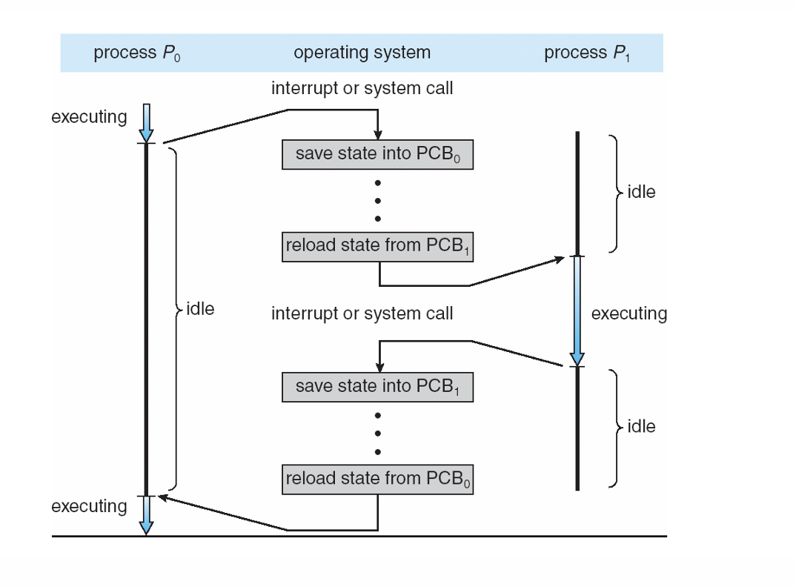


假设要从进程A切换到进程B，过程如下：

+ 保存A的**上下文context**到**PCB**，包括PC，CPU寄存器内容，堆栈指针，PSW
+ 更新进程状态，将PCB**插入到ready或者waiting队列中**
+ 运用调度算法选择下一个要运行的进程，即B
+ **加载B的上下文**到CPU中
+ **将新进程的状态改为Running，CPU将控制权交给B，B从上次中断的地方继续运行**


## 子进程

通过fork可以创建一个和父进程有**相同状态**的子进程(子进程也会有自己**不同的资源**，比如pid)，但该进程拥有自己**独立的空间**

子进程继承父进程的**文件描述符(表)**(注意不是拥有**同一个**)，即共同操作文件，对同一文件的写入**不会被覆盖但是顺序不确定**；子进程从**fork的下一行**开始执行，如果父进程**重定向了输出**，那么fork出的子进程的输出也同样会被重定向。


父进程和子进程的执行顺序是**不确定**的。


在一些操作系统中，为了防止僵尸进程的出现，当父进程终止时，**它的子孙进程也会跟着终止**，这是由**操作系统**完成的。


**fork()会返回两次，子进程会获得pid=0，父进程会获得子进程的标识符**，如果失败(一般是达到可以创建的进程**上限**)会返回**-1**

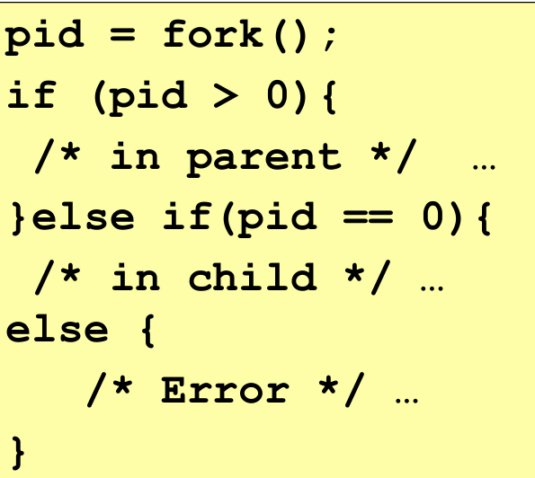


**getpid()返回进程的PID getppid()返回父进程的PID**


父进程需要等待子进程结束，**PID=wait(int *statue)**将**阻塞**程序直到**任意**子进程**结束执行**或者**发送中断信号SIGINT**，它会返回 **已退出的子进程的 PID**，如果不存在子进程则会返回**-1**，其中**statue**会储存进程的**返回状态**，传入**NULL**表示不储存。waitpid会等待**指定的进程**结束。


有时，父进程通过 **`abort()` 系统调用**主动终止其子进程，原因如下

- **资源超限**：子进程超出分配的资源（如内存、CPU时间）。
- **任务失效**：子进程的任务不再需要（如用户取消操作）。
- **父进程退出**：某些系统不允许子进程在父进程终止后继续运行（孤儿进程会被清理）。


**操作步骤**：

1. 父进程调用 `abort()` 发送终止信号。
2. 操作系统立即终止子进程，并回收其资源（可能不保留状态信息）


# Schedulers

Schedulers调度器**从所有可执行的进程中选一个进程执行**

当发生进程**退出**，**I/O阻塞**，或**semaphore**时，强制触发调度器；当新进程**创建**或者发生I/O**中断**时，可能会触发调度器。


**CPU 利用率最大化** 依赖于 **上下文切换（context switching）**，即**CPU 调度（CPU Scheduling）**。

CPU所分配的资源就是**运行时间**。


## 基本概念

+ **CPU Burst**：进程在CPU上执行计算的时间
+ **I/O Burst**：进程执行输入输出操作的时间

在进程的执行周期中，二者一般**交替进行**形成一种周期性的行为，一般CPU Burst跟在I/O Burst**后面**


CPU调度的目标：

1. 共享时间，保证公平（**Share time fairly among processes**）
2.  防止饥饿（**Prevent starvation of a process**），即低优先级的进程长期得不到CPU资源
3. **提高CPU利用率**
4. 低开销**(Have low overhead)**
5. 适当的进程优先级**(Prioritize processes when necessary**)，保证关键任务按需执行


操作系统中主要有以下几种队列：

+ 作业队列 **job queue** 储存**所有未进入主存的进程**，位于磁盘上

+ 就绪队列 **ready queue** 储存**所有已经在主存上，等待CPU执行的进程**，位于主存中

+ 阻塞队列 **Bolocked queue **储存**等待某些事件而暂停执行的队列**，位于主存中

+ 挂起队列 **Suspended Queue**：挂起的进程队列，位于磁盘上，注意Blocked, Suspend Queue在事件出现后会进入到Ready, Suspend Queu

  


调度器类型：

+ **Short-term Scheduler：**从Ready queue中选择**被执行**的进程，执行频率**较快**(以毫秒为单位)，可能是系统中的**唯一**的调度器。当进程**时间片耗尽**(送入到Ready queue)，**I/O阻塞**(送入到Blocked queue)，进程**终止**，新进程**进入**(优先级更高)时会被触发。
+ **Long-term scheduler：**从job queue中**选择**进程进入到Ready queue，调用频率**较低**(秒分为单位)，控制**可同时运行的最大进程数**(degree of multiple programming)
+ **Medium-term Scheduler：**负责在**内存与磁盘间**"换进/换出"进程——进程已经就绪，随时可以运行(在Ready queue中)，但因为内存不足，CPU负载高等从内存中挂起到磁盘(Ready, Suspend Queue)；进程被阻塞(在Blocked queue中)，因为资源压力等原因被挂起到磁盘中(Blocked, Suspend Queue)。可以控制主存中的**degree of multiple programming**，**swap-in**从磁盘中加载到内存，**swap-out**从内存加载到磁盘。可以提高内存利用率，实现了虚拟内存，基于优先级调度，但是性能下降，数据容易丢失，page fault增加

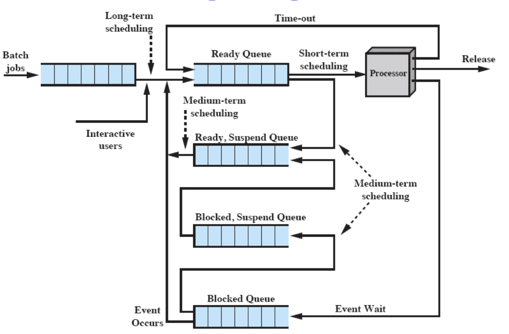


进程分为：

+ **I/O-bound process(I/O受限型，I/O密集型)：**大部分时间进行**I/O操作**，占据CPU时间**较短**，频繁但短暂的**CPU突发**(short  CPU bursts)，即每次使用CPU时间**较短**，然后因**等待I/O**而阻塞
+ **CPU-bound process(CPU受限型，计算密集型)：**花费大部分时间**计算**，长时间占据CPU(long CPU burst)

​	

Long-term scheduler负责**平衡(good process mix) ** I/O-bound进程和CPU-bound进程的**比例**，**防止系统在运行时因为I/O等待过多而陷入空闲，或者CPU资源被计算密集型进程沾满而导致其他系统饥荒。**


**CPU 进程调度的方式**，主要分为 **非抢占式（Non-preemptive）** 和 **抢占式（Preemptive）** 两种调度方式。

+ 非抢占式：一旦把处理机分配给某个程序后，就让其**一直运行下去**，只有当进程**完成**或者发生**事件阻塞**时才会把处理机**释放**给其他进程。
+ 抢占式：每个进程会运行**固定的时间**(在时间间隔结束时发生clock中断)或者**提前结束**


## 调度算法

调度可以选择赋予进程优先级来选择下一个要运行的进程，优先级的分配方式分为**动态与静态**。但有的时候一些低优先级的进程会遭遇**starvation**因为高优先级的进程的不断出现。

进程之间的调度时间一般不对**第一个进程**考虑

turnaround=**结束时间-到达时间**


### FCFS

First-Come, First-Served (**FCFS**)

在FCFS的模式下**同时**到达的三个进程p1=24,p2=3,p3=3，以p1,p2,p3的顺序运行所需时间如下：
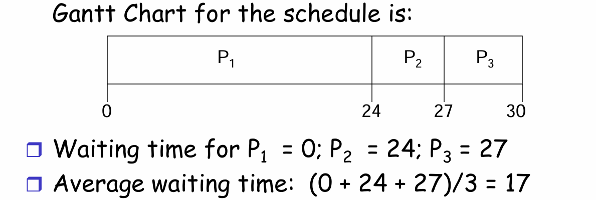


如果执行顺序为 P2 , P3 , P1，则有

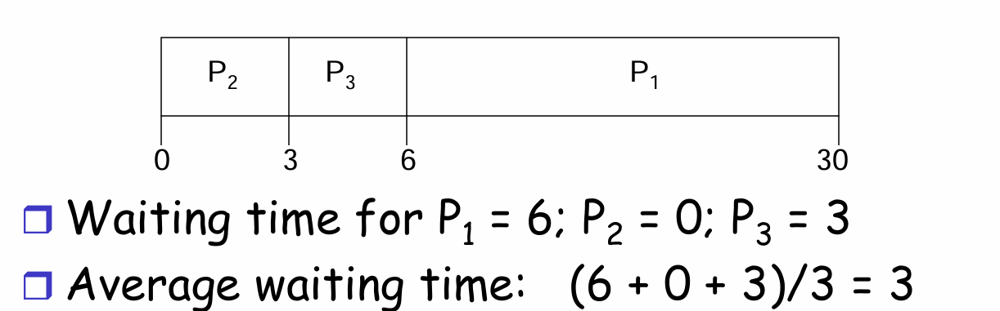


因此如果存在**长作业位于队首**时会导致**平均等待时间**较大，比如CPU密集型后跟多个I/O密集型，因为I/O密集型所需的**CPU时间较短**。


Last-In First-Out(LIFO)可能会导致starvation


### SJF

Shortest-Job-First (SJF)**最短作业优先**

每个进程都关联一个**估算的CPU burst time(这也是难点)** ，调度程序会选择进程中**最短**的运行(最短的回跳到**队首**)，这种方式可以**最小化平均等待时间**。batch jobs(**定期、重复执行**的任务)的运行时间很**容易**估算，交互式进程(Interactive processes)需要**统计**方法来估计

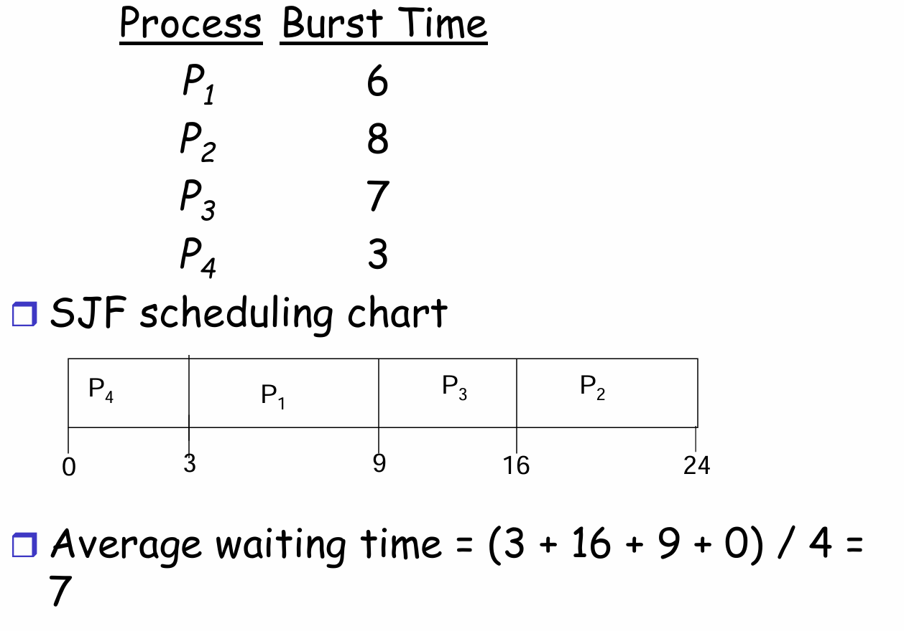

CPU burst 是未知的，一般通过历史数据预测，以指数加权平均的方式进行，a等于0.8**快速反应数据变化**，但如果**有异常值**，变化会出现波动。α = 0.2**过去**的数据仍然对当前平均值有显著影响

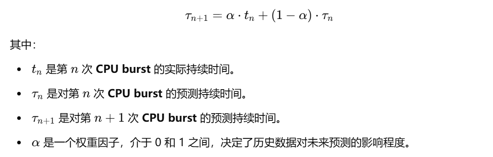


可以扩展一下

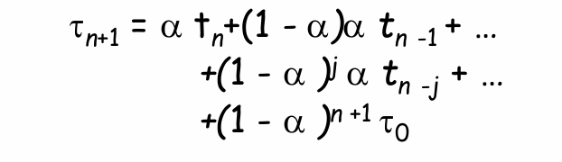


对于抢占式的SJF（任务可以更换）

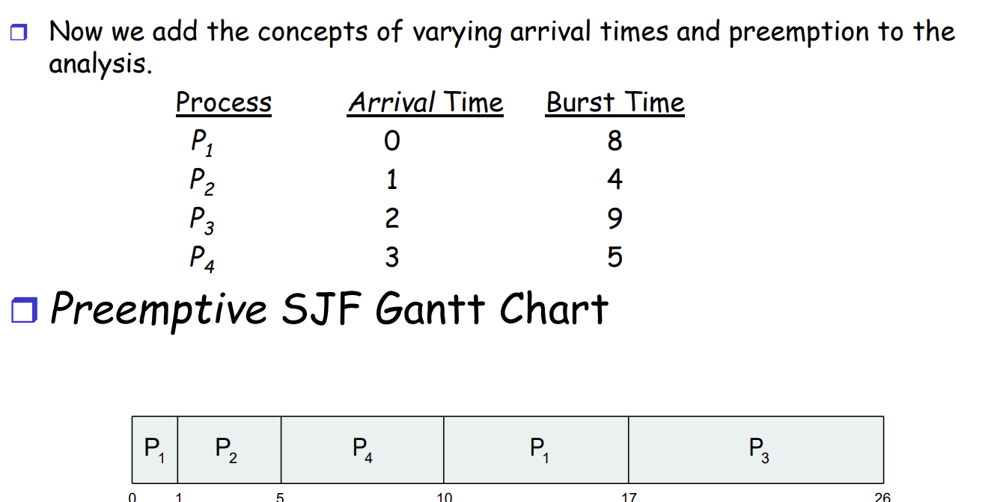


1. 初始时**只有p1**，因此会运行p1
2. 1s后，p2到达，此时p2(4)所需的**运行时间**比p1(7)**短**，因此会运行p2
3. 当p2运行完毕，此时p1p3p4都到达队列，其中p4所需的**时间最短**，因此运行p4
4. 重复选择最短的任务执行

注意这里并不会选择已存在的进程中最短的，而只会与**新来**的进程比较一下。


**每个任务的等待时间=结束时间-到达时间-运行所需时间**


在优先级调度中，**最小**的数字表示**最大**的权重。**SJF也是一种优先级调度**，其中优先级就是运行时间。显然地，优先级调度会出现**starvation**的问题，解决方法是**Aging**即通过时间来增加进程的优先级。


SJF调度过程如下，这里假设是**同时**到达的

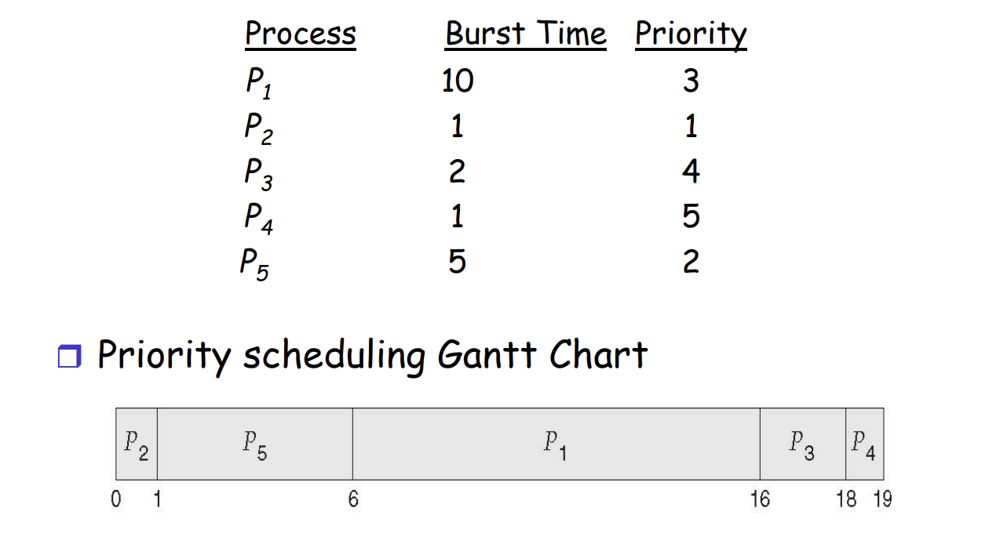

平均等待时间=8.2


### RR

轮转调度(Round Robin)，每个进程都会被分配一个**固定的时间片(Time Quantum)**，如果进程**未在q时间内完成**则会触发时钟中断，进程会被暂停，并放入Ready queue**末尾**。

如果有n个进程，时间片为q，每个进程会获得**1/n**的CPU时间且**最多运行q时间**，然后进入到队列末尾(未运行完)，每个进程最多等待**(n-1)q**时间。


如果q太大，会变为**FIFO**模式，太小会频繁地**context switch**增加开销(**至少比context switch的开销大**)，一般在**10ms to 100ms**


对于q=4的图如下所示

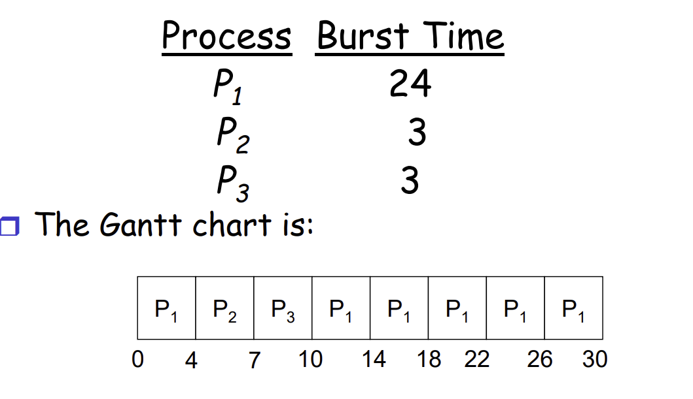


通常平均周转(turnaround)时间比sjf**大**，但是**响应时间更好**。 


注意**切换次数**的计算不是做除法

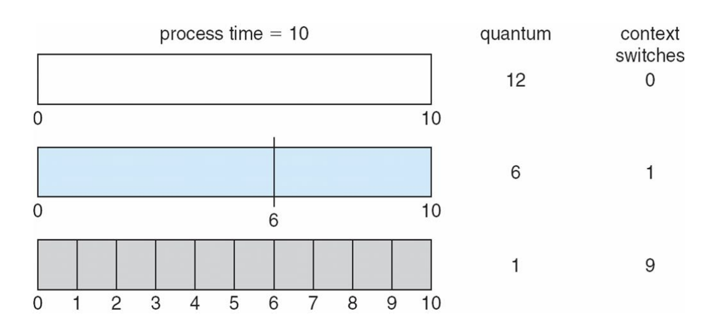


可用于优先级调度结合——对于**相同优先级**的进程执行RR，如果当前优先级只有自己那么**一直运行**下去

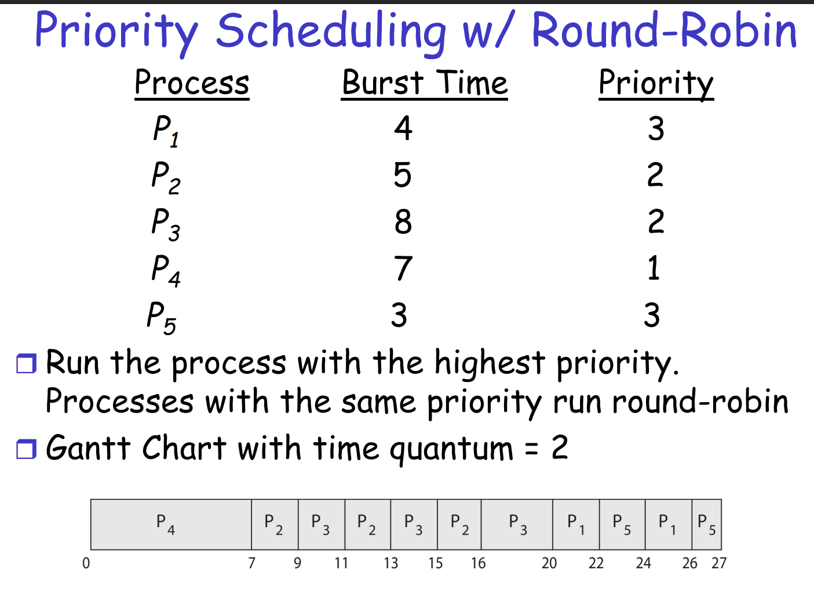


### Multilevel Feedback Queue Scheduling

在多级队列模型中，系统会把不同类型的进程分配到不同的队列中，队列之间的调度顺序有两种：**固定，时间片**

多级反馈队列调度，划分有**多个队列**，每个队列有**不同的优先级**，队列中的进程优先级都**相同**

进程可以在队列之间**切换**：

+ 如果一个进程用了**太多的CPU时间**(CPU burst)，那么它会被移动到**低优先级队列**的队尾；
+ **I/O密集型和交互式进程**通常会被保留在**较高优先级**的队列中；
+ 如果一个进程在**较低优先级**的队列中等待了太长时间，它可能会被移动到**较高优先级的队列**中。

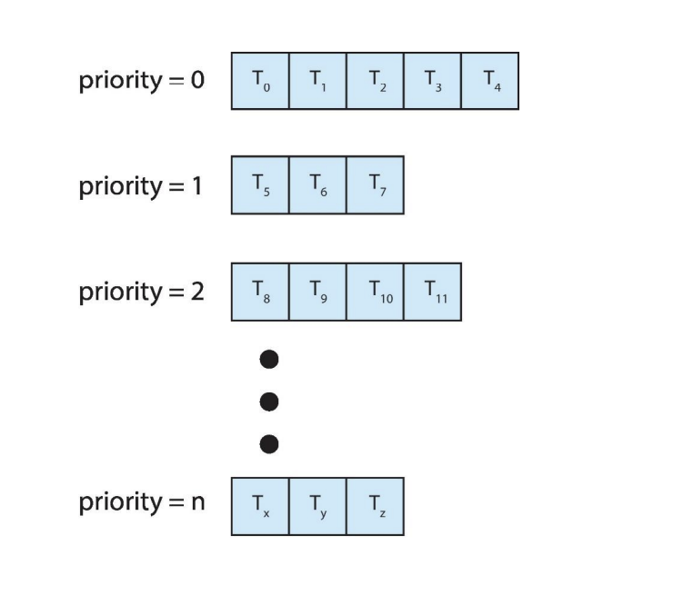

多级反馈调度仍有可能引起**starvation**，也可用于实现**Aging**机制。


一个多级反馈的例子是

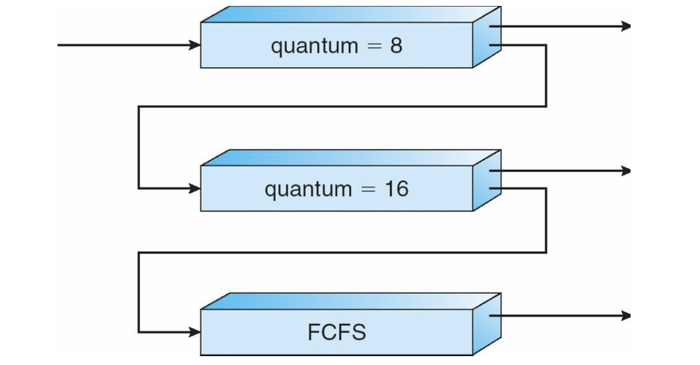

1. **新来**的进程都会赋予**最高优先级**
2. 如果进程在**规定的时间片**内完成，则直接**退出**，反之**降级**
3. 在第一级队列**空了**的时候才会执行第二级队列中的进程


传统 UNIX 系统中的调度策略

系统使用**多个队列**，每个队列有不同的**优先级**，每个队列内部使用**RR**，**高优先级的队列先被调度**，只有当高优先级的队列**为空**时才会调度低优先级队列中的进程。

每个进程最多执行**1s**，如果进程在1s内完成或者阻塞，则正常退出CPU，反之会被抢占

优先级**不是固定的**，而是会根据进程的执行行为**动态调整**：如果进程总是用完时间片，那么**降低**其优先级(**CPU密集型**)，反之**提升**其优先级(**I/O密集型**，可以频繁让出CPU)


### lottery scheduling

一种**随机化**的调度算法

每个进程都会获得一定量的 **lottery tickets**，票数越多被调度的概率就越大，调度器计算所有的彩票总数，然后**随机选择**一个号码，持有该号码的进程会被调度。


## 优先级

优先级每秒会被重新计算，进程的优先级会按照其功能被划分到不同的优先级层

**Swapper（最高优先级）**

- 负责进程的调度和内存交换（swap），确保系统的基本运行。

**Block I/O 设备控制（Block I/O device control）**

- 处理磁盘或其他大块数据传输设备的输入输出（例如硬盘读写）。

**文件操作（File manipulation）**

- 处理文件系统相关的操作（如打开、读取、写入文件）。

**字符 I/O 设备控制（Character I/O device control）**

- 处理键盘、鼠标、串口等字符输入输出设备的操作。

**用户进程（User processes，最低优先级）**

- 普通用户应用程序，如文本编辑器、浏览器等。


# 异常


定义：由于**处理器状态变化**而导致**控制流发生突然改变**的情况，这里介绍的是**操作系统的异常**而非程序语言中的异常。


异常分为两大类：**同步异常(Synchronous)和异步异常(Asynchronous)**，前者由指令引发，发生时机可预测

同步异常包括：**除0，请求I/O，请求更多的堆内存**，**访问受限的内存**（如访问内核地址，越界），**访问尚未加载到内存的变量**(虚拟内存)

异步异常包括：**键盘输入，磁盘完成数据读取**


异常与函数调用的异同

异常在某些方面类似于函数调用：

+ **控制流转移**
+ **执行处理代码**
+ **执行后返回**


区别在于：

+ **函数调用只保留返回地址，而异常会保留所有寄存器的值**

+ **异常会将数据压入操作系统栈而非应用程序栈，**
+ **异常的处理程序在内核模式下运行**
+ **异常可能会返回到当前指令，或者不返回，而非一定返回到下一指令**


异常有四种类型：Interrupts，Traps，Faults，Aborts


**Interrupts由外部设备触发，例如键盘输入会发送中断信号给 CPU，磁盘读取完成后通知CPU，属于异步异常**

**Traps(128)由程序主动触发的异常，通常用于请求操作系统服务，例如请求I/O或者堆内存**

**Faults是可以恢复的异常，比如访问受限内存，虚拟内存**

**Aborts是无法恢复的异常，程序会直接崩溃，比如过热**


发生中断时，处理器会设置PC**指向中断处理程序的起始地址**，并从**用户模式切换到内核模式**，处理中断的程序可以执行**特权指令(因为切换到了内核态)，切换回来时会重新设置PC**。

**TRAP 指令**会让CPU **从用户模式切换到内核模式**，**用户进程的状态会被保存**，在操作系统执行完处理程序后，**会恢复进程的状态**，然后执行用户模式。


# 轮询和中断

轮询polling——**CPU定期检查设备的状态以确定是否需要数据传输**，一般是通过读取设备状态寄存器来判断，类似于时不时查看手机确定时间。


Interrupt**允许设备在需要CPU时主动通知CPU，而不是由CPU定期检查**。


每个设备都会有一个**中断线(interrupt line)**，**用于在数据完成传输时通知处理器**，当中断信号触发时，处理器执行**中断处理程序**，没有设备需要服务时则不会有**额外的开销**。

CPU中有一个包含**每个设备类型的表**，表中存储着与设备有关的**中断处理程序的入口地址**，每当CPU收到中断信号时它都会**查找**表，找到对应的程序入口地址然后执行。


大多中断程序使用汇编语言写的，因为**高效**。

# System Call

系统调用：**操作系统提供给用户程序的接口，用于访问内核功能(文件读取，进程管理，文件管理，网络通信)**，只有通过**软中断**进入内核态才能使用。


系统调用分为三大类：**文件操作，进程管理，信息管理**


文件是**比特的序列**，内核并没有使用**数据结构**来组织文件，文件按照**树形结构的目录**管理(Tree-Structured Directories)，目录本身也是一个**文件**，储存了**如何寻找其他文件的内容**。

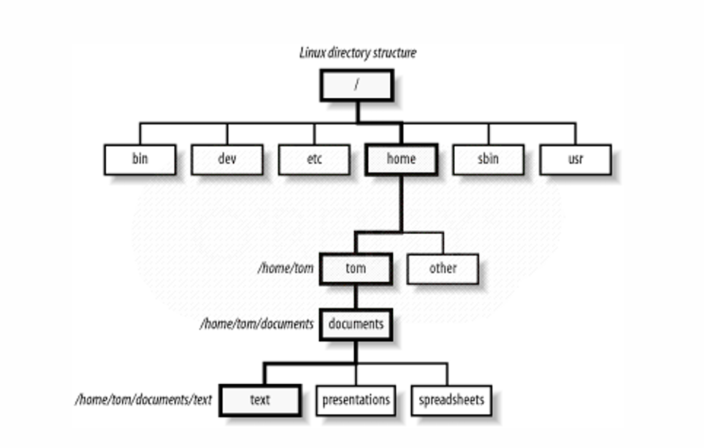


系统调用的过程：

+ 保存进程的**上下文**(到PCB或者内核栈中)，因为切换到内核态相当于切换了一个场景
+ 系统调用有唯一的**系统调用号**(kernel code)，用于指定内核态中对应的处理程序，它和其他参数存放到寄存器中，**传递给内核态**
+ 执行read()函数内部的**中断指令**，切换到内核态
+ 通过系统调用号找到对应的**内核函数**，读取参数并**执行**，处理的**结果**也会放到寄存器中
+ 返回到用户态，**恢复**原来的用户态寄存器、用户栈和PC


**POXIS是一组标准，规定了API，使得应用程序可以在不同的UNIX系统上运行。**

常用的有：


# IPC

进程可以分为Cooperating和Independent，前者可以**影响或者受到其他进程的影响**，后者则不会


IPC指**进程间通信**，有两种方式：一种是**共享内存**(管道)，另一种则是**传递信息**。

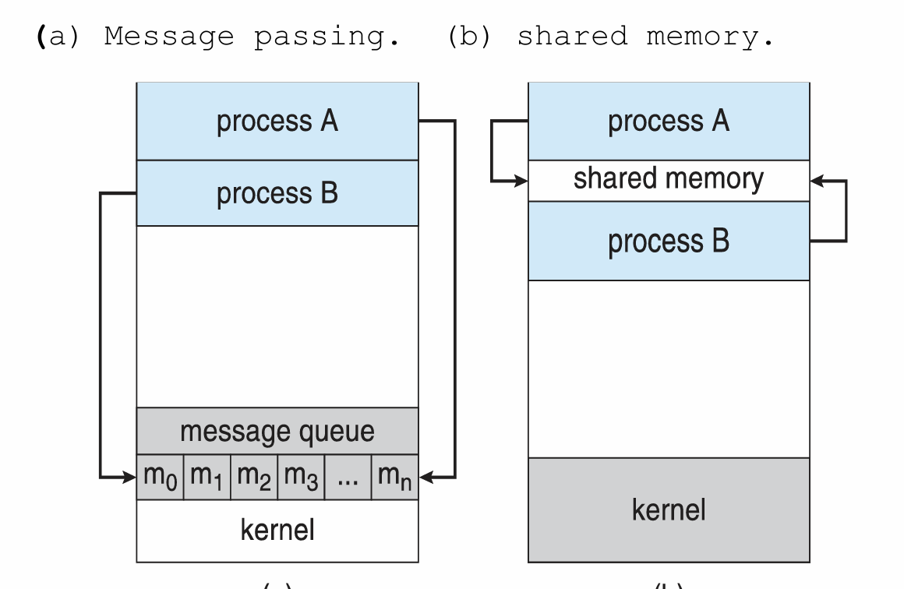


1. 单工：只支持数据在一个方向上传输

2. 半双工half-duplex：**允许数据在两个方向上传输，但同一时间只允许在一个方向上传输**

3. 全双工full-duplex：**允许数据同时在两个方向上传输**


管道分为**Ordinary Pipes和Named Pipes**，管道实际上是内存中的一块**缓存(大小有限，超出会阻塞)**，也可以认为是一个**特殊的文件**，它按照**先进先出**的方式处理数据，操作系统会**协调进程间的同步**，确保写入和读取的顺序匹配，不会发生数据混乱。


+ Ordinary Pipes(anonymous pipes)：**只能在父子进程中通信(只要满足有公共祖先)，数据是单向的，不能被其他进程访问。**

+ Named Pipes：**允许**无亲缘关系的进程**进行数据交换**，注意pipe需要满足父子进程的说法是**错误**的。


+ 当向**已满**的管道写入数据时，系统会**阻塞**程序，直到管道有**足够的空间**
+ 从**空的**管道中读取也同样会**阻塞**。
+ 如果一个进程**打开管道用于读取**，而没有进程**打开管道写入(提前关闭)**，读取进程会被一直**阻塞**，即管道需要**匹配**。

当写端关闭，读端会读取到**0**，表示EOF。反之，write()会返回**SIGPIPE**信号，如果忽略信号则 `write()` 返回 `-1`，`errno` 设为 `EPIPE`


进程通信的方法除了管道还有socket——**不需要进程间的关系，可以在不同机器之间通信**。


操作如下，注意**0是读，1是写**：

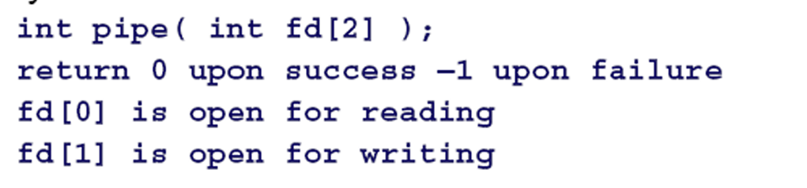


父子进程可以**重定向输入输出(非必须)**，更方便地操作

```C++
int pid, p[2];
// 创建管道失败
if (pipe(p) == -1)
    exit(1);
pid = fork();
if (pid == 0) {
    // 子进程关闭写端
    close(p[1]);
    // 重定向输入到读端
    dup2(p[0], 0);
    // 关闭读端，否则会出问题
    close(p[0]);
    execl(...);
}
else {
    // 同理，用不到读端
    close(p[0]);
    // 重定向后关闭
    dup2(p[1], 1);
    close(p[1]);
    ... write to stdout
    wait(&status);
}
```


# Linux操作

## 目录

+ / 根目录 ： **所有目录挂在其下**
+ /boot：**存放Ubuntu内核和系统启动文件。系统启动时这些文件先被装载。**
+ /etc：**系统的配置文件目录。密码文件、设置网卡信息、环境变量的设置等都在此目录中，许多网络配置文件也在其中**。
+ /lib ：**根文件系统目录下程序和核心模块的共享库。这个目录里存放着系统最基本的动态链接共享库，类似于Windows下的system32目录，几乎所有的应用程序都需要用到这些共享库。**
+ /media ：**主要用于挂载多媒体设备。ubuntu系统自动挂载的光驱、usb设备，存放临时读入的文件。**
+ /proc ：**这个目录是系统内存的映射，我们可以直接访问这个目录来获取系统信息。也就是说，这个目录的内容不在硬盘上而是在内存里。**
+ /sbin ：**s就是Super User的意思，这里存放的是系统管理员使用的系统管理程序，如系统管理、目录查询等关键命令文件。**
+ /tmp ：这**个目录是用来存放一些临时文件的，所有用户对此目录都有读写权限**。
+ /home ：**用户的主目录。下面是自己定义的用户名的文件夹。每个用户的设置文件，用户的桌面文件夹，还有用户的数据都放在这里。**
+ /mnt：**此目录主要是作为挂载点使用。通常包括系统引导后被挂载的文件系统的挂载点。如挂载Windows下的某个分区。**

​	

启动Ubuntu可以通过power shell输出**wsl**，如果要退出回window则输出**exit**指令	


## 指令

+ **ls 列出目录内容 -l显示详细信息，-a包括隐藏文件**
+ **pwd输出当前位置**
+ **cd 切换目录**
+ **ps查看系统中的进程信息 ps -el显示完整信息**
+ **rm name 删除文件(\*删除所有*) -f强制删除不确认 rmdir删除空目录**
+ **mkdir directory_name创建目录**
+  **uniq 过滤重复的结果 **
+ **cat filename显示文件内容(可以同时显示多个文件内容) cat>filename覆写文件内容（追加用>>），如果文件不存在则创建，使用ctrl+d退出编辑**


​	**cat file1 file2 > file3将前两个文件的内容合并到第三个文件中，同样是不存在则创建，存在则覆写**


+ **echo输出文本到终端 echo “text”**

+ **cp复制文件或目录，cp file1.txt /home/user/documents/复制文件到目录下，cp -r dir1/ dir2/复制一个目录的所有内容到另一个目录下。**


+ **mv用于移动或重命名文件，mv oldfile.txt newfile.txt重命名(新名称存在就覆盖)，mv file1.txt /home/user/documents/移动到目录，mv oldfile.txt /home/user/documents/newfile.txt移动到目录同时重命名。**


+  **wc filename 输出文件中的行数，词数(空格分割)，字符数  wc -c filename只输出字符数 wc -l filename只输出行数**


+ **sort filename 排序文件内容，以行划分字符串按升序进行，sort -r filename倒序**


## I/O重定向

每个进程启动时，通常会**自动拥有三个标准文件描述符012**，分别用于**输入stdin**，**输出stdout**，和**错误输出stderr**

在shell中可以通过**I/O重定向**，让程序的输入输出不在依赖默认的屏幕和键盘，而是文件


相当于程序 `a.out` 中 `scanf`、`cin` 等读取的不是键盘输入，而是 `input.txt` 里的内容，此时键盘输入不生效

```shell
./a.out < input.txt
```

结果输出到文件中

```shell
./a.out > output.txt
```

将错误信息存入文件中

```shell
./a.out 2> error.txt
```


同时修改输入输出和错误文件

```python
./a.out < input.txt > output.txt 2> error.txt	
```


dup函数使用**当前最小的可用文件描述符**指向和**oldfd**相同的**文件**，文件**偏移量**以及文件**权限**(如果失败，则返回**-1**)，函数会返回该**文件描述符**

```python
int dup(int oldfd);
```


每个进程都有自己的**文件描述符表**，当新打开一个文件时**会添加一个表项**，子进程被创建的时候会**复制**这张表。

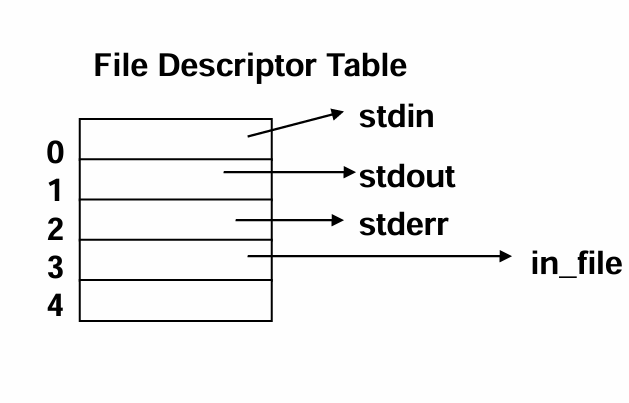


如下图所示：首先**打开**一个文件描述符，随后**关闭标准输出**(**0 标准输入，1标准输出，2标准错误**)，通过**dup(fd)**将标准输出定向到文件，因为此时**最小的可用文件描述符是标准输出**，dup的返回也就是标准输出，这里不需要接受返回值，至此将**标准输出定向到了文件**，最后**关闭原来指向文件的描述符**。

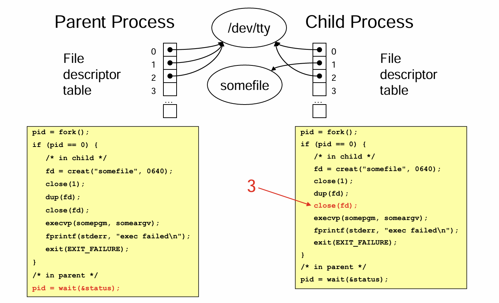


dup2(oldfd,newfd)相较于dup，**可以指定将oldfd复制给谁**，因此不需要预先关闭newfd

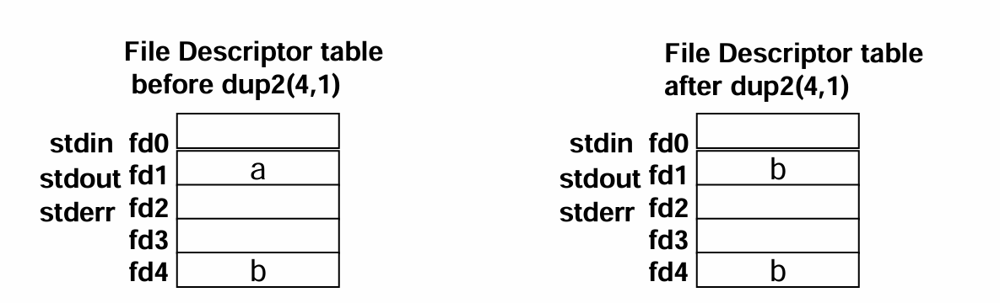

## exec

exec代表**一组**可以替换当前进程的系统调用，它不会**创建**新的进程，而是用**新的程序替换当前程序的数据和代码**。注意**PID**，**PPID**和**已经打开的文件描述符**会保留。


当调用该`exec` 族函数时：

1. **关闭当前程序的代码和数据，当进程的PID不变**
2. **加载新程序**
3. **执行该程序并且不会返回，如果调用失败会返回-**1


p使用**相对路径**，不加p则是**绝对路径**，e则是**自定义环境变量**，不加p则需要传入**完整的路径**。

**l**和**v**表示**参数的传递方式**，前者**一个一个列举**，后者使用**数组**，二者都需要用**NULL**结尾。

注意参数(不包括)中的第一个是**程序名**。

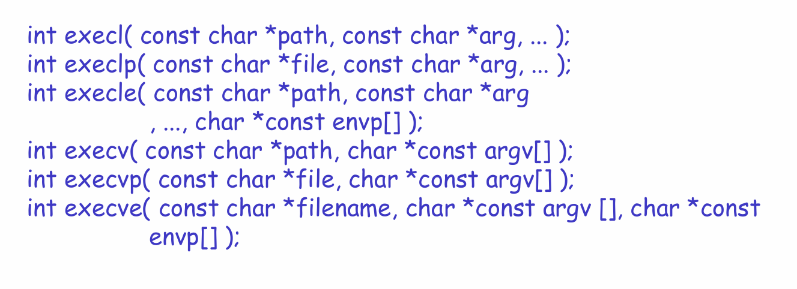

```C++
// 枚举传参
execl("/bin/ls", "ls", "-l", NULL);

// 列表传参
char *args[] = {"ls", "-l", NULL};
execv("/bin/ls", args);

execlp("ls","ls","-l","a.c",NULL);
```


## 管道符

管道符的作用和管道一样

**| 管道符可以将两个命令分开，左边的命令的输出作为右边的命令的输入**，可以**连续使用**即第一个命令的输出会作为第二个命令的输入，第二个命令的输出又会作为第三个命令的输入，依此类推。


将三个文件的内容排序后输出到打印设备，在后台执行

```bash
 cat file1 file2 file3 | sort  >/dev/lp &
```


​	
