# Fundamentals

## 操作系统定义

操作系统是用户和硬件的中介，二者紧密相连。

**1.可以使硬件更方便地被使用**

**2.管理系统资源，程序执行时所需的时间和空间，然而有的时候会出现冲突的目标，比如：最大化程序的吞吐量以及最小化响应时间**

**3.以一种更高效的方式使用硬件**

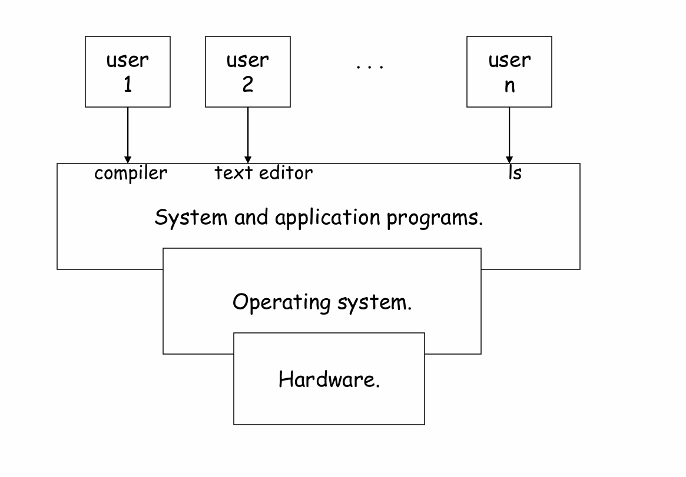

操作系统也可以表述为**用户应用程序和硬件之间的软件层**，**通过硬件接口抽象硬件，隐藏了运行时的大量细节**。

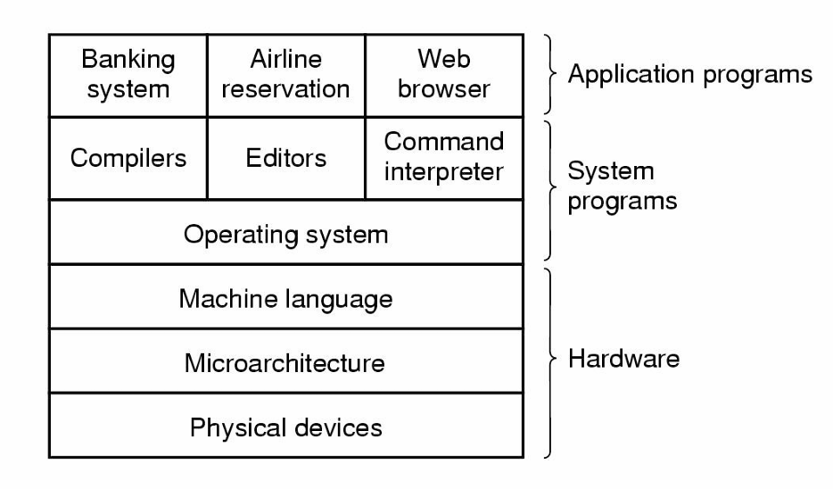

## 硬件资源

基本的硬件资源有：

+ CPU：同一时间只有**一个进程**会在CPU上运行，一秒钟能运行数亿条指令，是最宝贵的资源，控制系统中所有的事物

+ Memory：容量有限，临时存储，是一种电子存储设备速度非常快，**所有运行在CPU上的程序必须在内存中**。

+ Storage(Disk)：容量大，用于储存，是一种机械装置，所有的数据以块为单位储存

+ I/O

## 系统类型

系统类型：

+ Batch(批处理)：可以一次性提交大量的任务，系统决定运行那些
+ Time Sharing(分时)： 多个用户可以同时连接到同一台计算机，通过划分时间片在用户之间快速切换
+ Single User Interactive：传统的个人电脑
+ Parallel ：多处理器系统，通过多个处理器并行处理任务，提高**吞吐量（throughput）和容错能力（fault tolerance）**
+ Distributed(分布式)：多个联网计算机组成
+ Real-Time(实时系统)：对硬件和软件的**响应时间**有严格要求

单任务系统：同一时间只有一个程序运行，易于实现，利用率低 MS-DOS

多任务系统：较复杂，对系统资源的利用率更高，存在安全问题，Ubuntu, Windows 10

**操作系统一定保护自己免受用户影响**：例如操作系统会保留一部分内存区域(内核空间)为只有操作系统可以访问，防止用户程序修改或者破坏系统的核心部分。

**操作系统可能会保护用户彼此之间的安全**：即防止一个用户影响到另一个用户的数据或程序，但并非所有操作系统都实现。

## 双模式

**Dual-Mode Operation（双模式操作）** 是操作系统（OS）用于保护和安全的重要机制之一，它允许计算机区分 **用户模式（User Mode）** 和 **内核模式（Kernel/Supervisory Mode）**，以确保用户程序不会直接访问关键系统资源，从而保护操作系统的稳定性和安全性。

用户模式（User Mode）：**运行所有的用户应用程序，受限访问，只能执行基本的指令不能操作硬件( I/O 设备、内存管理)，如需访问受限资源需向操作系统请求服务(system call)**

内核模式（Kernel/Supervisory Mode）：**操作系统在该模式下运行，具有完全的权限**，只能在内核模式下运行的指令称为**特权指令**Privileged  Instructions，这些指令一般会影响整个机器，包括**读取/设置时间，读取文件，访问打印机**。

**用户永远不要在内核模式下操作**

# System Calls / Process

## 介绍

Ubuntu是以桌面应用为主的**Linux发行版操作系统**，Linux发行版包括**Linux内核**(负责管理**硬件资源**，如CPU，内存，磁盘网络并**提供系统调用接口**，使得应用程序可用与硬件交互)，以及其他工具。

shell是一种与**操作系统交互的程序**(命令行解释器)，提供用户与操作系统内核之间的**接口**。它**接收**用户输入的命令，**解释并传递给操作系统执行**，最后将执行结果**返回**给用户。

## 进程

进程process是**运行的程序**，程序不过是储存在磁盘中的**一堆指令**，当它被加载到**内存**中时便成为了一个进程，进程有一个**程序计数器(**Program Counter)用于**追踪即将执行的下一条指令**，同时每个进程都有自己的**地址空间**(address space进程可以**读写的内存区域**)，防止进程之间相互干扰。

注意下图只是一个演示，这些段在物理内存中的位置**可能不连续**，但操作系统通过**虚拟内存管理**，会将这些分散的段映射到进程的虚拟地址空间，使得进程**认为自己的内存是连续的**。

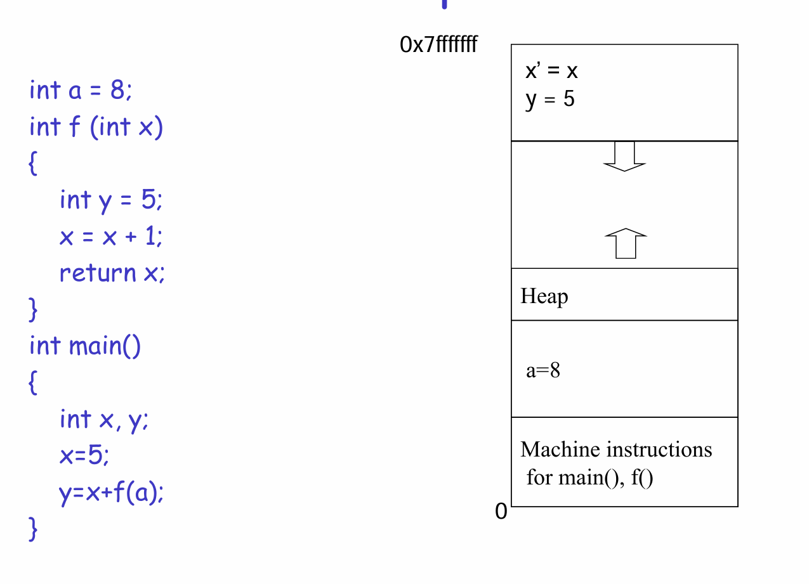

进程的空间可以划分为

+ 代码段：**存放可执行程序的指令代码，可共享对于频繁使用的程序只需在内存中保留一个副本，且是只读的防止被修改**
+ 数据段：**存放已初始化的全局变量和静态变量**
+ 堆：由 `malloc`、`calloc`、`realloc` 等**动态分配函数申请**，存储动态分配的内存，**向高地址增长，大小可变**

+ 栈：**存放函数调用相关信息(其中有局部变量)，向低地址增长**

**多次调用相同的程序会创建多次不同的地址空间**

## CPU

CPU的指令集指的是CPU**能执行的指令集合**，对于不同的CPU**架构**，其所对的指令集也**不同**，不过基本上都有**load和store**指令，用于在寄存器和内存之间转化。

CPU寄存器：

通用寄存器，General Registers，**用于储存关键变量和临时结果**

特殊寄存器包括有：程序计数器PC)——**存储下一条将要执行的指令的地址**，指令寄存器(Instruction Register, IR)——**存储当前正在执行的指令**，处理器状态字(Processor Status Word, PSW)——**包含CPU运行状态的各种控制位，如模式位**

操作系统会将程序加载到**内存**中，并将内存地址存放到**PC**中，CPU会**取得，解码，执行指令**，然后根据PC获得下一条指令。

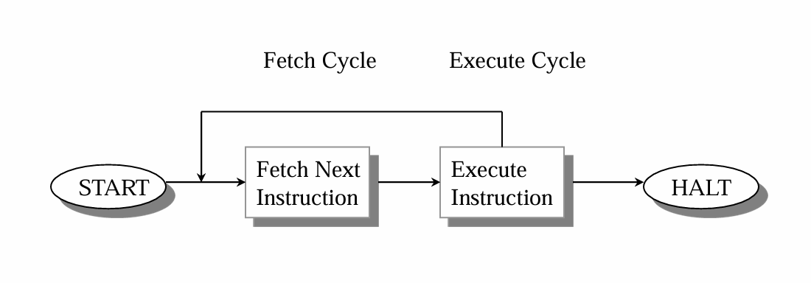

## 进程运行

下述是进程运行的状态图

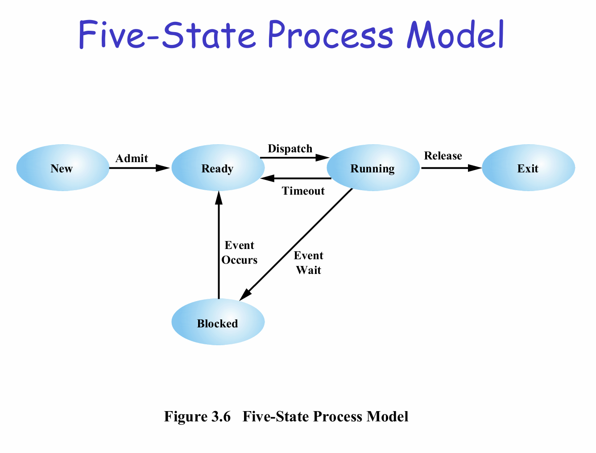

+ New: **进程首先被创建，还未被操作系统接收**
+ Ready: **进程已分配资源但尚未执行，等待CPU调度(Dispatch)**
+ Running: **进程在CPU上运行**
  + Timeout超时: **进程被剥夺CPU，回到Ready队列**
  + Event Wait等待事件: **进程进入Blocked（阻塞）**
  + Release释放: **进程执行完毕进入Exit终止状态**

+ Blocked: **等待某个事件完成**
+ Exit: **进程执行完毕，操作系统释放其资源**

 **每种状态都会维护一个队列，其中运行状态的队列大小为一**

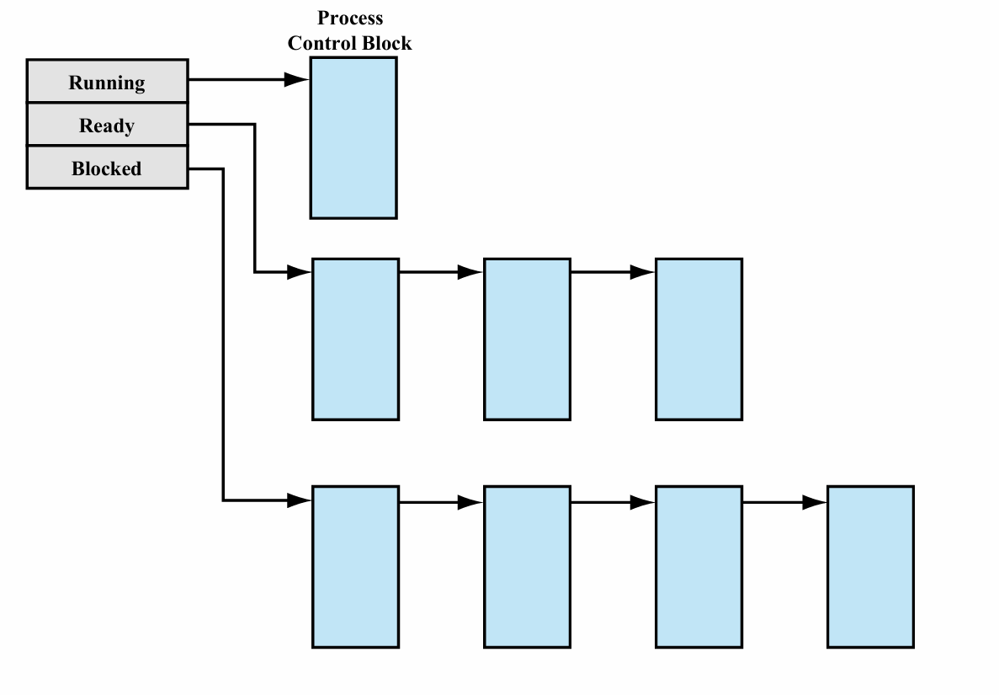

如下所示，**操作系统调度也要耗费时间**

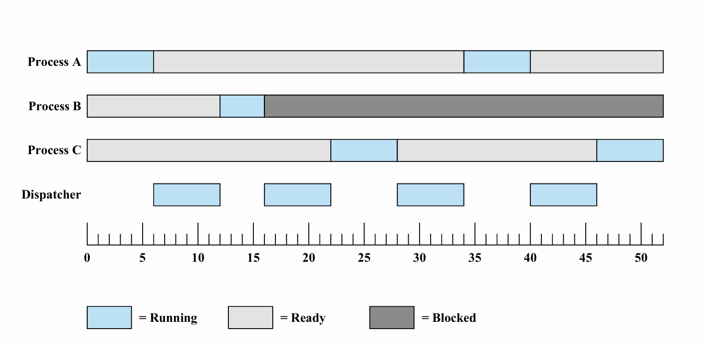

**进程切换(context switch)**指的是**操作系统暂停当前正在运行的进程，保存它的状态，并加载另一个进程的状态使其继续运行。**一般发生在**进程等待I/O，或者运行了一段时间的时候**。

**context指进程的完整运行状态，包括CPU寄存器，内存....**

假设要从进程A切换到进程B，过程如下：

+ 保存A的**上下文context**到**进程控制块PCB中**
+ 选择下一个要运行的进程B
+ **加载B的上下文**
+ **CPU将控制权交给B，B从上次中断的地方继续运行**

## 异常

定义：由于**处理器状态变化**而导致**控制流发生突然改变**的情况，这里介绍的是**操作系统的异常**而非程序语言中的异常。

异常分为两大类：**同步异常(Synchronous)和异步异常(Asynchronous)**

同步异常包括：**除0，请求I/O，请求更多的堆内存**，**访问受限的内存**（如访问内核地址，越界），**访问尚未加载到内存的变量**(虚拟内存)

异步异常包括：**键盘输入，磁盘完成数据读取**

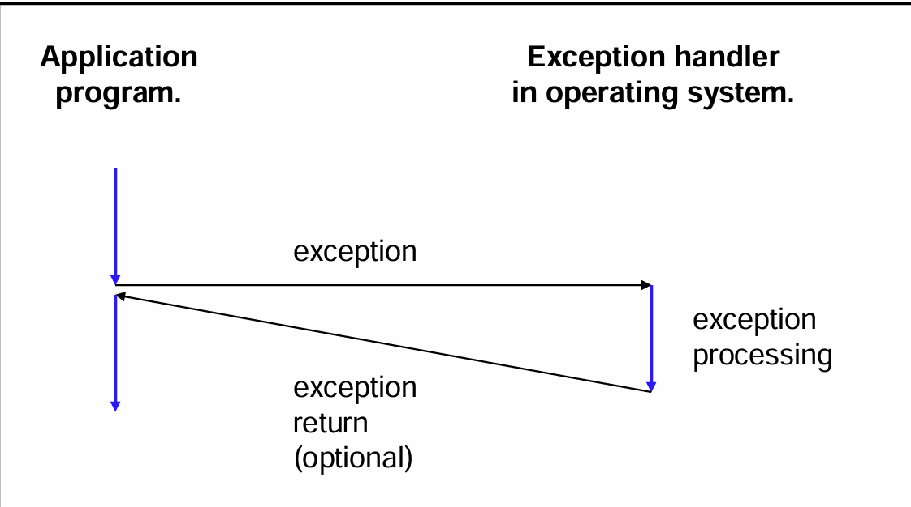

​	

异常与函数调用的异同

异常在某些方面类似于函数调用：

+ **控制流转移**
+ **执行处理代码**
+ **执行后返回**

区别在于：

+ **函数调用只保留返回地址，而异常会保留所有寄存器的值**

+ **异常会将数据压入操作系统栈而非应用程序栈，**
+ **异常的处理程序在内核模式下运行**
+ **异常可能会返回到当前指令，或者不返回，而非一定返回到下一指令**

异常有四种类型：Interrupts，Traps，Faults，Aborts

**Interrupts由外部设备触发，例如键盘输入会发送中断信号给 CPU，磁盘读取完成后知通知CPU**

**Traps由程序主动触发的异常，通常用于请求操作系统服务，例如请求I/O或者堆内存**

**Faults是可以恢复的异常，比如访问受限内存，虚拟内存**

**Aborts是无法恢复的异常，程序会直接崩溃，比如过热**

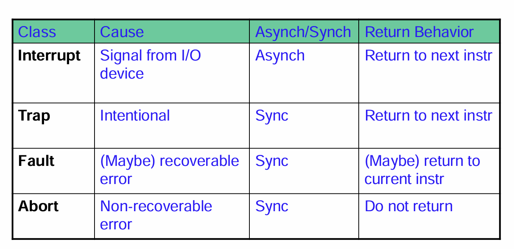

发生中断时，处理器会设置PC**指向中断处理程序的起始地址**，并从**用户模式切换到内核模式**，处理中断的程序可以执行**特权指令(因为切换到了内核态)，切换回来时会重新设置PC**。

**TRAP 指令**会让CPU **从用户模式切换到内核模式**，**用户进程的状态会被保存**，在操作系统执行完处理程序后，**会恢复进程的状态**，然后执行用户模式。

## 系统调用

系统调用**操作系统提供给用户程序的接口，用于访问内核功能(文件读取，进程管理，文件管理，网络通信)**，只有通过**软中断**进入内核态才能使用。

​	

系统调用的过程：

+ **用户调用read()函数，此时不会直接进入内核态，而是先执行一些处理步骤**
+ **函数的参数存入CPU寄存器**
+ **每个系统调用有个唯一的系统调用号，这个编号被放入特定寄存器**
+ **执行read()函数内部的中断指令，切换到内核态**
+ **通过系统调用号找到对应的系统处理函数**
+ **内核的系统调用处理函数读取寄存器内容，解析read()传入的参数**
+ **执行read的系统调用处理函数**
+ **返回到用户态**

**POXIS是一组标准，规定了API，使得应用程序可以在不同的UNIX系统上运行。**

常用的有：

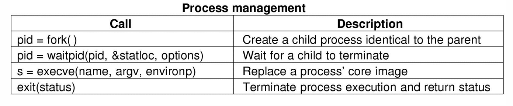

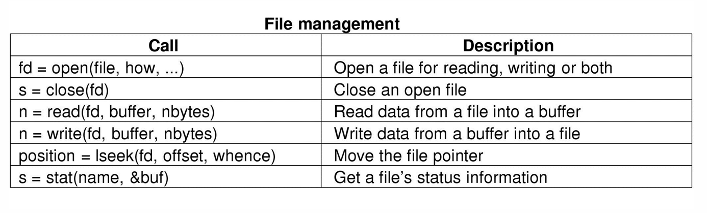

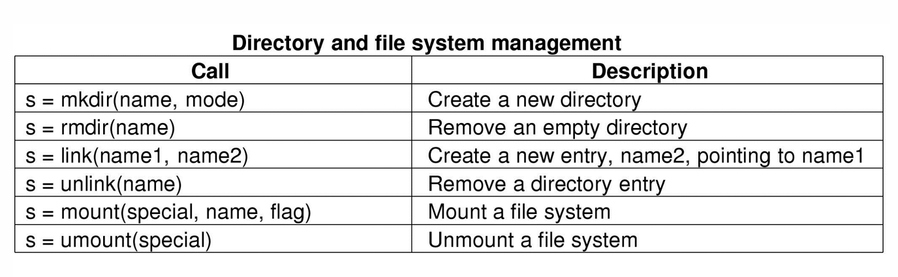

## 轮询和中断

轮询polling——**CPU定期检查设备的状态以确定是否可以进行数据传输**，一般是通过读取设备状态寄存器来判断，类似于是不是查看手机确定时间。

Interrupt**允许设备在需要CPU时主动通知CPU，而不是由CPU定期检查**。

每个设备都会有一个**中断线(interrupt line)**，**用于在数据完成传输时通知处理器**，当中断信号触发时，处理器执行**中断处理程序**，没有设备需要服务时则不会有**额外的开销**。

CPU中有一个包含**每个设备类型的表**，表中存储着与设备有关的**中断处理程序的入口地址**，每当CPU收到中断信号时它都会**查找**表，找到对应的程序入口地址然后执行。

大多中断程序使用汇编语言写的，因为**高效**。

# Linux操作

## 目录

+ / 根目录 ： **所有目录挂在其下**
+ /boot：**存放Ubuntu内核和系统启动文件。系统启动时这些文件先被装载。**
+ /etc：**系统的配置文件目录。密码文件、设置网卡信息、环境变量的设置等都在此目录中，许多网络配置文件也在其中**。
+ /lib ：**根文件系统目录下程序和核心模块的共享库。这个目录里存放着系统最基本的动态链接共享库，类似于Windows下的system32目录，几乎所有的应用程序都需要用到这些共享库。**
+ /media ：**主要用于挂载多媒体设备。ubuntu系统自动挂载的光驱、usb设备，存放临时读入的文件。**
+ /proc ：**这个目录是系统内存的映射，我们可以直接访问这个目录来获取系统信息。也就是说，这个目录的内容不在硬盘上而是在内存里。**
+ /sbin ：**s就是Super User的意思，这里存放的是系统管理员使用的系统管理程序，如系统管理、目录查询等关键命令文件。**
+ /tmp ：这**个目录是用来存放一些临时文件的，所有用户对此目录都有读写权限**。
+ /home ：**用户的主目录。下面是自己定义的用户名的文件夹。每个用户的设置文件，用户的桌面文件夹，还有用户的数据都放在这里。**
+ /mnt：**此目录主要是作为挂载点使用。通常包括系统引导后被挂载的文件系统的挂载点。如挂载Windows下的某个分区。**

​	

启动Ubuntu可以通过power shell输出**wsl**，如果要退出回window则输出**exit**指令	

## 指令

+ **ls 列出目录内容 -l显示详细信息，-a包括隐藏文件**
+ **pwd输出当前位置**
+ **cd 切换目录**
+ **rm name 删除文件(\*删除所有*) -f强制删除不确认 rmdir删除空目录**
+ **mkdir directory_name创建目录**
+ **cat filename显示文件内容 cat>filename覆写文件内容（追加用>>），如果文件不存在则创建，使用ctrl+d退出编辑**

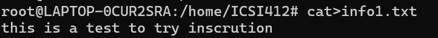

​	**cat file1 file2 > file3将前两个文件的内容合并到第三个文件中，同样是不存在则创建，存在则覆写**

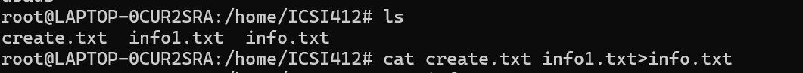

+ **echo输出文本到终端 echo “text”**

+ **cp复制文件或目录，cp file1.txt /home/user/documents/复制文件到目录下，cp -r dir1/ dir2/复制一个目录的所有内容到另一个目录下。**

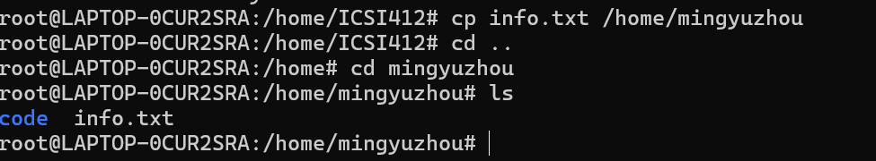

+ **mv用于移动或重命名文件，mv oldfile.txt newfile.txt重命名(新名称存在就覆盖)，mv file1.txt /home/user/documents/移动到目录，mv oldfile.txt /home/user/documents/newfile.txt移动到目录同时重命名。**

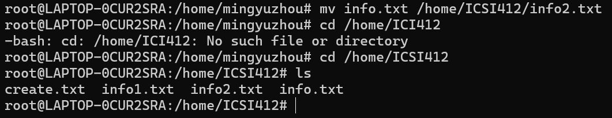

+  **wc filename 输出文件中的行数，字数(空格分割)，字符数  wc -c filename只输出字符数 wc -l filename只输出行数**

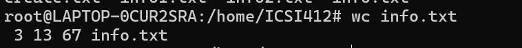

+ sort filename 排序文件内容，以行划分字符串按升序进行，sort -r filename倒序

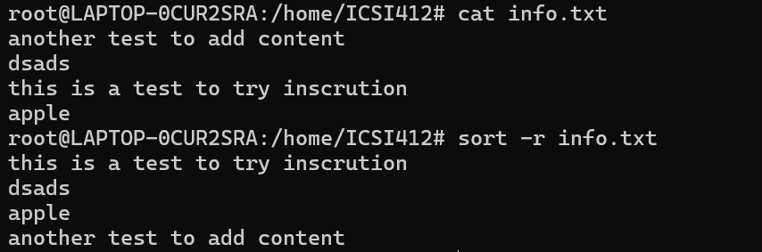