# Fundamentals

## 操作系统定义

操作系统是用户和硬件的中介(intermediary)，二者紧密相连。

**1.可以使硬件更方便地被使用**

**2.管理系统资源(时间和空间)，程序执行时所需的时间和空间，然而有的时候会出现冲突的目标，比如：最大化程序的吞吐量以及最小化响应时间**

**3.以一种更高效的方式使用硬件**


操作系统也可以表述为**用户应用程序和硬件之间的软件层**，**通过硬件接口抽象硬件，隐藏了运行时的大量细节**。

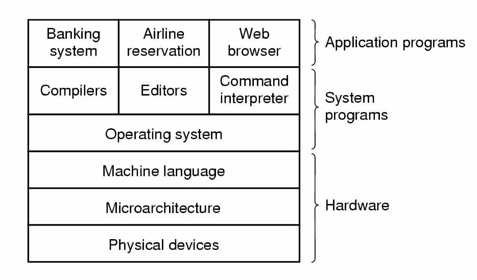

## CPU

基本的硬件资源有：

+ CPU：同一时间只有**一个进程**会在CPU上运行，一秒钟能运行数亿条指令，是最宝贵的资源，控制系统中所有的事物

+ Memory：容量有限，**临时**存储，是一种电子存储设备速度非常快，**所有运行在CPU上的程序必须在内存中**。

+ Storage(Disk)：近乎无限的容量，**永久**储存，速度较慢，是一种机械装置，所有的数据以**块**为单位访问

+ I/O：**Disk/SSD**属于I/O子系统，它们与CPU和内存的交互需要通过I/O总线


CPU的指令集：CPU**能执行的指令集合**，对于不同的CPU**架构**，其所对的指令集也**不同**，不过基本上都有**load和store**指令，用于在寄存器和内存之间传递数据。


CPU寄存器：

通用寄存器，General Registers，**用于储存关键变量和临时结果**

特殊寄存器包括有：程序计数器(PC)——**存储下一条将要执行的指令的地址**，指令寄存器(Instruction Register, IR)——**存储当前正在执行的指令**，处理器状态字(Processor Status Word, PSW)——**包含CPU运行状态的各种控制位，如模式位**


操作系统会将程序加载到**内存**中，并将内存地址存放到**PC**中，CPU会**取得，解码，执行指令**，然后根据PC获得下一条指令。

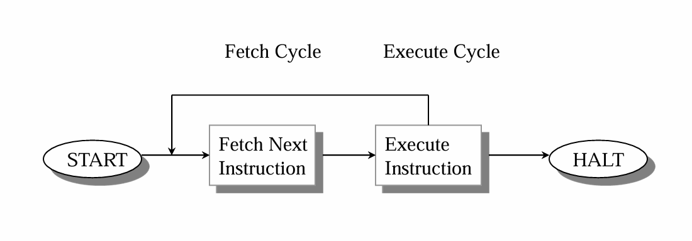


实际上会亏损1000

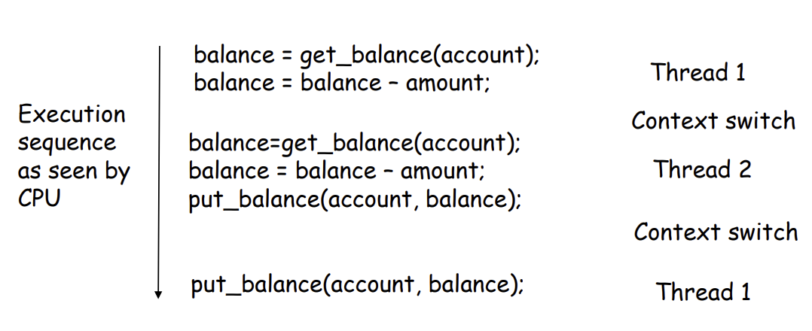


## 系统类型

系统类型：

+ Batch(批处理)：可以一次性提交大量的任务，系统决定运行那些
+ Time Sharing(分时)： 多个用户可以同时连接到同一台计算机，通过划分时间片在用户之间快速切换
+ Single User Interactive：传统的个人电脑
+ Parallel ：多处理器系统，通过多个处理器并行处理任务，提高**吞吐量（throughput）和容错能力（fault tolerance）**
+ Distributed(分布式)：多个联网计算机组成
+ Real-Time(实时系统)：对硬件和软件的**响应时间**有严格要求


单任务系统：同一时间只有一个程序运行，易于实现，利用率低 MS-DOS

多任务系统：较复杂，对系统资源的利用率更高，存在安全问题，Ubuntu, Windows 10


**操作系统一定保护自己免受用户影响**：例如操作系统会保留一部分内存区域(内核空间)为只有操作系统可以访问，防止用户程序修改或者破坏系统的核心部分。

**操作系统可能会保护用户彼此之间的安全**：即防止一个用户影响到另一个用户的数据或程序，但并非所有操作系统都实现。


## 双模式

**Dual-Mode Operation（双模式操作）** 是操作系统（OS）用于保护和安全的重要机制之一，它允许计算机区分 **用户模式（User Mode）** 和 **内核模式（Kernel/Supervisory Mode）**，以确保用户程序不会直接访问关键系统资源，从而保护操作系统的稳定性和安全性。


内核指的是在**系统调用接口之下，硬件之上的部分**。


用户模式（User Mode）：**运行所有的用户应用程序，受限访问，只能执行基本的指令不能操作硬件( I/O 设备、内存管理)，如需访问受限资源需向操作系统请求服务(system call)**

内核模式（Kernel/Supervisory Mode）：**具有完全的权限**，只能在内核模式下运行的指令称为**特权指令**Privileged  Instructions，这些指令一般会影响整个机器，包括**读取/设置时间，读取文件，访问打印机**。

**用户永远不要在内核模式下操作**

# Ubuntu

Ubuntu是以桌面应用为主的**Linux发行版操作系统**，Linux发行版包括**Linux内核**(kernel负责管理**硬件资源**，如CPU，内存，磁盘网络并**提供系统调用接口**，使得应用程序可用与硬件交互)，以及其他工具。

 

# shell

命令行解释器(Command Interpreter)，它接收用户**输入的命令**，**解释并传递给操作系统执行**，最后将执行结果**返回**给用户，命令行解释器**包裹**着内核。

用户所键入的命令并不是操作系统的一部分，而是利用了系统调用的，独立的**可执行二进制文件**

shell特指正在**运行着的**命令解释器进程


shell的**运行机制**大体上如下


当执行命令时会创建一个**子进程**来运行该命令，**对于简单的命令，shell会等待子进程结束**

使用**&**命令，shell不会等待进程结束，而是可以继续接受新的命令


system program系统程序是一类**特殊**的程序，利用操作系统**内核**提供的系统调用来实现各种功能，shell中的**指令**就属于系统程序。


# Process


## 进程

进程process是**运行的程序**，程序不过是储存在磁盘中的**一堆指令**，当它被加载到**内存**中时便**成为了一个进程**。

所有的进程都是**init进程**的子进程	

进程有一个**程序计数器(**Program Counter)用于**追踪即将执行的下一条指令**，同时每个进程都有自己的**地址空间**(address space进程可以**读写的内存区域**)，防止进程之间相互干扰。


进程被**进程标识符(pid)**标识


注意下图只是一个演示，这些段在物理内存中的位置**可能不连续**，但操作系统通过**虚拟内存管理**，会将这些分散的段映射到进程的虚拟地址空间，使得进程**认为自己的内存是连续的**。


进程的空间可以划分为

+ 代码段：**存放可执行程序的指令代码，可共享对于频繁使用的程序只需在内存中保留一个副本，通常是只读的防止被修改**
+ 数据段：**存放已初始化的全局变量和静态变量**
+ 堆：由 `malloc`、`calloc`、`realloc` 等**动态分配函数申请**，存储动态分配的内存，**向高地址增长，大小可变**

+ 栈：**存放函数调用相关信息(其中有局部变量)，向低地址增长**


**多次调用相同的程序会创建多次不同的地址空间**


除了单进程外，还有**multiprocess**模式用于**防止崩溃**，比如浏览器。


## 僵尸进程

僵尸进程指**子进程已经终止，但父进程未回收其退出状态的进程。**而孤儿进程**orphan**指的是父进程未等待子进程就结束。 


形成过程如下：

1. **父进程调用fork创建子进程**
2. **子进程结束任务后调用exit()终止，进入终止状态(Terminated State)**
3. **此时子进程的状态还保留在PCB中，当子进程退出时，系统不会立即清空它的PCB而是保留其退出状态，直到父进程调用wait进行回收**
4. **如果父进程未调用wait回收资源，那么子进程的资源是不会被释放的**


**top**指令会显示进程的信息。


## PCB

PCB 进程控制块，每个进程都会有一个对应的PCB，它是**内核中储存进程信息的数据结构**，一般存放在内核空间中而不是进程的地址空间防止被用户操作


它包括的信息有

+ **进程标识符**
+ **处理机状态：通用寄存器，PC，PSW，用户栈指针**
+ **进程调度信息：进程状态，进程优先级，进程调度所需的其他信息(调度算法)，事件(阻塞原因)**
+ **进程资源：内存空间，打开的文件**


## 进程切换

下述是进程运行的状态图，suspend状态见schedules

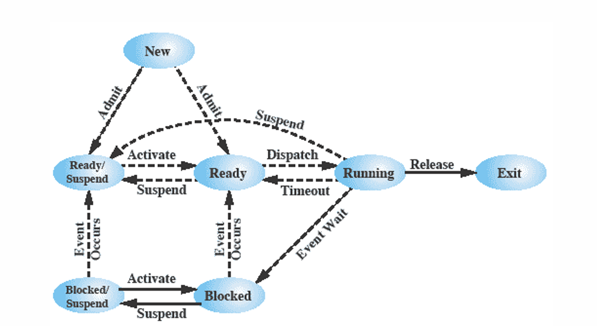

+ New: **进程首先被创建，还未被操作系统接收**
+ Ready: **进程已分配资源但尚未执行，等待CPU调度(Dispatch)**
+ Running: **进程在CPU上运行**
  + Timeout超时: **进程被剥夺CPU，回到Ready队列**
  + Event Wait等待事件: **进程进入Blocked（阻塞）**
  + Release释放: **进程执行完毕进入Exit终止状态**

+ Blocked: **等待某个事件完成**
+ Exit: **进程执行完毕，操作系统释放其资源**


 **每种状态都会维护一个队列，其中运行状态的队列大小为一**

实际上队列中存储的是**进程的PCB**


如下所示，**操作系统调度也要耗费时间**，这段时间中系统不会做有用的工作，越复杂的OS和PCB，切换所需的时间也就越长。


Dispatch latency指**用于停止一个进程并开启另一个进程所需的时间**。


**进程切换(context switch)**指的是**操作系统暂停当前正在运行的进程，保存它的状态，并加载另一个进程的状态使其继续运行。**一般发生在**进程等待I/O，或者运行了一段时间的时候**。

**context指进程的完整运行状态，包括CPU寄存器，内存....**，也就是储存在**PCB**中的内容，有的硬件可以一次性加载**多个**context。


假设要从进程A切换到进程B，过程如下：

+ 保存A的**上下文context**到**PCB**，包括PC，CPU寄存器内容，堆栈指针，PSW
+ 更新进程状态，将PCB**插入到ready或者waiting队列中**
+ 运用调度算法选择下一个要运行的进程，即B
+ **加载B的上下文**到CPU中
+ **将新进程的状态改为Running，CPU将控制权交给B，B从上次中断的地方继续运行**


## 子进程

通过fork可以创建一个和父进程有**相同状态**的子进程(子进程也会有自己**不同的资源**，比如pid)，但该进程拥有自己**独立的空间**

子进程继承父进程的**文件描述符(表)**(注意不是拥有**同一个**)，即共同操作文件，对同一文件的写入**不会被覆盖但是顺序不确定**；子进程从**fork的下一行**开始执行，如果父进程**重定向了输出**，那么fork出的子进程的输出也同样会被重定向。


父进程和子进程的执行顺序是**不确定**的。


在一些操作系统中，为了防止僵尸进程的出现，当父进程终止时，**它的子孙进程也会跟着终止**，这是由**操作系统**完成的。


**fork()会返回两次，子进程会获得pid=0，父进程会获得子进程的标识符**，如果失败(一般是达到可以创建的进程**上限**)会返回**-1**

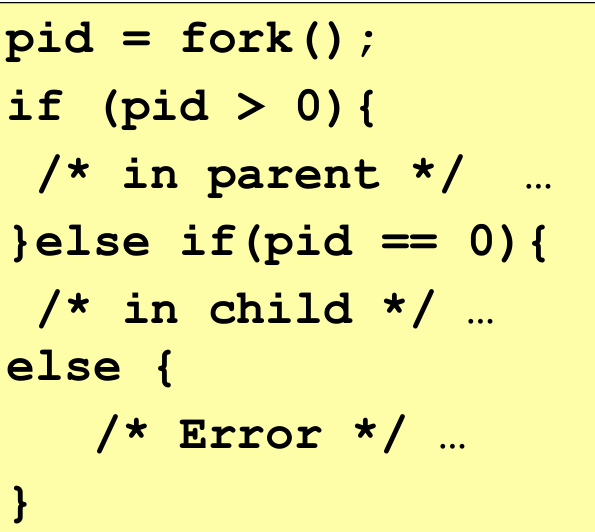


**getpid()返回进程的PID getppid()返回父进程的PID**


父进程需要等待子进程结束，**PID=wait(int *statue)**将**阻塞**程序直到**任意**子进程**结束执行**或者**发送中断信号SIGINT**，它会返回 **已退出的子进程的 PID**，如果不存在子进程则会返回**-1**，其中**statue**会储存进程的**返回状态**，传入**NULL**表示不储存。waitpid会等待**指定的进程**结束。


有时，父进程通过 **`abort()` 系统调用**主动终止其子进程，原因如下

- **资源超限**：子进程超出分配的资源（如内存、CPU时间）。
- **任务失效**：子进程的任务不再需要（如用户取消操作）。
- **父进程退出**：某些系统不允许子进程在父进程终止后继续运行（孤儿进程会被清理）。


**操作步骤**：

1. 父进程调用 `abort()` 发送终止信号。
2. 操作系统立即终止子进程，并回收其资源（可能不保留状态信息）


# Schedulers

Schedulers调度器**从所有可执行的进程中选一个进程执行**

当发生进程**退出**，**I/O阻塞**，或**semaphore**时，强制触发调度器；当新进程**创建**或者发生I/O**中断**时，可能会触发调度器。


**CPU 利用率最大化** 依赖于 **上下文切换（context switching）**，即**CPU 调度（CPU Scheduling）**。

CPU所分配的资源就是**运行时间**。


## 基本概念

+ **CPU Burst**：进程在CPU上执行计算的时间
+ **I/O Burst**：进程执行输入输出操作的时间

在进程的执行周期中，二者一般**交替进行**形成一种周期性的行为，一般CPU Burst跟在I/O Burst**后面**


CPU调度的目标：

1. 共享时间，保证公平（**Share time fairly among processes**）
2.  防止饥饿（**Prevent starvation of a process**），即低优先级的进程长期得不到CPU资源
3. **提高CPU利用率**
4. 低开销**(Have low overhead)**
5. 适当的进程优先级**(Prioritize processes when necessary**)，保证关键任务按需执行


操作系统中主要有以下几种队列：

+ 作业队列 **job queue** 储存**所有未进入主存的进程**，位于磁盘上

+ 就绪队列 **ready queue** 储存**所有已经在主存上，等待CPU执行的进程**，位于主存中

+ 阻塞队列 **Bolocked queue **储存**等待某些事件而暂停执行的队列**，位于主存中

+ 挂起队列 **Suspended Queue**：挂起的进程队列，位于磁盘上，注意Blocked, Suspend Queue在事件出现后会进入到Ready, Suspend Queu

  


调度器类型：

+ **Short-term Scheduler：**从Ready queue中选择**被执行**的进程，执行频率**较快**(以毫秒为单位)，可能是系统中的**唯一**的调度器。当进程**时间片耗尽**(送入到Ready queue)，**I/O阻塞**(送入到Blocked queue)，进程**终止**，新进程**进入**(优先级更高)时会被触发。
+ **Long-term scheduler：**从job queue中**选择**进程进入到Ready queue，调用频率**较低**(秒分为单位)，控制**可同时运行的最大进程数**(degree of multiple programming)
+ **Medium-term Scheduler：**负责在**内存与磁盘间**"换进/换出"进程——进程已经就绪，随时可以运行(在Ready queue中)，但因为内存不足，CPU负载高等从内存中挂起到磁盘(Ready, Suspend Queue)；进程被阻塞(在Blocked queue中)，因为资源压力等原因被挂起到磁盘中(Blocked, Suspend Queue)。可以控制主存中的**degree of multiple programming**，**swap-in**从磁盘中加载到内存，**swap-out**从内存加载到磁盘。可以提高内存利用率，实现了虚拟内存，基于优先级调度，但是性能下降，数据容易丢失，page fault增加


进程分为：

+ **I/O-bound process(I/O受限型，I/O密集型)：**大部分时间进行**I/O操作**，占据CPU时间**较短**，频繁但短暂的**CPU突发**(short  CPU bursts)，即每次使用CPU时间**较短**，然后因**等待I/O**而阻塞
+ **CPU-bound process(CPU受限型，计算密集型)：**花费大部分时间**计算**，长时间占据CPU(long CPU burst)

​	

Long-term scheduler负责**平衡(good process mix) ** I/O-bound进程和CPU-bound进程的**比例**，**防止系统在运行时因为I/O等待过多而陷入空闲，或者CPU资源被计算密集型进程沾满而导致其他系统饥荒。**


**CPU 进程调度的方式**，主要分为 **非抢占式（Non-preemptive）** 和 **抢占式（Preemptive）** 两种调度方式。

+ 非抢占式：一旦把处理机分配给某个程序后，就让其**一直运行下去**，只有当进程**完成**或者发生**事件阻塞**时才会把处理机**释放**给其他进程。
+ 抢占式：每个进程会运行**固定的时间**(在时间间隔结束时发生clock中断)或者**提前结束**


## 调度算法

调度可以选择赋予进程优先级来选择下一个要运行的进程，优先级的分配方式分为**动态与静态**。但有的时候一些低优先级的进程会遭遇**starvation**因为高优先级的进程的不断出现。

进程之间的调度时间一般不对**第一个进程**考虑

turnaround=**结束时间-到达时间**


### FCFS

First-Come, First-Served (**FCFS**)

在FCFS的模式下**同时**到达的三个进程p1=24,p2=3,p3=3，以p1,p2,p3的顺序运行所需时间如下：
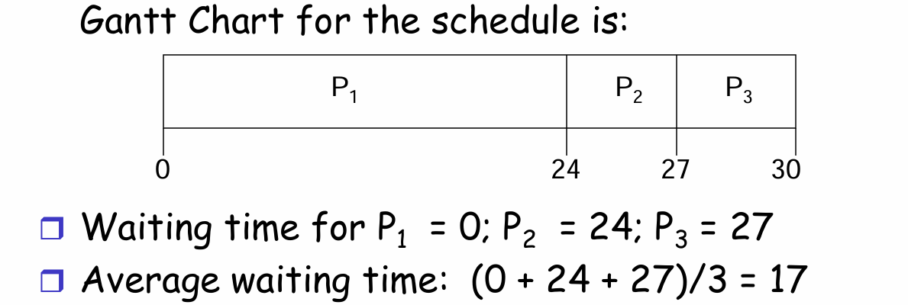


如果执行顺序为 P2 , P3 , P1，则有


因此如果存在**长作业位于队首**时会导致**平均等待时间**较大，比如CPU密集型后跟多个I/O密集型，因为I/O密集型所需的**CPU时间较短**。


Last-In First-Out(LIFO)可能会导致starvation


### SJF

Shortest-Job-First (SJF)**最短作业优先**

每个进程都关联一个**估算的CPU burst time(这也是难点)** ，调度程序会选择进程中**最短**的运行(最短的回跳到**队首**)，这种方式可以**最小化平均等待时间**。batch jobs(**定期、重复执行**的任务)的运行时间很**容易**估算，交互式进程(Interactive processes)需要**统计**方法来估计

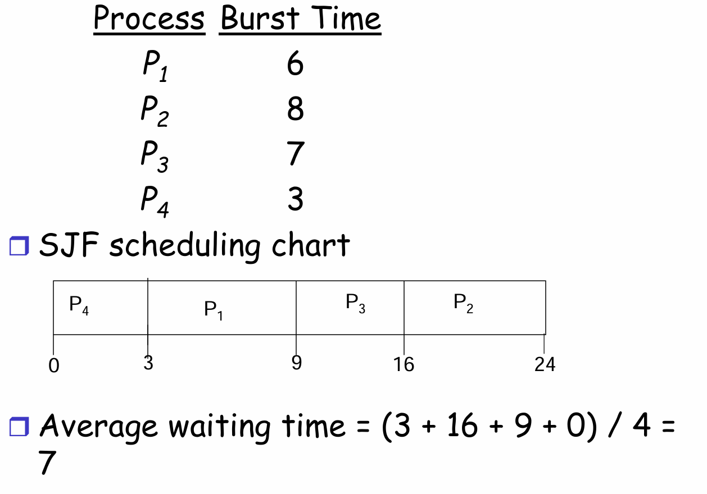

CPU burst 是未知的，一般通过历史数据预测，以指数加权平均的方式进行，a等于0.8**快速反应数据变化**，但如果**有异常值**，变化会出现波动。α = 0.2**过去**的数据仍然对当前平均值有显著影响


可以扩展一下


对于抢占式的SJF（任务可以更换）


1. 初始时**只有p1**，因此会运行p1
2. 1s后，p2到达，此时p2(4)所需的**运行时间**比p1(7)**短**，因此会运行p2
3. 当p2运行完毕，此时p1p3p4都到达队列，其中p4所需的**时间最短**，因此运行p4
4. 重复选择最短的任务执行

注意这里并不会选择已存在的进程中最短的，而只会与**新来**的进程比较一下。


**每个任务的等待时间=结束时间-到达时间-运行所需时间**


在优先级调度中，**最小**的数字表示**最大**的权重。**SJF也是一种优先级调度**，其中优先级就是运行时间。显然地，优先级调度会出现**starvation**的问题，解决方法是**Aging**即通过时间来增加进程的优先级。


SJF调度过程如下，这里假设是**同时**到达的

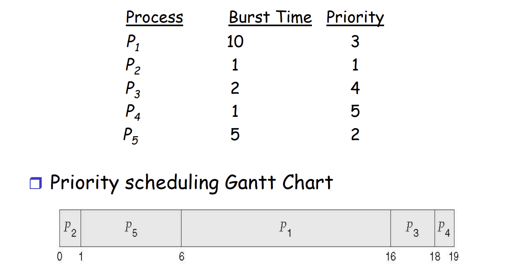

平均等待时间=8.2


### RR

轮转调度(Round Robin)，每个进程都会被分配一个**固定的时间片(Time Quantum)**，如果进程**未在q时间内完成**则会触发时钟中断，进程会被暂停，并放入Ready queue**末尾**。

如果有n个进程，时间片为q，每个进程会获得**1/n**的CPU时间且**最多运行q时间**，然后进入到队列末尾(未运行完)，每个进程最多等待**(n-1)q**时间。


如果q太大，会变为**FIFO**模式，太小会频繁地**context switch**增加开销(**至少比context switch的开销大**)，一般在**10ms to 100ms**


对于q=4的图如下所示

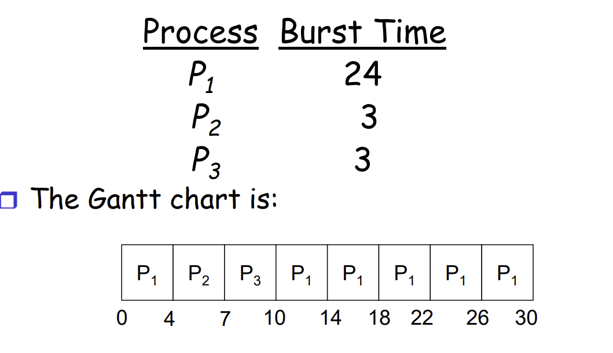


通常平均周转(turnaround)时间比sjf**大**，但是**响应时间更好**。 


注意**切换次数**的计算不是做除法


可用于优先级调度结合——对于**相同优先级**的进程执行RR，如果当前优先级只有自己那么**一直运行**下去

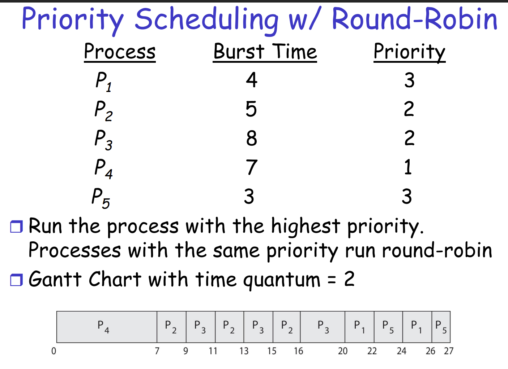


### Multilevel Feedback Queue Scheduling

在多级队列模型中，系统会把不同类型的进程分配到不同的队列中，队列之间的调度顺序有两种：**固定，时间片**

多级反馈队列调度，划分有**多个队列**，每个队列有**不同的优先级**，队列中的进程优先级都**相同**

进程可以在队列之间**切换**：

+ 如果一个进程用了**太多的CPU时间**(CPU burst)，那么它会被移动到**低优先级队列**的队尾；
+ **I/O密集型和交互式进程**通常会被保留在**较高优先级**的队列中；
+ 如果一个进程在**较低优先级**的队列中等待了太长时间，它可能会被移动到**较高优先级的队列**中。

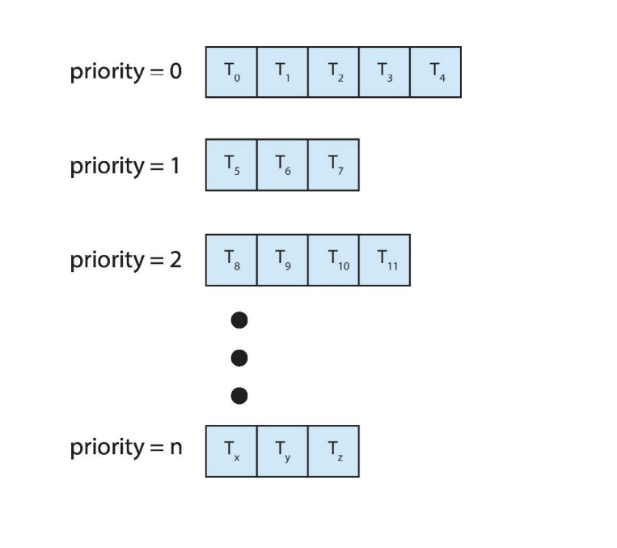

多级反馈调度仍有可能引起**starvation**，也可用于实现**Aging**机制。


一个多级反馈的例子是


1. **新来**的进程都会赋予**最高优先级**
2. 如果进程在**规定的时间片**内完成，则直接**退出**，反之**降级**
3. 在第一级队列**空了**的时候才会执行第二级队列中的进程


传统 UNIX 系统中的调度策略

系统使用**多个队列**，每个队列有不同的**优先级**，每个队列内部使用**RR**，**高优先级的队列先被调度**，只有当高优先级的队列**为空**时才会调度低优先级队列中的进程。

每个进程最多执行**1s**，如果进程在1s内完成或者阻塞，则正常退出CPU，反之会被抢占

优先级**不是固定的**，而是会根据进程的执行行为**动态调整**：如果进程总是用完时间片，那么**降低**其优先级(**CPU密集型**)，反之**提升**其优先级(**I/O密集型**，可以频繁让出CPU)


### lottery scheduling

一种**随机化**的调度算法

每个进程都会获得一定量的 **lottery tickets**，票数越多被调度的概率就越大，调度器计算所有的彩票总数，然后**随机选择**一个号码，持有该号码的进程会被调度。


## 优先级

优先级每秒会被重新计算，进程的优先级会按照其功能被划分到不同的优先级层

**Swapper（最高优先级）**

- 负责进程的调度和内存交换（swap），确保系统的基本运行。

**Block I/O 设备控制（Block I/O device control）**

- 处理磁盘或其他大块数据传输设备的输入输出（例如硬盘读写）。

**文件操作（File manipulation）**

- 处理文件系统相关的操作（如打开、读取、写入文件）。

**字符 I/O 设备控制（Character I/O device control）**

- 处理键盘、鼠标、串口等字符输入输出设备的操作。

**用户进程（User processes，最低优先级）**

- 普通用户应用程序，如文本编辑器、浏览器等。


# 异常


定义：由于**处理器状态变化**而导致**控制流发生突然改变**的情况，这里介绍的是**操作系统的异常**而非程序语言中的异常。


异常分为两大类：**同步异常(Synchronous)和异步异常(Asynchronous)**，前者由指令引发，发生时机可预测

同步异常包括：**除0，请求I/O，请求更多的堆内存**，**访问受限的内存**（如访问内核地址，越界），**访问尚未加载到内存的变量**(虚拟内存)

异步异常包括：**键盘输入，磁盘完成数据读取**


异常与函数调用的异同

异常在某些方面类似于函数调用：

+ **控制流转移**
+ **执行处理代码**
+ **执行后返回**


区别在于：

+ **函数调用只保留返回地址，而异常会保留所有寄存器的值**

+ **异常会将数据压入操作系统栈而非应用程序栈，**
+ **异常的处理程序在内核模式下运行**
+ **异常可能会返回到当前指令，或者不返回，而非一定返回到下一指令**


异常有四种类型：Interrupts，Traps，Faults，Aborts


**Interrupts由外部设备触发，例如键盘输入会发送中断信号给 CPU，磁盘读取完成后通知CPU，属于异步异常**

**Traps(128)由程序主动触发的异常，通常用于请求操作系统服务，例如请求I/O或者堆内存**

**Faults是可以恢复的异常，比如访问受限内存，虚拟内存**

**Aborts是无法恢复的异常，程序会直接崩溃，比如过热**


发生中断时，处理器会设置PC**指向中断处理程序的起始地址**，并从**用户模式切换到内核模式**，处理中断的程序可以执行**特权指令(因为切换到了内核态)，切换回来时会重新设置PC**。

**TRAP 指令**会让CPU **从用户模式切换到内核模式**，**用户进程的状态会被保存**，在操作系统执行完处理程序后，**会恢复进程的状态**，然后执行用户模式。


# 轮询和中断

轮询polling——**CPU定期检查设备的状态以确定是否需要数据传输**，一般是通过读取设备状态寄存器来判断，类似于时不时查看手机确定时间。


Interrupt**允许设备在需要CPU时主动通知CPU，而不是由CPU定期检查**。


每个设备都会有一个**中断线(interrupt line)**，**用于在数据完成传输时通知处理器**，当中断信号触发时，处理器执行**中断处理程序**，没有设备需要服务时则不会有**额外的开销**。

CPU中有一个包含**每个设备类型的表**，表中存储着与设备有关的**中断处理程序的入口地址**，每当CPU收到中断信号时它都会**查找**表，找到对应的程序入口地址然后执行。


大多中断程序使用汇编语言写的，因为**高效**。

# System Call

系统调用：**操作系统提供给用户程序的接口，用于访问内核功能(文件读取，进程管理，文件管理，网络通信)**，只有通过**软中断**进入内核态才能使用。


系统调用分为三大类：**文件操作，进程管理，信息管理**


文件是**比特的序列**，内核并没有使用**数据结构**来组织文件，文件按照**树形结构的目录**管理(Tree-Structured Directories)，目录本身也是一个**文件**，储存了**如何寻找其他文件的内容**。

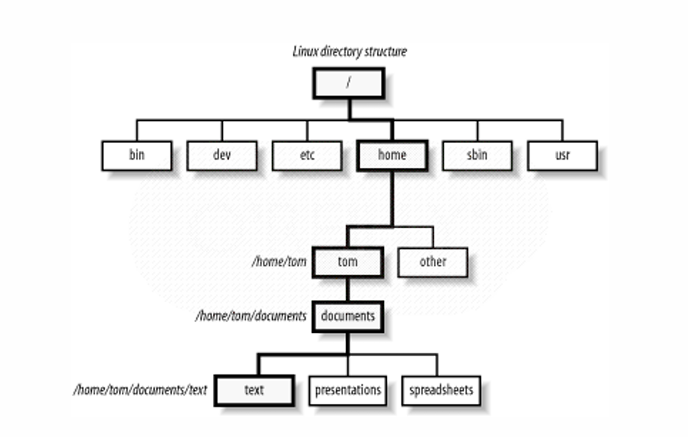


系统调用的过程：

+ 保存进程的**上下文**(到PCB或者内核栈中)，因为切换到内核态相当于切换了一个场景
+ 系统调用有唯一的**系统调用号**(kernel code)，用于指定内核态中对应的处理程序，它和其他参数存放到寄存器中，**传递给内核态**
+ 执行read()函数内部的**中断指令**，切换到内核态
+ 通过系统调用号找到对应的**内核函数**，读取参数并**执行**，处理的**结果**也会放到寄存器中
+ 返回到用户态，**恢复**原来的用户态寄存器、用户栈和PC


**POXIS是一组标准，规定了API，使得应用程序可以在不同的UNIX系统上运行。**

常用的有：

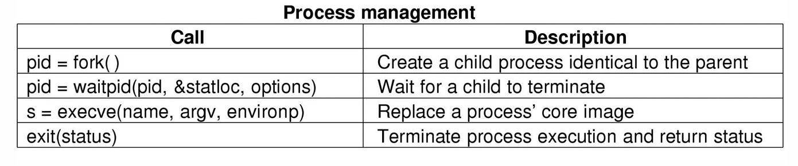


# IPC

进程可以分为Cooperating和Independent，前者可以**影响或者受到其他进程的影响**，后者则不会


IPC指**进程间通信**，有两种方式：一种是**共享内存**(管道)，另一种则是**传递信息**。


1. 单工：只支持数据在一个方向上传输

2. 半双工half-duplex：**允许数据在两个方向上传输，但同一时间只允许在一个方向上传输**

3. 全双工full-duplex：**允许数据同时在两个方向上传输**


管道分为**Ordinary Pipes和Named Pipes**，管道实际上是内存中的一块**缓存(大小有限，超出会阻塞)**，也可以认为是一个**特殊的文件**，它按照**先进先出**的方式处理数据，操作系统会**协调进程间的同步**，确保写入和读取的顺序匹配，不会发生数据混乱。


+ Ordinary Pipes(anonymous pipes)：**只能在父子进程中通信(只要满足有公共祖先)，数据是单向的，不能被其他进程访问。**

+ Named Pipes：**允许**无亲缘关系的进程**进行数据交换**，注意pipe需要满足父子进程的说法是**错误**的。


+ 当向**已满**的管道写入数据时，系统会**阻塞**程序，直到管道有**足够的空间**
+ 从**空的**管道中读取也同样会**阻塞**。
+ 如果一个进程**打开管道用于读取**，而没有进程**打开管道写入(提前关闭)**，读取进程会被一直**阻塞**，即管道需要**匹配**。

当写端关闭，读端会读取到**0**，表示EOF。反之，write()会返回**SIGPIPE**信号，如果忽略信号则 `write()` 返回 `-1`，`errno` 设为 `EPIPE`


进程通信的方法除了管道还有socket——**不需要进程间的关系，可以在不同机器之间通信**。


操作如下，注意**0是读，1是写**：


父子进程可以**重定向输入输出(非必须)**，更方便地操作

```C++
int pid, p[2];
// 创建管道失败
if (pipe(p) == -1)
    exit(1);
pid = fork();
if (pid == 0) {
    // 子进程关闭写端
    close(p[1]);
    // 重定向输入到读端
    dup2(p[0], 0);
    // 关闭读端，否则会出问题
    close(p[0]);
    execl(...);
}
else {
    // 同理，用不到读端
    close(p[0]);
    // 重定向后关闭
    dup2(p[1], 1);
    close(p[1]);
    ... write to stdout
    wait(&status);
}
```


# Linux操作

## 目录

+ / 根目录 ： **所有目录挂在其下**
+ /boot：**存放Ubuntu内核和系统启动文件。系统启动时这些文件先被装载。**
+ /etc：**系统的配置文件目录。密码文件、设置网卡信息、环境变量的设置等都在此目录中，许多网络配置文件也在其中**。
+ /lib ：**根文件系统目录下程序和核心模块的共享库。这个目录里存放着系统最基本的动态链接共享库，类似于Windows下的system32目录，几乎所有的应用程序都需要用到这些共享库。**
+ /media ：**主要用于挂载多媒体设备。ubuntu系统自动挂载的光驱、usb设备，存放临时读入的文件。**
+ /proc ：**这个目录是系统内存的映射，我们可以直接访问这个目录来获取系统信息。也就是说，这个目录的内容不在硬盘上而是在内存里。**
+ /sbin ：**s就是Super User的意思，这里存放的是系统管理员使用的系统管理程序，如系统管理、目录查询等关键命令文件。**
+ /tmp ：这**个目录是用来存放一些临时文件的，所有用户对此目录都有读写权限**。
+ /home ：**用户的主目录。下面是自己定义的用户名的文件夹。每个用户的设置文件，用户的桌面文件夹，还有用户的数据都放在这里。**
+ /mnt：**此目录主要是作为挂载点使用。通常包括系统引导后被挂载的文件系统的挂载点。如挂载Windows下的某个分区。**

​	

启动Ubuntu可以通过power shell输出**wsl**，如果要退出回window则输出**exit**指令	


## 指令

+ **ls 列出目录内容 -l显示详细信息，-a包括隐藏文件**
+ **pwd输出当前位置**
+ **cd 切换目录**
+ **ps查看系统中的进程信息 ps -el显示完整信息**
+ **rm name 删除文件(\*删除所有*) -f强制删除不确认 rmdir删除空目录**
+ **mkdir directory_name创建目录**
+  **uniq 过滤重复的结果 **
+ **cat filename显示文件内容(可以同时显示多个文件内容) cat>filename覆写文件内容（追加用>>），如果文件不存在则创建，使用ctrl+d退出编辑**


​	**cat file1 file2 > file3将前两个文件的内容合并到第三个文件中，同样是不存在则创建，存在则覆写**

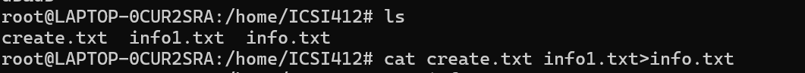

+ **echo输出文本到终端 echo “text”**

+ **cp复制文件或目录，cp file1.txt /home/user/documents/复制文件到目录下，cp -r dir1/ dir2/复制一个目录的所有内容到另一个目录下。**


+ **mv用于移动或重命名文件，mv oldfile.txt newfile.txt重命名(新名称存在就覆盖)，mv file1.txt /home/user/documents/移动到目录，mv oldfile.txt /home/user/documents/newfile.txt移动到目录同时重命名。**


+  **wc filename 输出文件中的行数，词数(空格分割)，字符数  wc -c filename只输出字符数 wc -l filename只输出行数**


+ **sort filename 排序文件内容，以行划分字符串按升序进行，sort -r filename倒序**


## I/O重定向

每个进程启动时，通常会**自动拥有三个标准文件描述符012**，分别用于**输入stdin**，**输出stdout**，和**错误输出stderr**

在shell中可以通过**I/O重定向**，让程序的输入输出不在依赖默认的屏幕和键盘，而是文件


相当于程序 `a.out` 中 `scanf`、`cin` 等读取的不是键盘输入，而是 `input.txt` 里的内容，此时键盘输入不生效

```shell
./a.out < input.txt
```

结果输出到文件中

```shell
./a.out > output.txt
```

将错误信息存入文件中

```shell
./a.out 2> error.txt
```


同时修改输入输出和错误文件

```python
./a.out < input.txt > output.txt 2> error.txt	
```


dup函数使用**当前最小的可用文件描述符**指向和**oldfd**相同的**文件**，文件**偏移量**以及文件**权限**(如果失败，则返回**-1**)，函数会返回该**文件描述符**

```python
int dup(int oldfd);
```


每个进程都有自己的**文件描述符表**，当新打开一个文件时**会添加一个表项**，子进程被创建的时候会**复制**这张表。


如下图所示：首先**打开**一个文件描述符，随后**关闭标准输出**(**0 标准输入，1标准输出，2标准错误**)，通过**dup(fd)**将标准输出定向到文件，因为此时**最小的可用文件描述符是标准输出**，dup的返回也就是标准输出，这里不需要接受返回值，至此将**标准输出定向到了文件**，最后**关闭原来指向文件的描述符**。


dup2(oldfd,newfd)相较于dup，**可以指定将oldfd复制给谁**，因此不需要预先关闭newfd

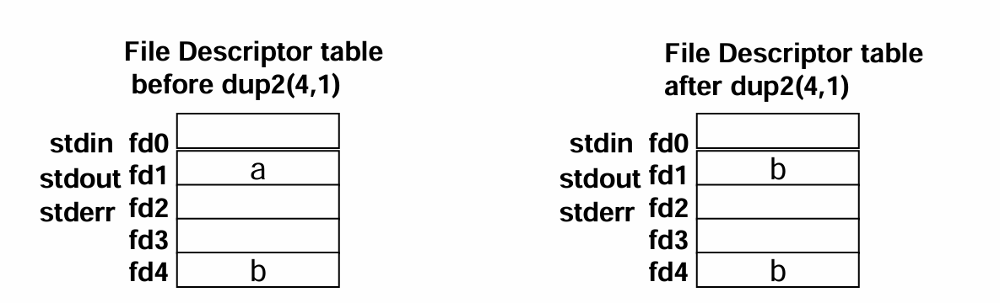

## exec

exec代表**一组**可以替换当前进程的系统调用，它不会**创建**新的进程，而是用**新的程序替换当前程序的数据和代码**。注意**PID**，**PPID**和**已经打开的文件描述符**会保留。


当调用该`exec` 族函数时：

1. **关闭当前程序的代码和数据，当进程的PID不变**
2. **加载新程序**
3. **执行该程序并且不会返回，如果调用失败会返回-**1


p使用**相对路径**，不加p则是**绝对路径**，e则是**自定义环境变量**，不加p则需要传入**完整的路径**。

**l**和**v**表示**参数的传递方式**，前者**一个一个列举**，后者使用**数组**，二者都需要用**NULL**结尾。

注意参数(不包括)中的第一个是**程序名**。


```C++
// 枚举传参
execl("/bin/ls", "ls", "-l", NULL);

// 列表传参
char *args[] = {"ls", "-l", NULL};
execv("/bin/ls", args);

execlp("ls","ls","-l","a.c",NULL);
```


## 管道符

管道符的作用和管道一样

**| 管道符可以将两个命令分开，左边的命令的输出作为右边的命令的输入**，可以**连续使用**即第一个命令的输出会作为第二个命令的输入，第二个命令的输出又会作为第三个命令的输入，依此类推。


将三个文件的内容排序后输出到打印设备，在后台执行

```bash
 cat file1 file2 file3 | sort  >/dev/lp &
```


​	

# Thread

线程是CP**U资源分配和执行**的**最小**单位(CPU utilization)，可以看作是**按顺序**(sequential)执行的一系列指令。


同一进程内的多个线程**共享内存空间**(代码段**Text**，数据段**data**，堆**heap**，文件描述符**open files**，**sockets**，**lock**...)，但每个线程都有独立的**栈，SP，寄存器状态(register state)，errno和PC**，使得它们可以**并发**执行。


**传统**的进程是**单线程模式**，即一个进程只包含一个线程，拥有独立的空间


进程**创建**所需的时间和资源比线程**昂贵**，但是有着**更快**的**响应速度**，以及**安全性**(一个任务的崩溃不会影响到别的任务)


线程的另一个优势是可以**高效地管理共享资源**，比如在web中，服务器通常会维护**缓存**以存储频繁访问的页面，通过缓存可以加速数据的传输，如果创建进程，由于每个进程有自己**独立的内存空间**它们是无法共享到缓存的。

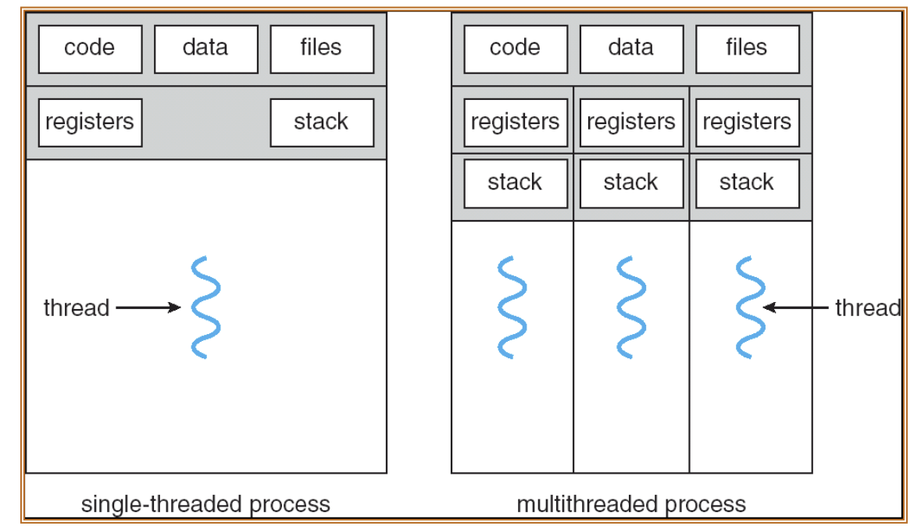


线程的**内存开销低**，**上下文的切换更快**，线程可以在**单个CPU上同时进行计算和I/O处理**，当一个线程因为I/O阻塞时，另一个线程仍可以继续进行计算，从而提高响应性**Responsiveness**。


带宽**bandwidth**与延时**latency**的关系并不紧密**loosely coupled**，即使工程可以提高生产效率(bandwidth)但是并不会降低产品生产所需的时间(latency)


延时很难被**减小**，但是带宽可以增加


延时——**完成一个任务所需的时间**，吞吐量——**单位时间可以完成的工作量**

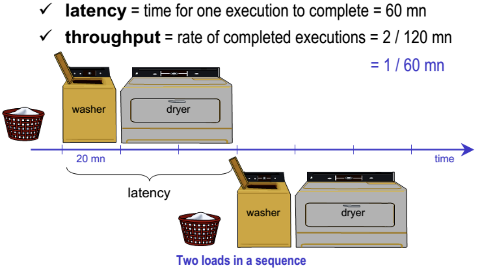


通过流水线技术可以**缩减吞吐量(1/最长耗时阶段)**，但并**不能提高延时**反而提高，每个阶段**固定**为最长耗时阶段

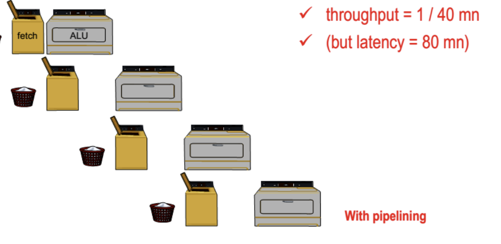


线程独享的资源储存在**自己的栈中**


多线程模式中，通过**TCB**（线程控制块）管理线程信息，其**存储线程的运行状态，栈，PC，SP，寄存器的值，errno**


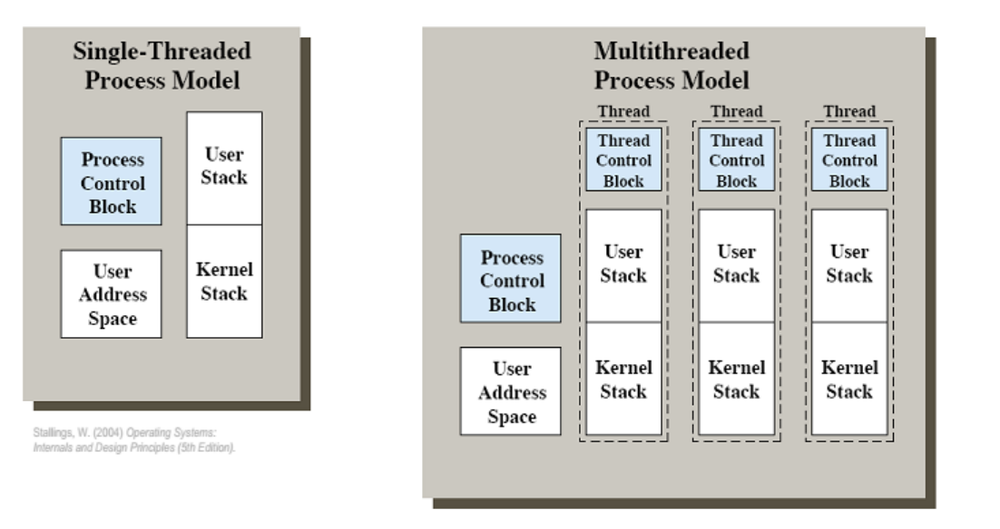


线程没有**挂起**swap操作


线程可以**创建线程**，线程之间没有**依赖关系**


```C
#include <pthread.h>
int pthread_create(pthread_t *thread, const pthread_attr_t *attr, void *(*start_routine)(void *), void *arg);
```

+ thread指向该线程的指针
+ attr指定线程的属性，可以传入NULL指定默认属性
+ start_routine线程创建后要执行的函数，需要返回void类型
+ arg传给函数的参数，一般用结构体
+ 成功则返回0


线程也有**唯一的标识符**，可以通过**pthread_self()**得到


注意**Main**函数本身就创建了一个线程


**pthread_join**阻塞当前线程直到目标线程结束，目标线程的退出状态存到retval中

注意传入的是指针而不是标识符

```python
int pthread_join(pthread_t thread, void **retval);
```

返回0，成功


线程的优势在于：

+ **更快的创建**
+ **更快的结束**
+ **更快的切换(上下文更少)**
+ **线程可以共享资源，它们之间的通信不需要使用内核**

因此线程被称为**轻量级**进程(lightweight process)，如果应用要执行一堆**相关联的操作**时，使用多线程更有优势。


**RPC** Remote procedure calls 理解为客户端发送请求


线程有三种实现方式

User-Level Threads, ULTs

+ **内核不知道线程的存在，只看到单线程的进程，这些线程一般通过线程库(POSIX)创建**
+ **每个进程维护自己的私有线程表，记录每个线程的信息——PC，SP，寄存器值，线程状态..**
+ **进程切换不需要内核模式，因此更快**
+ **如果一个线程阻塞，整个进程都会被阻塞**

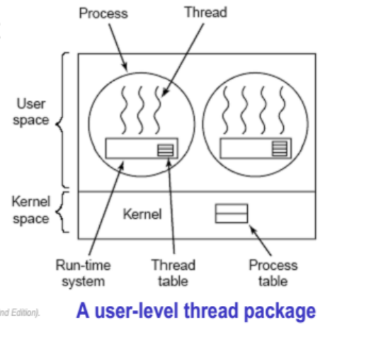


Kernel-Level Threads, KLTs

+ **线程的创建和销毁都是通过系统调用完成的**
+ **内核维护全局的线程表**
+ **一个线程阻塞，其他线程仍能执行**
+ **线程开销更大**
+ **调度是基于线程的，而不是进程(fine-grain精密)**

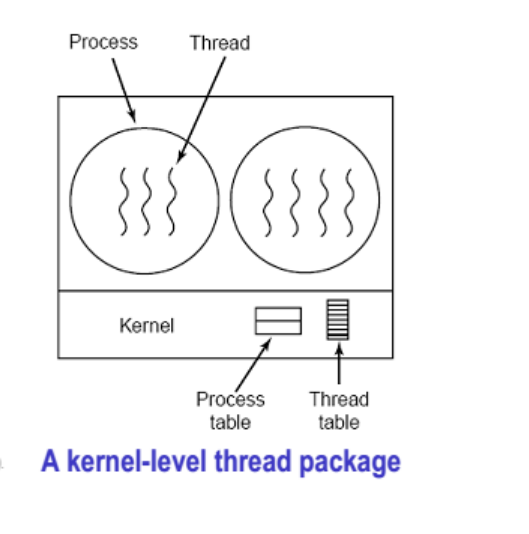


混合线程实现(**Hybrid**)

+ **将用户级线程嫁接到内核级线程上**

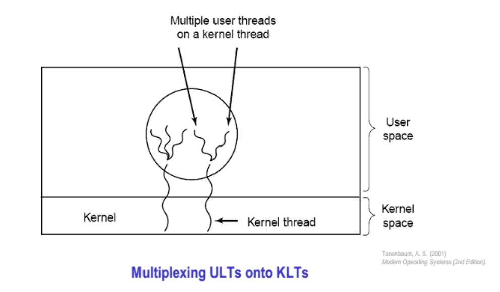


# Mutual Exclusion

当程序的执行结果依赖于多个线程之间的**精确的执行顺序**(共享资源，执行影响结果)时，就存在竟态条件race condition


考虑如下代码

```C
char chin, chout; // 全局变量

void echo() {
    do {
        chin = getchar();
        chout = chin;
        putchar(chout);
    } while (...);
}
```

当多个线程运行此程序时，可能出现A读取了一个字符到chin中还没来得及输出，B就将chin**覆盖**


```C
void echo() {
    char chin, chout; // 局部变量
    do {
        chin = getchar();
        chout = chin;
        putchar(chout);
    } while (...);
}
```

即使改为局部变量也不能保证正确输出，因为多个程序**尝试输出**导致顺序不确定


在汇编语言中，x=x+1会被如下方式执行

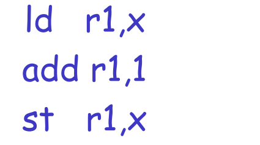

这个过程中可能发生竟态


想要避免竟态，关键在于将指令成组执行，避免线程之间过度交错(interleaving)，从而划分**关键区域** critical region(**CR**或者说是 "indivisible" blocks of execution )。

关键区域是**同一时间只能被一个进程/线程执行的部分**

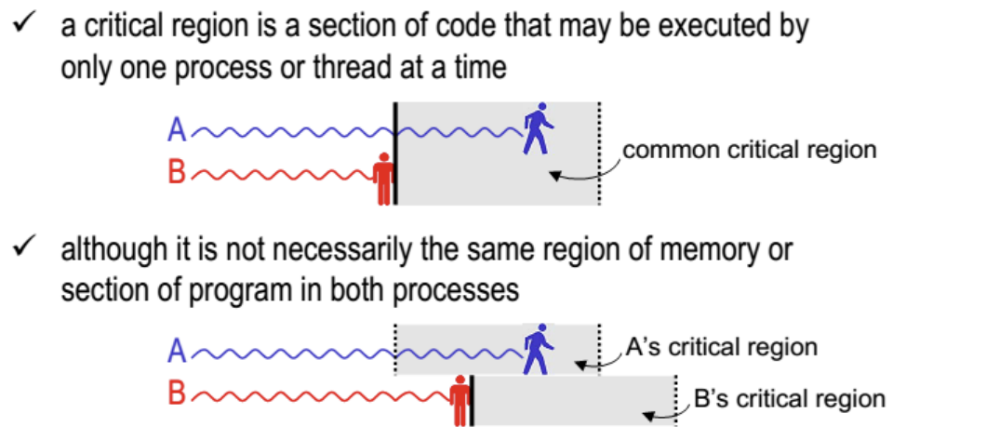


implementation0 

+ A进入关键区域后关闭所有的**interupts**，离开时重启中断
+ 只适用于**单核**
+ 不应该给用户**中断**的能力


implementation1

+ 使用lock变量(**全局变量**)，A进入后设置为1，离开时设置为0

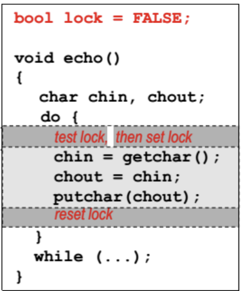

但是在**test**的过程中可能会发生竟态，导致两个线程**同时**进入关键区域


**indivisible原子操作**——操作不能被**中断**或被其他线程看到中间状态


implementation2

+ A先到达CR，通过一个**原子操作**(不可分割地读和写)将其设为1然后进入，这个不可分割的操作可用**TSL**硬件指令实现, CPU会锁上memory bus，**1**表示锁住，**0**表示未上锁

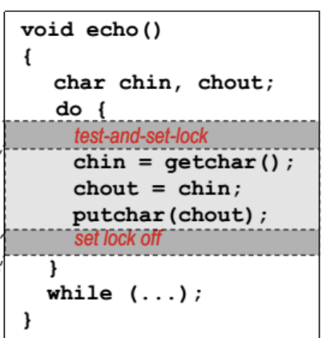


如果两个人都要取钱，银行会亏损，因为余额被错误更新(total-x but not total-x-x )

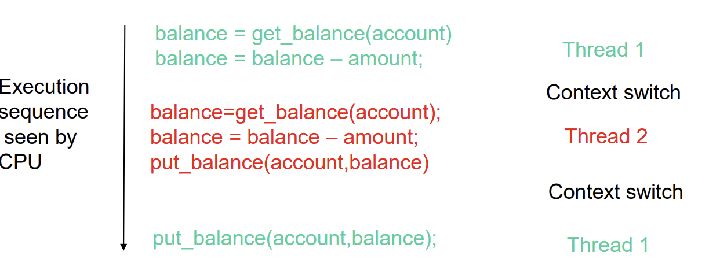


critical section访问共享资源的代码段，临界区(不知道和CR有什么区别)


互斥的条件：

+ Mutual Exclusion 同一时间只有一个线程或进程可以访问共享资源(临界区)
+ Progress 没有线程在临界区运行，那么就不能阻止其他线程进入临界区
+ Bounded Waiting 线程不会永远等待，它最终一定能进入临界区
+ 不对CPU速度，切换时间，或数量做假设


实现互斥的几种方法：


Supervisory server监督服务器：

+ 进程在访问共享资源之前，先向服务器发送**请求**
+ 服务器根据当前状态判断是否允许访问，如果资源被占用——拒绝(**refusal**)并把请求者放入**等待队列**，反之发送**许可**(permission)
+ 进程使用完资源后向服务器发送**释放信息**，服务器接收到信息后从**等待队首**取出下一个进程，授予其访问权


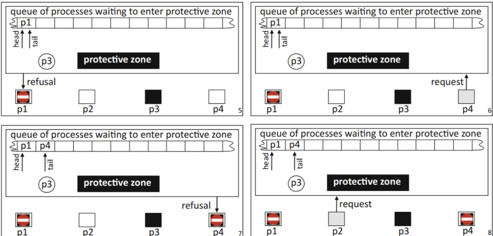

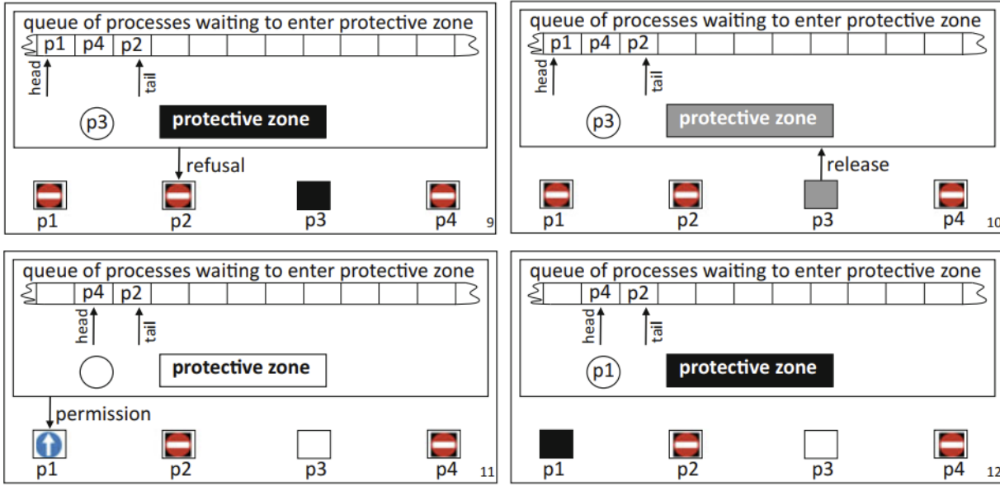


多路访问协议MAC

+ 单一共享广播信道，多个设备通过**一个信道**发送数据，Single shared broadcast channel
+ 如果两个或多个**同时**发送数据，会发送Collision，数据可能**丢失**
+ 三种常见的多路访问协议
  + **Channel Partitioning**， 信道会被分为多个小片段，时分/频分/编码(code)
  + **Random Access**，信道不预先划分，设备随时尝试发送。ALOHA，CSMA，CSMA/CD
  + **Taking Turns**，轮询，令牌传递


CSMA/CD

+ **发送之前先监听**，如果有节点正在发送那么就**等待**

+ Collision Detection冲撞检测，一**边发送一边检测**，如果有节点也在发送(接收到的数据不同) 则**停止**并发送噪声信号J**amming Signal**

+ 发生冲突后等待一个随机时间(**Randomness**)，使用**二进制**指数退避，注意时间不必是2的幂次


Peterson’s Solution

+ 限制在**两个进程**
+ 假设**LOAD**和**STOR**是**原子性**的
+ 两个进程共享**int turn**(指定谁先进入临界区)和**int flag[2]**\(初始化为False)
  + flag[0] = true implies that process P0 is ready! 
  + flag[0] = false implies that process P0 is not ready! 
  + flag[1] = true implies that process P1 is ready! 
  + flag[1] = false implies that process P1 is not

代码的设计保证了不会阻塞且互斥，进入CR之前将**turn设置为对方**，Flag设置为**准备**状态，离开时Flag设置为**未准备**状态，判断条件为——**对方已准备好且轮到对方了**。

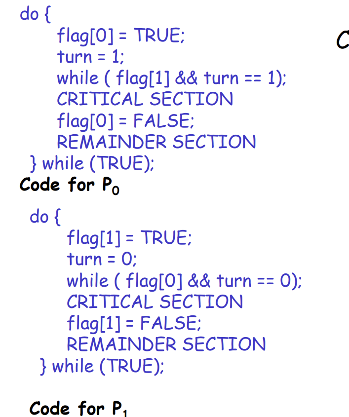


Peterson’s Solution不适用于现代计算机，因为现代计算机**乱序**执行和内存重排序来提高性能


TSL和Peterson’s Solution虽然可以实现互斥但是会出现**Busy waiting**——浪费CPU时间不断循环检查条件，会导致优先级反转**Priority inversion**

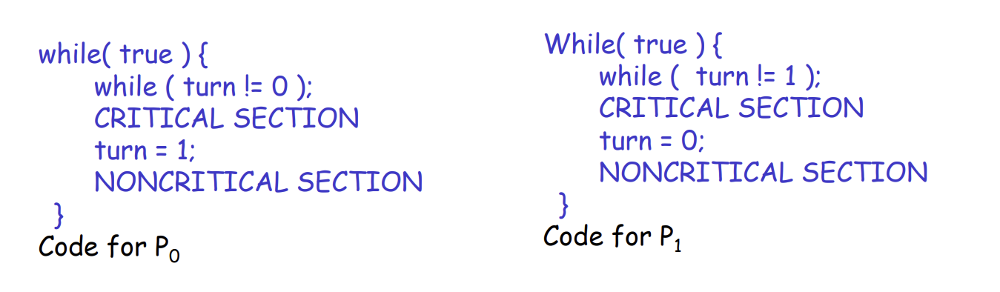

上述程序有Busy waiting的问题，且如果一个进程出问题了，另一个要等待无限长的时间


无论是什么方法，进入临界区之前都需要**锁**


**Semaphores信号量**

+ 初始化：可以将信号量初始化为任意**非负值**，S=10表示系统最多支持10个用户登录。

+ 减1操作（P操作 down）：进程执行 `P(S)` 操作时，信号量值减1。只有当信号量值**大于0**时，进程才能继续执行；如果信号量值为0，进程会**阻塞**，进入等待队列。
+ 加1操作（V操作 up）：进程执行 `V(S)` 操作时，信号量值加1。如果有进程因信号量为0而阻塞，那么执行 `V(S)` 后会**唤醒**一个阻塞的进程。否则，信号量值会**简单增加**。


信号量操作是**原子操作**，内部可能使用TSL

进程想要进入时执行**down**操作，退出时执行**up**操作


Binary Semaphore 即**S=1/0**，也被称为 mutex（互斥锁）


 # Sockets

计算机网络是一组相互关联(**interconnected collection**)的自主(**autonomous**)计算机集合


网络包含：

+ 硬件设备
  + **互联传输介质**，Interconnect transmission media
  + **运行协议软件**，Run protocol software
  + **控制数据传输**，Control transmission of data
+ 协议软件
  + **编码**和**格式化**数据
  + **检测**和**修正**传输中遇到的问题


地址address：唯一标识网络中节点的字节字符串

+ 单播**unicast**，消息发送给特定节点，属于点到点的同行
+ 广播**broadcast**，消息发送给网络中所有的节点
+ 组播**multicast**，消息发送到网络中一个特定的节点子集


路由**route**：将消息从发送端传送到目标结点的过程，这个过程依赖**目标结点的地址**


大多数网络应用可以划分为**客户端**(sometime on 主动发起连接)和**服务器**(always on 被动接收请求，需要固定的地址)


Socket是一个**抽象层**，通过它，应用程序可以**发送和接收数据**。它类似于他打开一个文件句柄(open-file handle)，应用程序通过文件句柄与文件进行读写操作，而应用程序通过socket与网络中的**其他应用**进行数据交换。

通过socket，处于**同一网络中**的不同应用程序能互相通信

socket是进程间通信的端点**(end point)**，本身也作为**API**用于创建网络应用程序，数据的传输必须通过**底层的网络**。


数据传输的过程

+ **网络层**基于目标**IP**地址发送**数据包**
+ **操作系统层**基于目标**的端口号**传送数据到目标**socket**
+ **应用层**读写socket中的数据，并解释


TCP(**Stream Socket**)

+ **保证交付 Reliable**
+ **字节流stream of bytes-按顺序交付**
+ **面向连接connect oriented，每一个连接有一个socket**
+ **传输数据前建立连接**


UDP(**Datagram Socket**)，多媒体，IP语音，类似于Postal Mail

+ **不保证交付 No Guaranteed delivery best effort** 
+ **无序 no in-order**
+ **数据包独立**
+ **单一的socket接收信息**
+ **必须为每个数据包指定地址**
+ **无连接 connectionless**


IPv4 **32**位，IPv6 **128**位

每个主机可以运行多个不同的进程，因此需要端口号port来唯一标识每个进程的通信端口。端口号是一个**16**位的数字，**web-80** **email-25**

服务器使用**0-1023**的端口(需要**root**权限)，客户端使用**1024-65535**的临时**ephemeral**端口


socket标识符由三部分组成：**主机地址host address 传输协议 Protocol 端口号Port Number**

主机之间的通信通过两个IP地址和两个端口号来标识，同时**底层协议**(TCP/UDP)也会影响通信的区分。


对于客户端

+ 初始化
  + gethostbyname
  + **socket 创建**
  + **connect 连接到端口**
+ 传输数据
  + send
  + recv
+ 中断
  + close


对于服务器

+ 初始化
  + **socket**
  + **bind 绑定端口**
  + **listen 进入监听状态**
+ 循环
  + **accept 接收请求**
  + rec
  + send
+ 中断
  + close


注意到TCP**先建立连接再传送请求**

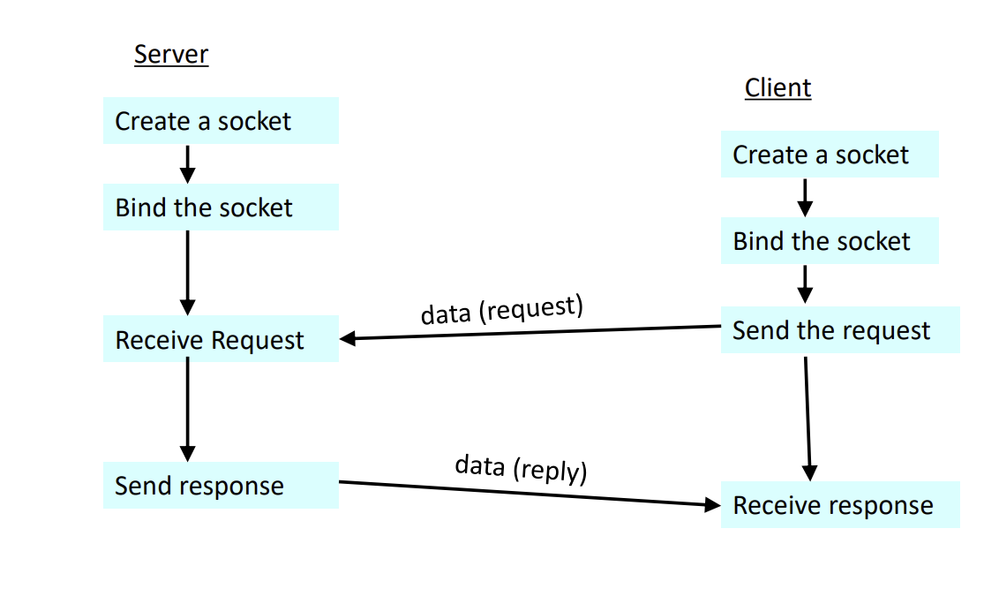


通过**fork**处理客户端请求

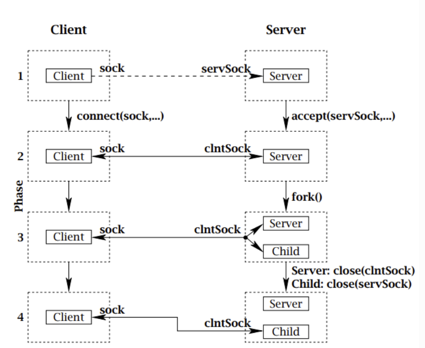

servSock服务器套接字，**用于监听请求**

clntSock客户端套接字，**与发送请求的客户端通信(accept返回)**

**父进程需要关闭clntSock**，因为子进程去处理了，**子进程要关闭servSock**，因为它不需要监听

 

#  DeadLocks

一组进程每个都持有一部分资源同时又在**等待**其他进程**释放**它所需的资源，一般发生在线程/进程**争抢资源**或者**通信**。处于死锁的进程**不可运行**，**释放资源**，**被唤醒**(其等待一个永远不会发生的事件)

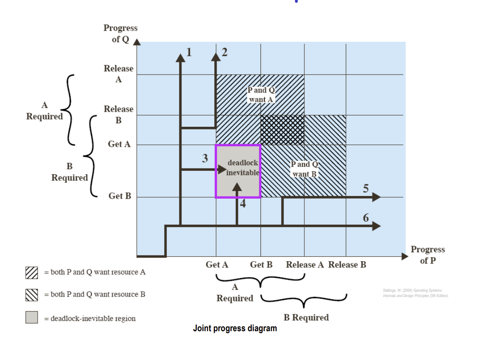

灰色区域有时被称为swamp


死锁取决于程序设计**program design**和调度情况**scheduling condition**

改变**代码的逻辑**可以避免死锁

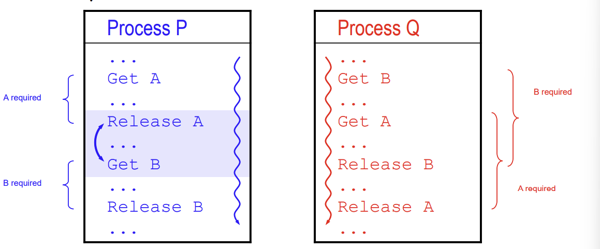


下图不会形成死锁因为没有出现**循环**

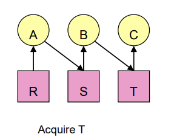


系统模型

资源类型：通常表示为**R1, R2, ..., Rm**，例如：CPU计算能力，内存空间，I/O设备，可抢占资源**Preemptable** ——能被**安全**地从一个进程哪里拿走，不可抢占资源**Nonpreemptable** ——如果拿走会导致**进程崩溃**。

资源实例：每个资源类型都有**多个实例**，用Wi标识

进程对资源的使用有三个过程：**请求request，使用use，释放release**


死锁形成的四个必要条件：

+ **互斥Mutual Exclusoin**，每个资源只能分配给一个进程
+ **Hold and wait**，一个进程持有资源的同时可以**请求更多的资源**
+ **No preemption**，资源**不可被抢占**，除非进程主动释放，即 exclusive access独占
+ **循环等待Circular Wait**，存在一个循环链，链中至少有**两个及以上**的进程，每个进程都在等待**下一个**进程持有的资源，具体可以表示为有一组进程，**{P0, P1, ..., Pn}**，这些进程都处于**等待状态**，每个进程都在等待下一个进程持有的资源
  + **P0** 等待 **P1** 持有的资源，
  + **P1** 等待 **P2** 持有的资源，
  + ...
  + **Pn-1** 等待 **Pn** 持有的资源
  + **Pn** 等待**P0**持有的资源


用图表示


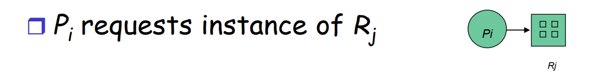


如果图中**没有环**，那么不存在**死锁**

如果存在**环**

+ 每个资源**只有一个实例**——**必然死锁**
+ 每个资源有**多个实例**——**可能死锁**


下图不存在死锁，因为资源有**多个实例**，没有被环占用的实例**最终会被释放**

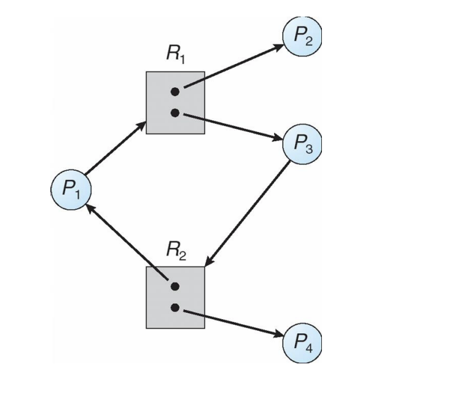


下图存在死锁

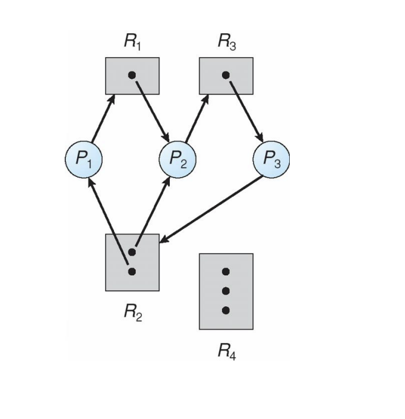


操作系统处理死锁的方案：

+ **忽略**，有很多系统都是这样处理的
+ **检测并恢复**
+ **动态避免死锁**(谨慎地分配资源)
+ **预防死锁**，从源头上避免死锁的四个条件之一


Ostrich Algorithm(鸵鸟算法)

+ **假装死锁不存在**，因为死锁**很少**发生，且预防的**代价昂贵**
+ **Unix和window**采取这种策略，现代计算机**资源很充足**，死锁很少出现，如果出现了**直接重启**


死锁预防Deadlock Avoidance

+ 保证系统时刻处于**安全状态**，如果请求会导致进入不安全状态，那么**拒绝**这个请求。安全状态safe state指的是，不管进程如何请求资源，只要按照**某种顺序分配资源**就能保证不发生死锁
+ **阻止循环等待**
+ 系统执行前需要知道每个进程对资源类型的**最大需求量**


**银行家算法**——动态避免死锁

在允许一个资源请求之前，先**模拟**一下看看系统是否会变得不安全，如果会变得不安全那么拒绝请求，反之批准请求，银行家算法十分小心，**不安全并不等于会出现死锁**，但该算法仍会拒绝请求。


当满足进程资源要求之后(**到达limit**)，进程完成任务并**释放**资源，此时可用资源会**加上**该进程所需的资源


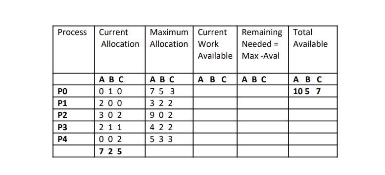


**系统总资源**：A=10, B=5, C=7

| 进程 | 当前分配(Current Allocation) | 最大需求(Maximum Allocation) | 仍需资源(Remaining Needed) |
| ---- | ---------------------------- | ---------------------------- | -------------------------- |
|      | A  B  C                      | A  B  C                      | A  B  C                    |
| P0   | 0  1  0                      | 7  5  3                      | 7  4  3                    |
| P1   | 2  0  0                      | 3  2  2                      | 1  2  2                    |
| P2   | 3  0  2                      | 9  0  2                      | 6  0  0                    |
| P3   | 2  1  1                      | 4  2  2                      | 2  1  1                    |
| P4   | 0  0  2                      | 5  3  3                      | 5  3  1                    |


**当前已分配资源总计**：A=7, B=2, C=5  ，**可用资源(Current Work Available)**：A=3, B=3, C=2 (计算：总资源-已分配)

安全序列检查步骤

1. **初始可用资源**：A=3, B=3, C=2

2. **寻找可满足的进程**：
   - 比较每个进程的"仍需资源"与"可用资源"
   - P1需要(1,2,2) ≤ (3,3,2) → 可以满足
   - 选择P1执行

3. **P1执行完成**：
   - 释放P1的资源：A=2, B=0, C=0
   - 新可用资源 = (3,3,2) + (2,0,0) = (5,3,2)

4. **继续寻找**：
   - P3需要(2,1,1) ≤ (5,3,2) → 可以满足
   - 选择P3执行

5. **P3执行完成**：
   - 释放P3的资源：A=2, B=1, C=1
   - 新可用资源 = (5,3,2) + (2,1,1) = (7,4,3)

6. **继续寻找**：
   - P4需要(5,3,1) ≤ (7,4,3) → 可以满足
   - 选择P4执行

7. **P4执行完成**：
   - 释放P4的资源：A=0, B=0, C=2
   - 新可用资源 = (7,4,3) + (0,0,2) = (7,4,5)

8. **继续寻找**：
   - P0需要(7,4,3) ≤ (7,4,5) → 可以满足
   - 选择P0执行

9. **P0执行完成**：
   - 释放P0的资源：A=0, B=1, C=0
   - 新可用资源 = (7,4,5) + (0,1,0) = (7,5,5)

10. **最后执行P2**：
    - P2需要(6,0,0) ≤ (7,5,5) → 可以满足
    - 选择P2执行

找到的安全序列为：**P1 → P3 → P4 → P0 → P2**

因为存在至少一个安全序列，所以**系统当前处于安全状态**，不会发生死锁。

注意可能存在**多个**安全序列


# Main Memory

**volatile**——数据无法长久存储

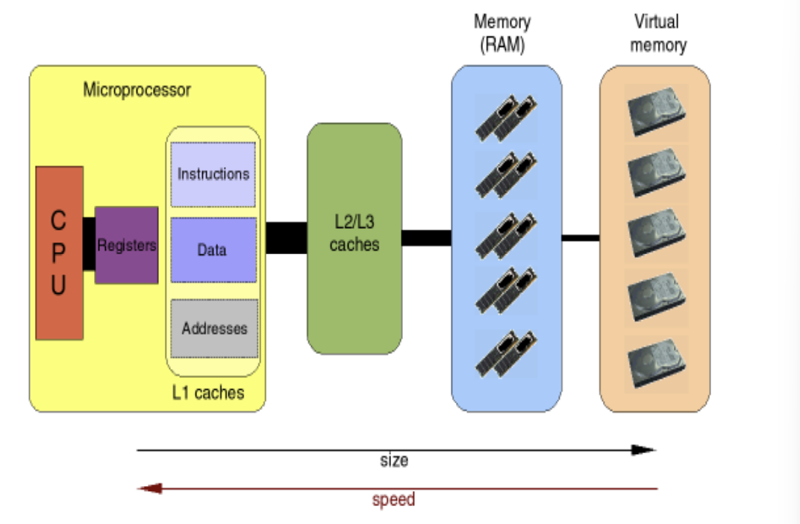


**Cache（高速缓存）：**是容量很小但是非常快、也很贵的内存，主要用来存放最近用到的数据，减少访问主内存的时间。

- **L1 Cache（一级缓存）：** 通常直接集成在CPU芯片内部，非常快。
- **L2 和 L3 Cache（二级和三级缓存）：** 放在CPU外部的，使用SRAM（静态随机存取存储器）。速度比L1慢一些、容量也大一些。

**Main Memory（主存，即RAM）：**使用的是DRAM（动态随机存取存储器），速度中等、价格也适中，容量比Cache大得多。

**Disk（磁盘存储）：**是最慢但最便宜、容量最大的存储，比如固态硬盘（SSD），可以存储GB,TB级别的数，而且是**非易失性**(non-volatile)（断电不会丢失数据）,上述的几个都是volatile。


在只有一个程序运行的简单系统中，内存管理很基础：操作系统，设备驱动，程序布置到内存中即可，不需要分页paging，换出swapping，以及内存保护，但是要保持一定的灵活性。


固定分区Fixed partitions，分区的大小在启动时就已确定，分区的大小可以相同也可以不同，但长度不会变化。

如果分区大小相同，那么放到那个分区都一样，如果程序大小占不满分区会造成浪费，**internal fragmentation**

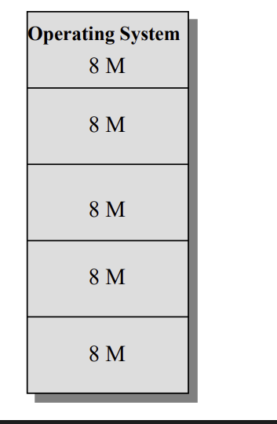

如果分区的大小不同，那么每个进程会分配给刚好能装下他的最小分区。

每个分区可用有自己的队列，当分区空闲时进程可以直接装入，否则新来的进程要在对应的队列中排队等待。

或者使用一个总队列，可以最大化利用率

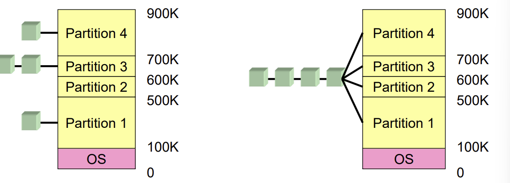


如果进程大多是I/O密集型的，那么需要放更多的进程来弥补CPU空闲，进程越多CPU利用率越高


动态分区Dynamic Partitioning

+ 分区的长度和数量可变
+ 进程按需分配内存
+ 随着进程的加载释放，内存中会留下不连续的空闲区域 External Fragmentation
+ 为了应对External Fragmentation，需要进行Compaction内存压缩，通过移动进程，使其连续排列，并将所有空闲内存合并为一个大的空闲块。

动态分区算法：

+ 最佳适应算法 Best-fit：选择最小的足够大的空闲内存块，总体性能最差，因为要找所有的分区，并且会留下许多小的不连续的空间因此需要经常压缩。
+ 首次适应算法 First-fit：从头开始扫描，找到第一个大小合适的空闲块进行分配
+  下一个适应算法 Next-fit：从上一次分配结束的位置开始扫描
+ 最差适应法 Worst Fit： 选择最大的空闲块


操作系统想要实现Multiprogramming必须：

+ 重定位relocation：操作系统不能确定程序被加载到内存的那个位置，因此变量和程序不能使用绝对内存地址，需要支持重定位才能将程序的代码和数据迁移到不同的位置而不改变程序的逻辑和行为
+ 保护：防止进程访问其他进程的内存，防止进程修改自身的内存敏感区域(代码段)


base register 记录进程的开始位置（物理地址），bound register记录进程的结束位置，limit register 最大地址偏移量。

它们的值在进程载入load或swap in 时设置，这两个寄存器只有在系统模式下(system mode)才能访问。

- **虚拟地址Logical Address，进程视角下的地址**

- **物理地址Physical address，实际内存中的地址，Physical address = base + logical address**

当程序执行时，所有的相对地址都会加上基址寄存器的地址得到一个绝对地址(物理地址)，然后与界限寄存器中的值比较，确保该地址在进程的内存范围内，实际上直接比较limit register的值与logical 地址即可

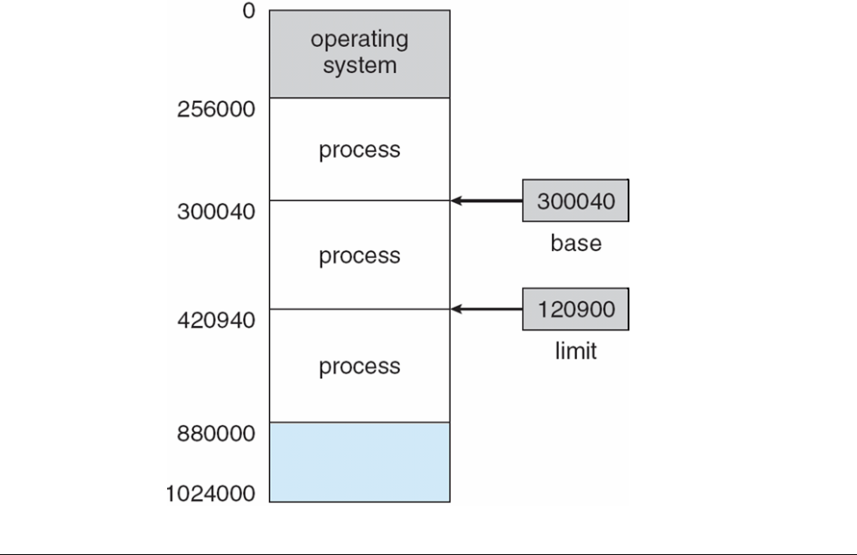


bitmap可以记录内存使用，每一位对应固定大小的一块内存区域，块越小需要的内存就越多，1表示已分配，0表示空闲。位图的大小只和总内存有关于分配状态无关，如果1bit表示4KB，那么1MB需要256bit。

寻找空闲区域需要扫描位图，不容易快速找到，但是修改状态只需翻转。

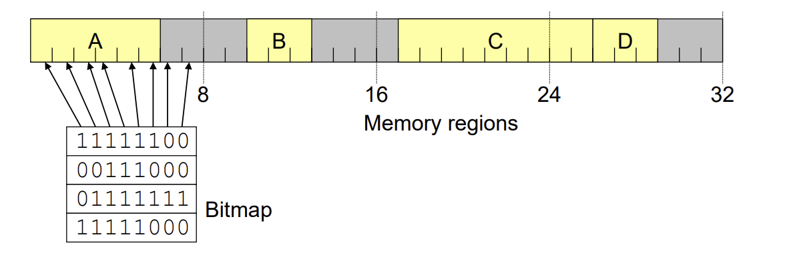


链表也可以记录内存使用，每一个条目表示空闲或已使用的连续内存区域，节点记录两个信息，起始位置—内存大小

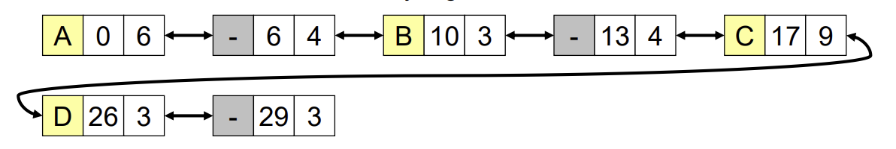


当内存被划分为较大的连续块时，链表的管理效率较高，因为节点的数量较少。

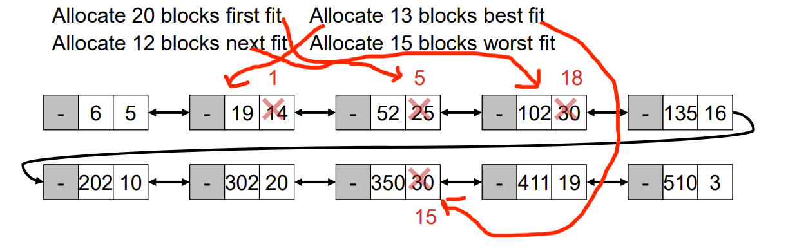


交换技术是一种常见的内存管理技术，用于将不活跃的金册灰姑娘一处内存，腾出空间给其他进程。这种技术会带来一些问题

+ 交换技术要求整个进程必须能够进入物理内存，因此无法运行比物理内存还大的进程(虚拟内存可以实现)
+ 内存碎片化fragmented
+ 进程要么完全在内存中，要么完全在磁盘中，即使只交换一小部分内存也必须交换整个进程


覆盖技术overlays，分批加载进程的不同部分到内存中(一般是数据部分)，只将当前需要的代码/数据留在内存中，动态替换非必须的部分，用户自行实现不依赖操作系统的特殊支持，但编程设计较为复杂。

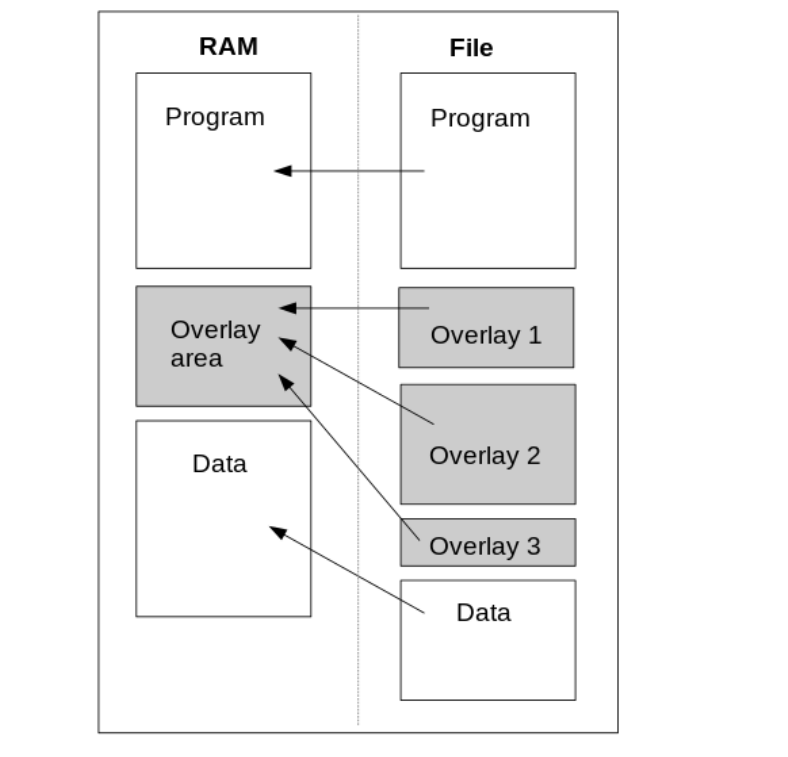

overlays可以解决第一个问题，仍然无法解决碎片化fragmented和进程部分驻留partially resident processes(仍要频繁地交换)


# Paging

分页技术：**物理内存**划分为**大小相等**的**页框**，进程的**逻辑空间地址**被划分为与页框**大小相同**的**页**，注意同样大小，二者**相互对应**。

这种技术不会产生外部碎片**external fragmentation**，但会出现内部碎片**Internal fragmentation**，内部碎片的**平均**大小是每个进程**一个半页**，页越大，就有越多的**空间**被浪费，反之**页表更大**。


虚拟内存(VM)使得操作系统可以处理比实际物理内存(PM)**更大**的地址

+ **将频繁访问的数据保留在物理内存中**
+ **不常使用的数据被移到磁盘**
+ 对进程**隐藏**内存和磁盘的交换过程，进程看到的是一个**连续的虚拟地址空间**，操作系统对数据的移动完全**不需要进程的参**与。
+ 虚拟内存在multiprogramming十分有用，**帮助实现并发**(没有虚拟内存需要将进程全部加载到内存中执行，而虚拟内存能节省空间)


每个进程页对应一个页框frame，操作系统必须知道哪些页框是空闲的，哪些页框已被分配，操作系统通过页框表**frame table**管理页框，页框表中的条目entry对应一个**页框**，其记录页框的**是否被分配**，如果被分配则**指示对应的页面**。


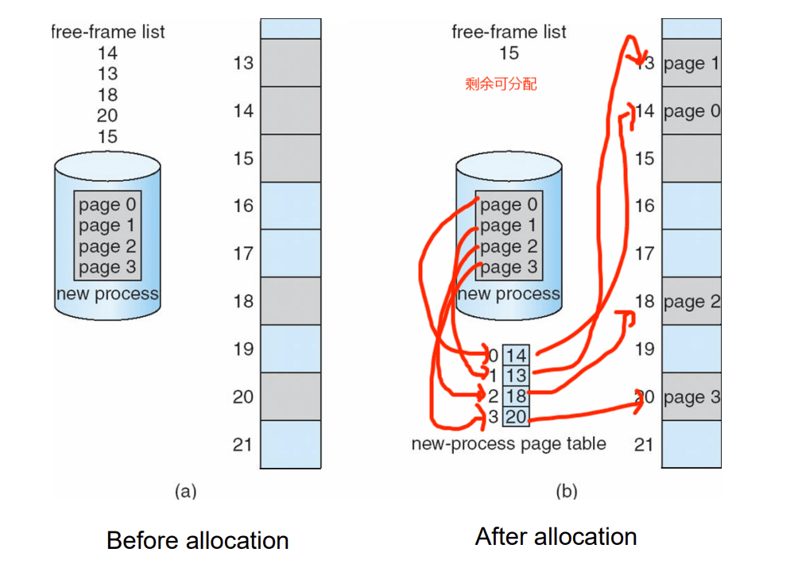


程序只使用**虚拟地址（逻辑地址）**，每个进程都有自己的**虚拟地址空间**，但虚拟地址**不能直接访问**物理内存，需要通过硬件——**MMU**(Memory Management Unit)转换，一般和**CPU**处于同一位置，逻辑空间地址不需要和物理地址**一样大**。

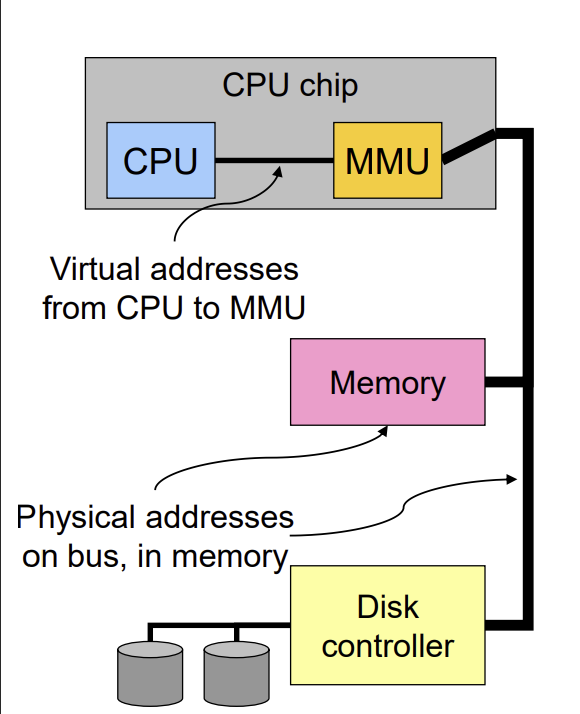


如果某段代码是**只读的**(reentrant)，那么不同进程之间可以**共享**这一份代码的副本，必须在所有进程的**虚拟空间映射到相同的位置****(不是页表)**

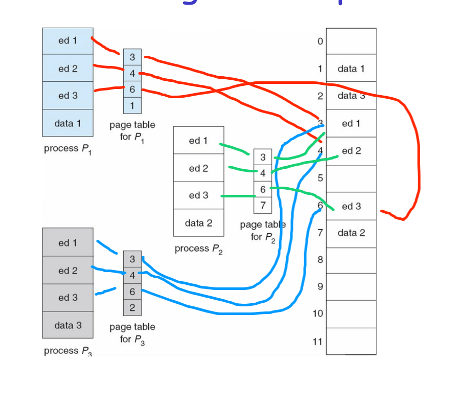

**私有数据不能共享**，它们可以在进程的虚拟地址空间的**任何**位置


操作系统会维护每个进程的**页表**，页表中记录了**进程的每一页储存在那个物理内存中**，页表始终储存在**内存**中，**PTBR(Page-table base register)储存页表的起始地址，PTLR(Page-table length register)储存页表的大小**。

**页表负责将虚拟页号转换为物理页号**

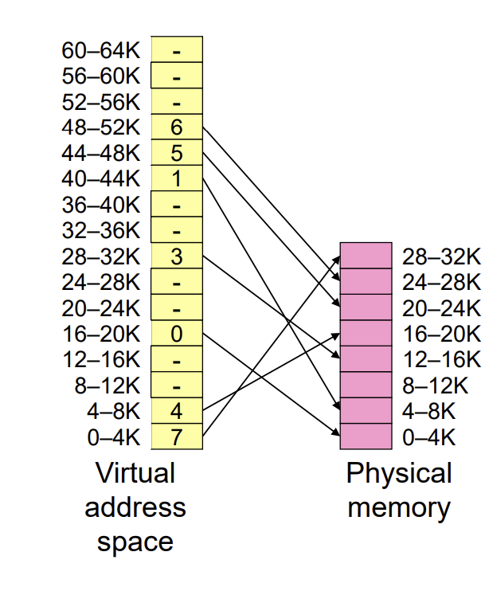

页表项**PTE**储存**映射关系**，虚拟页并不一定要对应一个物理页，物理页也不一定要被使用


虚拟地址分为两部分：

+ **页号page number p  用于在页表中查找对应的页框**
+ **页内偏移offset d 确定数据在页框中的具体位置**


**n是偏移的位数，m是虚拟地址的位数**——logical address space对应$2^m$，page size(**entry in page**)对应$2^n$，偏移量也就是页的大小


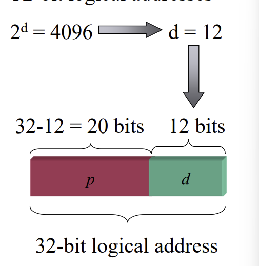


映射过程

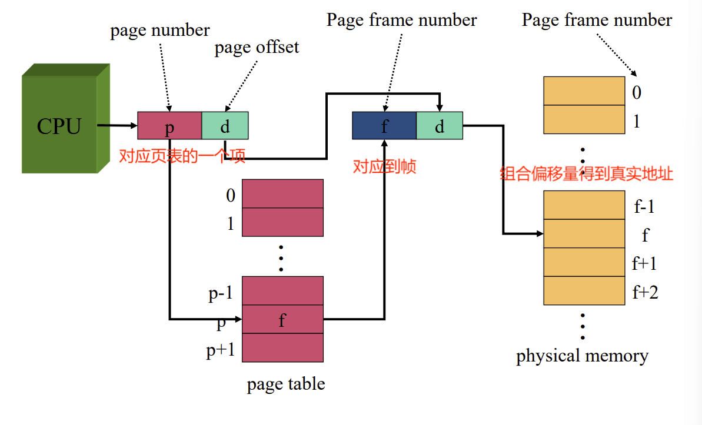


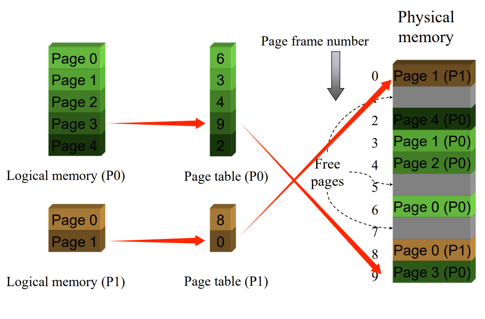


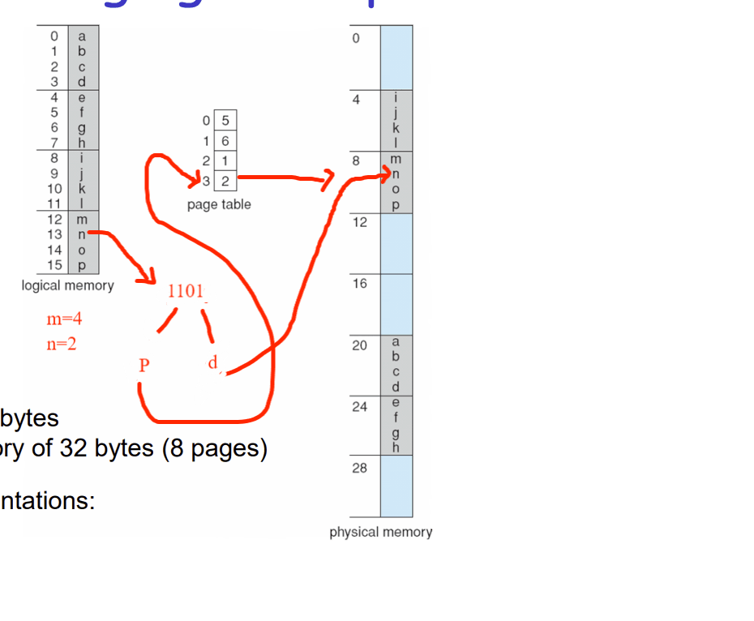


这个过程每次需要进行**两次查找**：**虚拟地址通过页表转换为物理地址，再去访问物理地址**，为了减小开销出现了**TLB** Translation Look-aside Buffers，**其存储虚拟地址到物理地址的直接转换**，同时每个条目还储存一个空间标识符**ASID**，**用于唯一标识进程**，以**提供地址空间保护**。

TLB是**关联存储器(Associative memory)**，可以在**所有**条目中**并行**地查找地址映射，当搜索时，如果**p（页号）出现在TLB中**，那么**直接返回对应的物理帧号**，反之要**去页表中查找**，一般会将查找结果更新到TLB中。

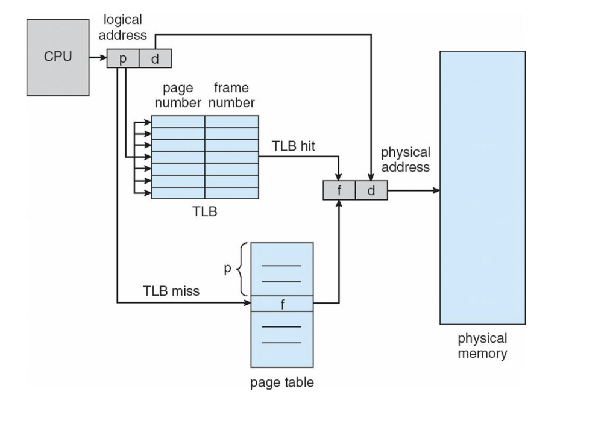


**Hit Ratio 命中率**，如果等于80%则表示80%的时间能直接在TLB中找到

**TLB HIt Time 命中时间——TLB搜索时间+访问内存时间**

**TLB Miss Time 未命中时间——TLB搜索时间+访问内存时间*2，要查询主存中的页表所以需要额外访问一次内存。**

**Effective Access Time (EAT) 有效访问时间=Hit Ratio*TLB HIt Time +(1-Hit Ratio)TLB Miss Time**

假设有80%的命中率，访问内存需要100ns，搜索TLB需要20ns，

1. TLB HIt Time=100+20
2. TLB Miss Time =100*2+20
3. EAT=0.8*120+(1-0.8)\*220


现代操作系统中，虚拟内存地址十分巨大32~64位，如果偏移量是**4KB(12位)**，那么32位虚拟地址的页表需要20位——千万级别的条目数，**内存开销巨大**，同时访问内存时，每条指令又需要**访问页表**，这会带来**性能上的开销**，TLB虽然可以加快访问速度，但十分**昂贵**。


**两级页表查找**，假设一个32位的虚拟地址中，页偏移是10位，页号是22位，因为页表太大，所以进一步把页号划分为两级

+ 第一季页表索引 12位
+ 第二季页表索引 10位


**其中一级页表的项指向二级页表，二级页表指向物理帧号**


同理还有三级分页


当地址空间大于32位时，需要用哈希页表**hashed page table**，哈希表的每个条目可以存储**多个虚拟地址的页号**(**页号通过哈希函数计算得到相同的值**)，然后在其哈希链**chained list**中存放**实际页号和物理帧号**。

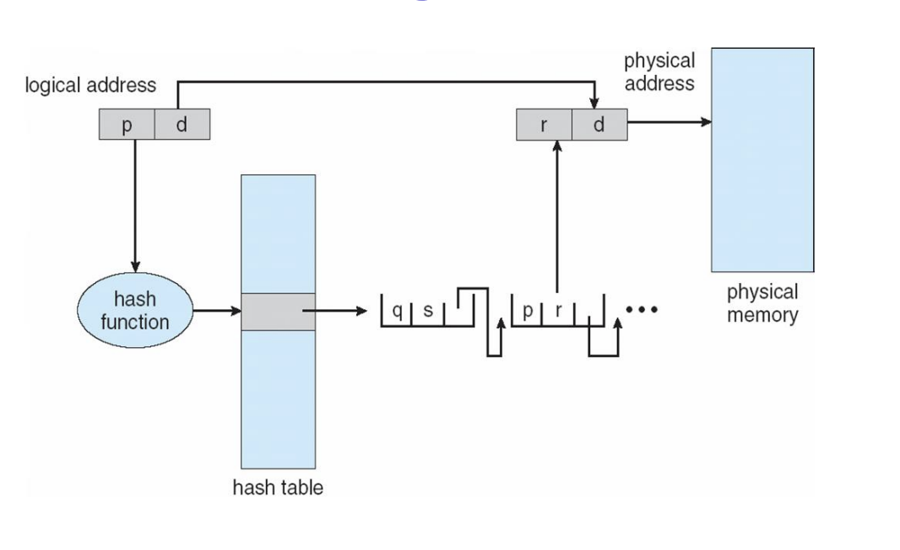


**反向页表 Inverted Page Table**

与传统页表不同，反向页表维护每个frame对应的**虚拟页地址，以及哪个进程拥有该地址**，大大**减少了内存**，但是**查找速度慢**，可以用**哈希表加速计算**，每次输入**(pid, vpn)**查询。

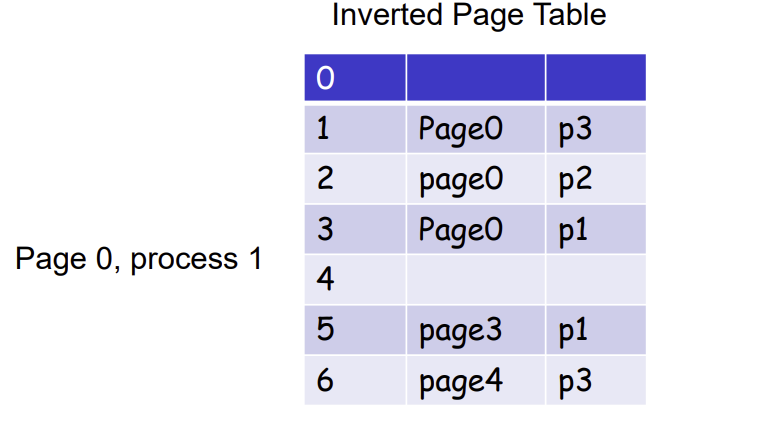

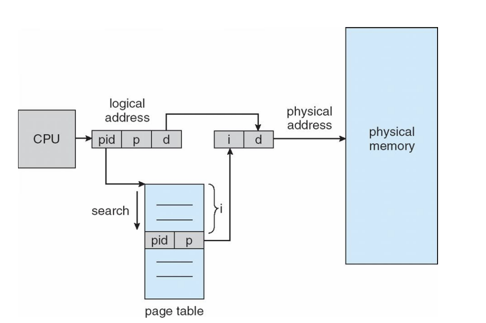


**Segmentation段式管理**，从**用户视角**出发划分内存，比如说将程序划分为函数，类，数组

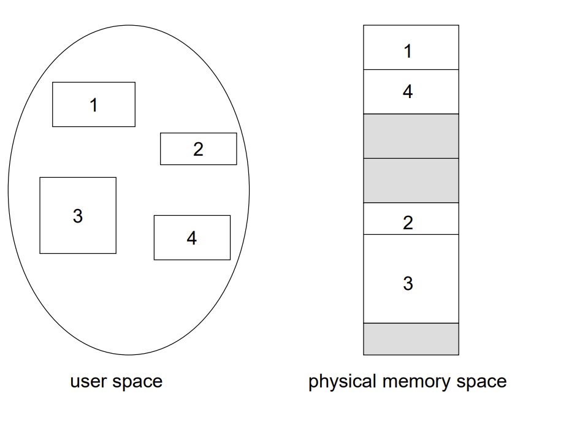

段式管理中，虚拟地址是一个**二元组——段号，偏移量**。

段表用于将虚拟地址转换为物理地址，其中每个条目记录：**段在内存中的起始位置base以及段的大小limit**。

此外还有**STBR**( Segment-table base register)指向**段表在内存中的起始位置**，以及**STLR**，Segment Table Length Register段表长度寄存器，**指明程序用了多少段**。

段表的每个表项还带有**保护信息**，验证位**validation bit**，**0**表示非法段，**1**表示合法段，以及**权限控制**(读写...)。

因为段的**长度不同**，所以内存分配成了**动态分配**问题，可能会出现**外部碎片**。

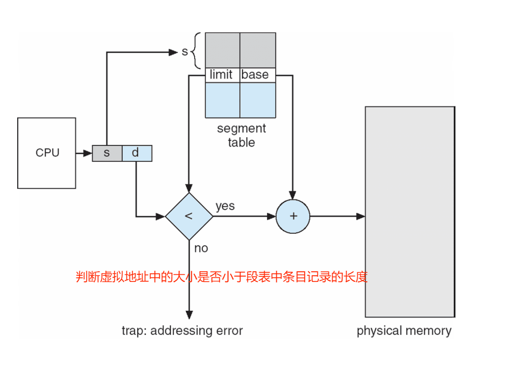


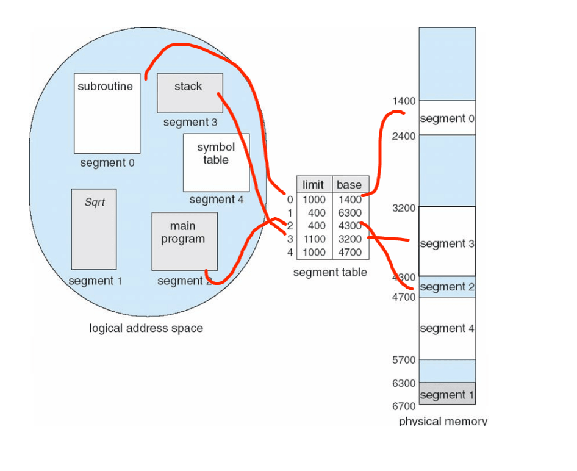


# File Systems 

文件系统指的是**整个目录树(整个目录层次)**，用于组织电脑上的文件，通常储存在**磁盘**上，磁盘可以划分为**多个分区**，每个分区都有**独立**的文件系统

**扇区sector**是磁盘的**最小单位**，磁盘的**0级**sector是**MBR**(Master Boot Record)，分区表位于MBR**尾部**包含**每个分区的起始和结束位置，其中有一个分区被标记为active活跃分区。**


计算机启动时**首先读取并执行MBR中的代码**，MBR程序首先确定哪个分区**被标记为活动分区**，然后去读活动分区的**第一个块**，这个块中的程序负责**加载该分区的操作系统**。


文件：**字节序列**

磁盘：**由扇区(sectors)组成(512字节)，文件必须存储在扇区中**

文件系统会定义一个**块block**，其必须为**每个文件分配块(文件必须存储在块中)**，**块由若干个连续的扇区组成**，文件系统把磁盘看作是**块的数组**。


四种常见的文件块分配方法

+ Contiguous Allocation（连续分配）：**把整个文件存储在磁盘上连续的一段块中**，一个50KB的文件就需要50个连续1KB的磁盘块
  + 这种方式十分**简单**，每个文件只需记录**第一个块的磁盘地址以及用了多少块**，**读取**性能是**最好**的。
  + 会出现**碎片**，需要定期清理，系统必须**在创建时知道文件的最大可能大小**，防止插入到**空洞**时出问题。
  + 只适合**只读存储介质**——DVD，CD-ROM，**不会删除且文件大小已知**。

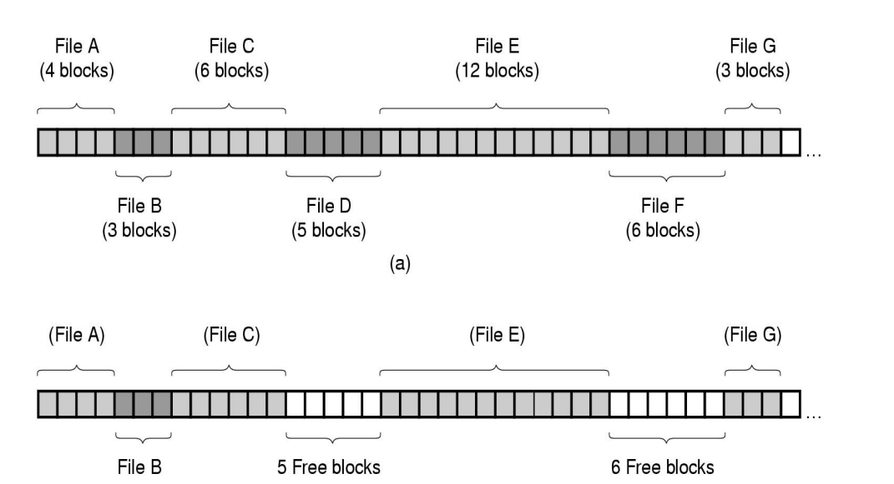

+ Linked List Allocation（链式分配）
  + **不存在碎片化问题**
  + **随机访问速度慢**

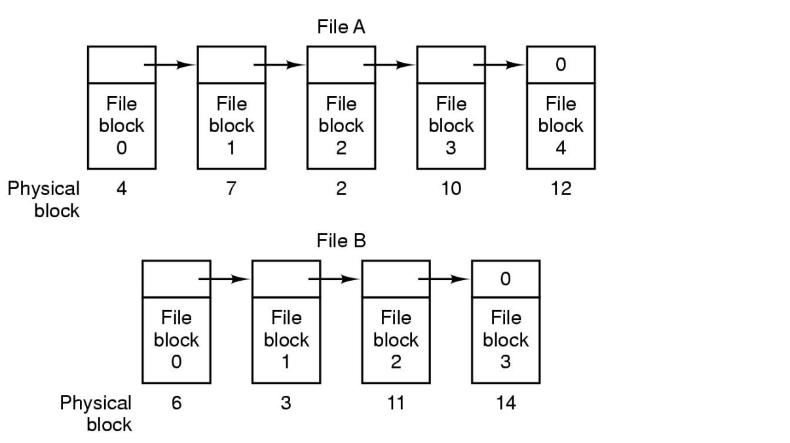

+ Linked List Allocation using Index（用索引表的链式分配）：将磁盘块中的指针字pointer word提取出来，**存在内存中的FAT表**，FAT表的**索引**对应一个磁盘块，**表项中存储该磁盘块的下一个**，使用**-1**标识结尾
  + 虽然还是沿着链子找，但**不需要引用磁盘因此更快**
  + **FAT占用内存**

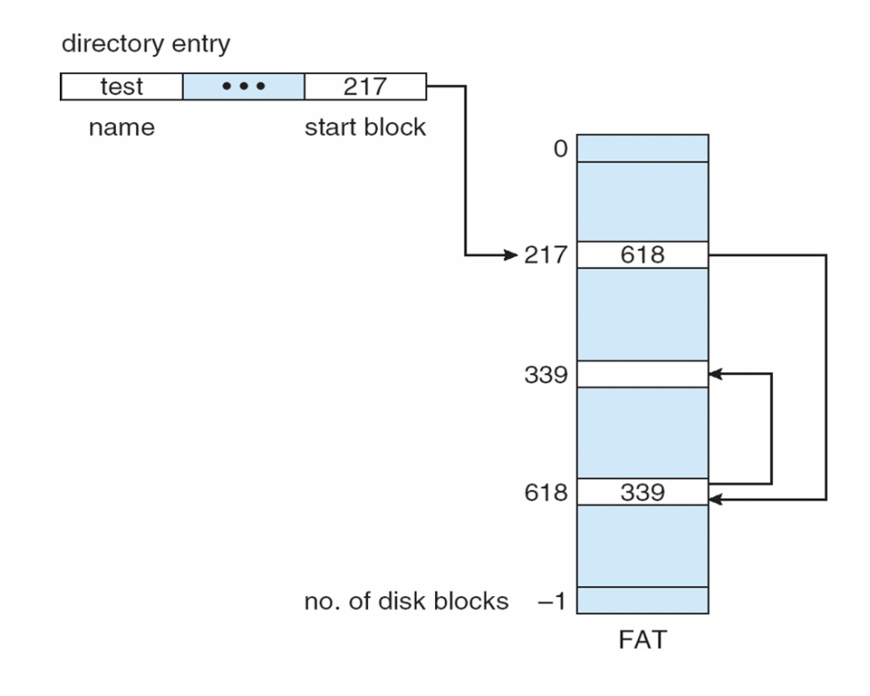


+ I-nodes（索引节点）：每个文件对应一个**固定大小**的**i-node数据结构**，其中**存放文件属性以及指向文件数据块的指针(直接/间接)**，操作系统可以通过i-node找到文件**所有的数据块**。当直接数据块指针用完了会将使用**预留**的**最后一个指针**(间接指针)，该指针指向一个**专门存储额块列表**的磁盘块
  + **减少内存使用**
  + **更新复杂度较高，多级指针**

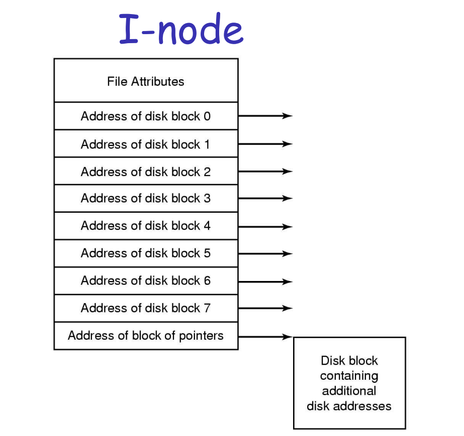

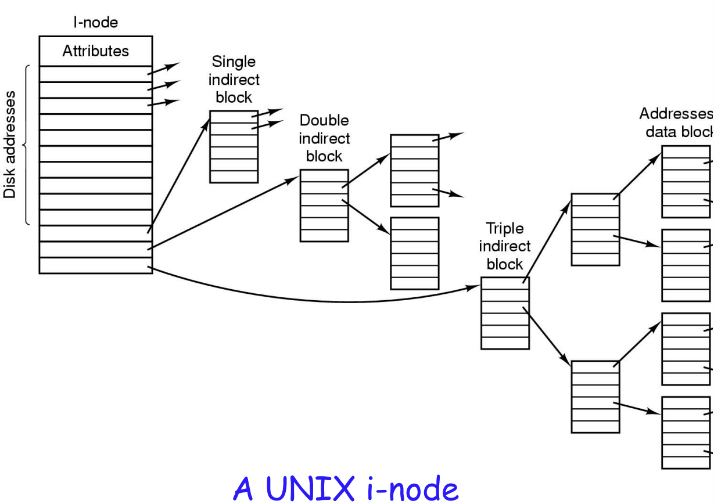

**目录的存储结构与文件类似(本质就是一种特殊的文件)**，其额外包含一个**16字节**的**目录项数组directory entries**，数组的每个条目包含**文件名**，对应的**i-node编号**(指向i-node结构，每个文件/目录创建时会被分配**唯一一个编号**)，**文件名可以指向另一个目录**。


打开一个文件时，操作系统需要知道**文件的路径名**，操作系统根据路径名**定位到目录项**，unix系统中使用**superblock**记录文件系统的基本信息——**文件系统的总大小，块的大小，空闲块，已使用块的数量位置，以及根目录对应的i-node的位置**。

以查找路径名`/usr/ast/mbox`为例，步骤如下：

1. **找到根目录(root directory)：**
   - 根目录中包含每个文件和子目录的信息。
2. **查找路径的第一部分`usr`：**
   - 在根目录里找到名字叫`usr`的目录项。
   - 得到它的i-node号，比如i-node号是**6**。
3. **根据`usr`的i-node信息找到`/usr`目录的数据：**
   - i-node记录了这个目录的数据块位置，比如在**块132**(block 132)。
4. **在块132中继续查找路径的下一部分`ast`：**
   - 在`/usr`目录里找到名为`ast`的子目录的目录项。
   - 得到`/usr/ast`对应的i-node号。
5. **根据`/usr/ast`的i-node信息，找到它的数据块：**
   - 再在`/usr/ast`目录中查找文件`mbox`。
6. **找到文件`mbox`的i-node：**
   - 将`mbox`的i-node读入内存。
   - 文件一直打开着时，这个i-node会留在内存中，直到**文件被关闭**。

文件用数据块标识，那么**目录也是用数据块表示的**，目录的数据块中**会额外维护目录项数组**，因此可以继续找。

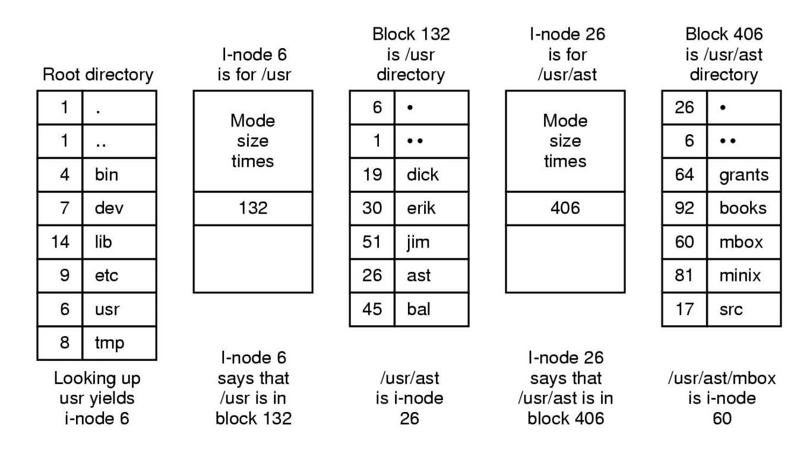


# Storage and I/O Management

I/O的基本硬件包括：

- **总线**(Buses)
- **设备控制器**(Device controllers)
- **设备本身**(Devices)


长期信息存储的三大核心要求：

+ 能够存储**大量数据**
+ 数据在进程**结束后**依然持久保存
+ 多个进程可以同时访问，**并发**

磁盘通过**I/O总线**bus连接到计算机


每个同心圆**concentric**是**磁道track**，磁道被划分为**扇区**，数据**串行排列serially**在磁道上


磁盘由**多个盘片platter**组成，每张盘片的**上下两面**都可以用于存储数据，**盘片相对位置相同的磁道组成柱面**，臂的末端会有**读写磁头head**，磁头**同时**移动。


磁头**前后**移动

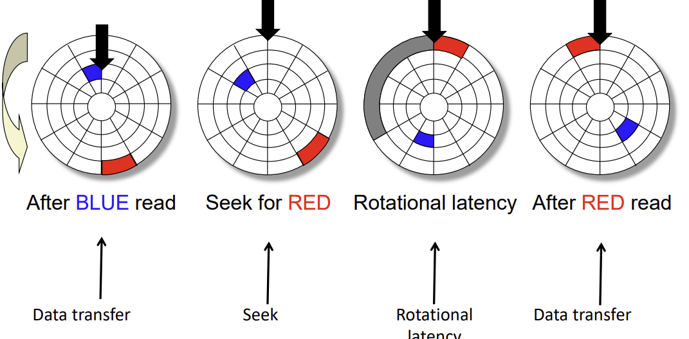


**latency**：启动磁盘传输的时间，**发出读写请求到数据真正开始传输之间的等待时间**。

seek time：**把磁头移动到正确柱面所需的时间，占时间的大头**

rotational time：**等待正确的扇区转到磁头下的时间**，一旦对准了磁道读取上面连续的扇区**十分快**，读取更多的数据到内存中有助于加快磁盘访问。


CPU发起磁盘读取操作时：

1. 将**读取命令**，**逻辑块号LBN**和**目标内存地址**写到磁盘控制器**disk controller**的**端口**
2. 磁盘收到命令后，定位到正确的扇区将数据通过**DMA**直接内存访问的方式传输到内存中，**无需CPU参与**
3. 传输完成后，**磁盘控制器**会发送一个**中断信号**给CPU

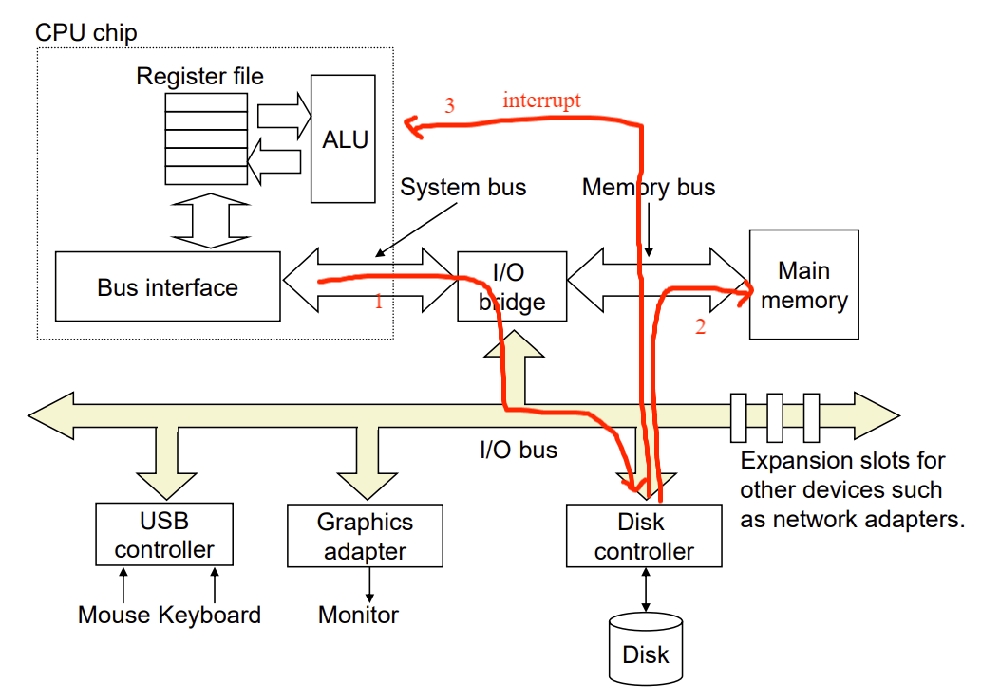


在早期的设计中，CPU需要自己**一字节一字节**的传数据，效率低下，为了**大批量快速搬运数据**设计了DAM。

DAM在传输数据时会**绕过CPU**，**直接在内存和设备之间传输**。操作系统会将**DMA命令写到内存中**，其中包括了**数据的源/目标地址，以及多少字节，读还是写**，随后会将这个命令的**地址**告诉**DMA控制器**，让其开始工作。传输数据时，DAM控制器会**暂时夺取总线bus**的控制权。注意这里的命令是告诉DMA怎么**把数据在磁盘和内存间转移**，而不是如何取磁盘中读数据。


CPU在执行完**每条指令**后会检查**是否有中断信号**，**Maskable Interrupt可屏蔽中断**，可以暂**时屏蔽/延迟处理**

中断向量**Interrupt Vectors**中记录了每种**中断对应的处理程序地址**，执行中断处理程序时要**保存上下文**，不同的中断有不同的**优先级**，如果多个设备**共享**一个中断号，则需要**一连串调用**

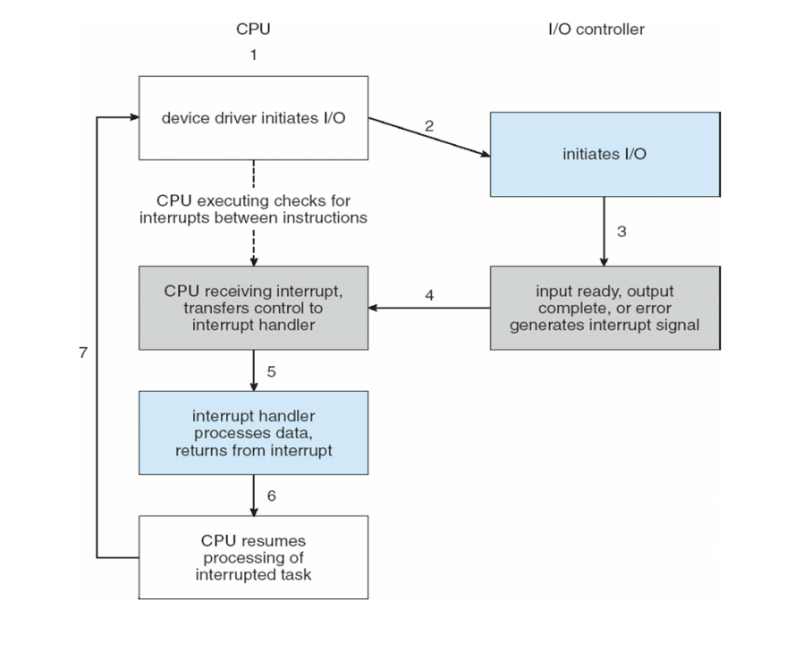


中断处理程序应该**隐藏**起来，只完成必要操作，中断处理程序需要设置自己的**上下文环境**，手动保存**未保存的寄存器**(CPU硬件会自动把保存一些寄存器)


 **Device-independent I/O software设备无关软件**，操作系统可以统一管理**驱动设备**

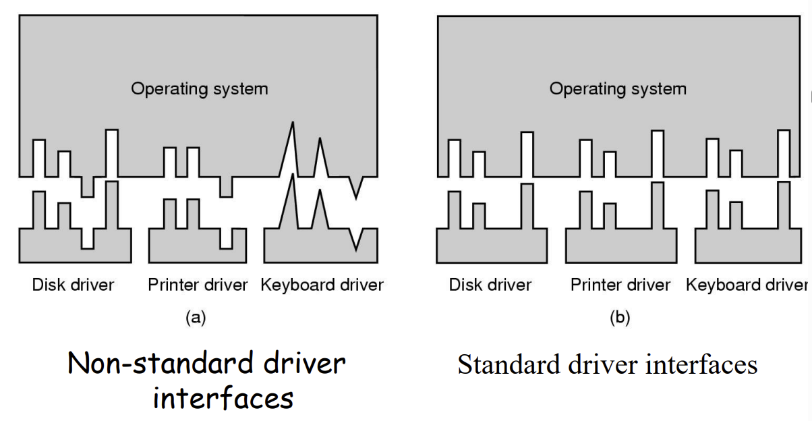


总线上的**数据传输是**由控制器**controller**完成的，每个磁盘**自带**一个磁盘控制器，

执行一次I/O的大致过程：

1. **计算机把读写命令写到主机控制器bus controller**
2. **主机控制器把命令传给磁盘控制器**
3. **磁盘控制器控制磁盘硬件**
4. **磁盘控制器中可能有缓存，用于加速命令**


磁盘带宽**disk bandwidth=Total bytes transferred / time to service request**


磁盘调度策略

**FCFS：易于实现，公平fairness，但会造成不必要的seek distance寻道距离**

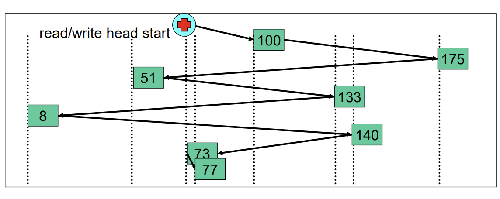

假设磁头初始位置为63，以下是待处理的请求磁道号：

- 请求顺序：100, 175, 51, 133, 8, 140, 73, 77

1. **磁头初始位置：63**

2. **计算寻道距离**：

   - 从63移动到100：**|100 - 63| = 37**
   - 从100移动到175：**|175 - 100| = 75**
   - 从175移动到51：**|175 - 51| = 124**
   - 从51移动到133：**|133 - 51| = 82**
   - 从133移动到8：**|133 - 8| = 125**
   - 从8移动到140：**|140 - 8| = 132**
   - 从140移动到73：**|140 - 73| = 67**
   - 从73移动到77：**|77 - 73| = 4**

   **总寻道距离** = 37 + 75 + 124 + 82 + 125 + 132 + 67 + 4 = **646** 个磁道

 

**SSTF，Shortest Seek Time First：每次选择与当前磁头位置最短的请求处理，可以减少寻道时间，但可能导致饥饿。**

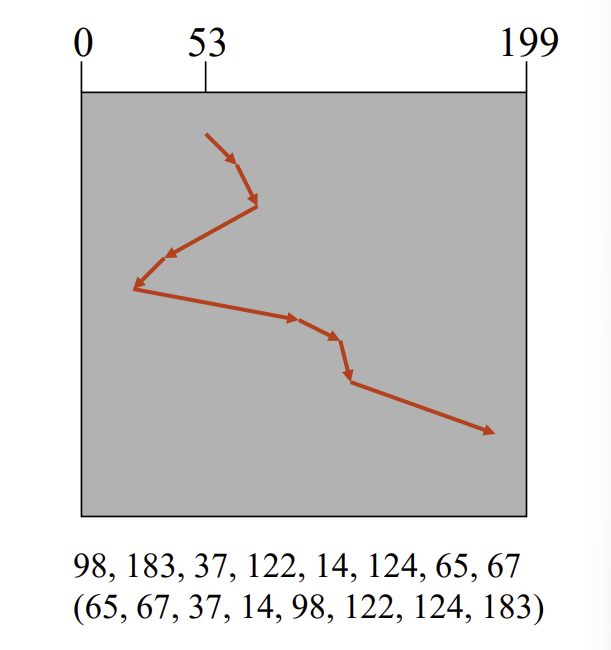

假设磁头初始位置为63，待处理的请求磁道号如下：

- 请求顺序：100, 175, 51, 133, 8, 140, 73, 77

1. **磁头初始位置：63**

2. **计算寻道距离**：

   - 从63移动到**73**（最接近的请求）：**|73 - 63| = 10**
   - 从73移动到**77**（最接近的请求）：**|77 - 73| = 4**
   - 从77移动到**100**（最接近的请求）：**|100 - 77| = 23**
   - 从100移动到**133**（最接近的请求）：**|133 - 100| = 33**
   - 从133移动到**140**（最接近的请求）：**|140 - 133| = 7**
   - 从140移动到**175**（最接近的请求）：**|175 - 140| = 35**
   - 从175移动到**51**（最接近的请求）：**|175 - 51| = 124**
   - 从51移动到**8**（最接近的请求）：**|51 - 8| = 43**

   **总寻道距离** = 10 + 4 + 23 + 33 + 7 + 35 + 124 + 43 = **279** 个磁道


**SCAN， elevator algorithm：磁头从磁盘的一端开始，沿着磁盘的一个方向移动，到达端点时再反向移动处理剩余请求**

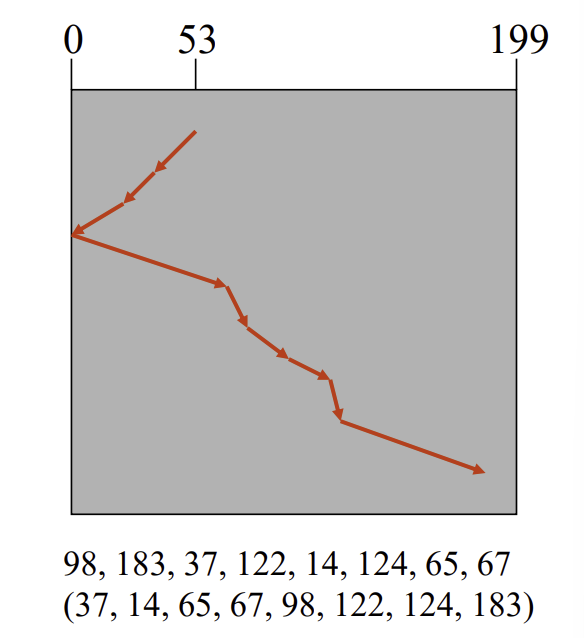

假设磁头初始位置为63，待处理的请求磁道号如下：

- 请求顺序：100, 175, 51, 133, 8, 140, 73, 77

1. **磁头初始位置：63**

2. **计算寻道距离**：

   - 从63开始，磁头向磁盘的起始位置移动，并依次服务请求。
   - 请求按顺序服务，直到磁头到达磁盘的最小轨道（0）。
   - 移动方向：63 → 51 → 8 → 0 → 73 → 77 → 100 → 133 → 140 → 175。

   计算寻道距离：

   - 从63移动到51：**|63 - 51| = 12**
   - 从51移动到8：**|51 - 8| = 43**
   - 从8移动到0：**|8 - 0| = 8**
   - 从0移动到73：**|73 - 0| = 73**
   - 从73移动到77：**|77 - 73| = 4**
   - 从77移动到100：**|100 - 77| = 23**
   - 从100移动到133：**|133 - 100| = 33**
   - 从133移动到140：**|140 - 133| = 7**
   - 从140移动到175：**|175 - 140| = 35**

   **总寻道距离** = 12 + 43 + 8 + 73 + 4 + 23 + 33 + 7 + 35 = **238** 个磁道


磁盘调度使用待处理请求表**pending request table**。表格以**柱面cylinder编号**为索引，**同一**柱面的I/O请求通过**链表连接**，**链表头存储在表项中**。

磁盘调度的优化机制：同一个柱面有**多个**请求时，**优先处理下一个经过磁头的扇区**，使用**缓存**记录额外信息。


数据传输错误类型

+ 单比特错误**single bit**，仅有一个bit被翻转，相邻bit未受影响
+ 突发错误**Burst Error**，比特序列中**第一个**比特和**最后一个**比特出错，且**中间可能有多个错误位**，可能由**Impulse noise**脉冲噪声或者无线信号衰弱造成，**一般传输速率越快越容易出错**。


一般用**错误检测码**来检测错误，检测方将附加的校验位**check bit**添加到原始数据**末尾**，接收方将比特分为**数据比特和校验比特**，接收方使用相同的算法对数据比特执行错误校验，将计算出的检测码与收到比较。


CRC循环冗余检测

**循环冗余检测(CRC)**：发送方与接收方**沟通一个r+1位G**，然后发送方在数据D后面**添加r位的冗余位**，扩充后的数据必须能够**模G**，接收方在收到数据后必须也能**模G**，否则就有**差错**。

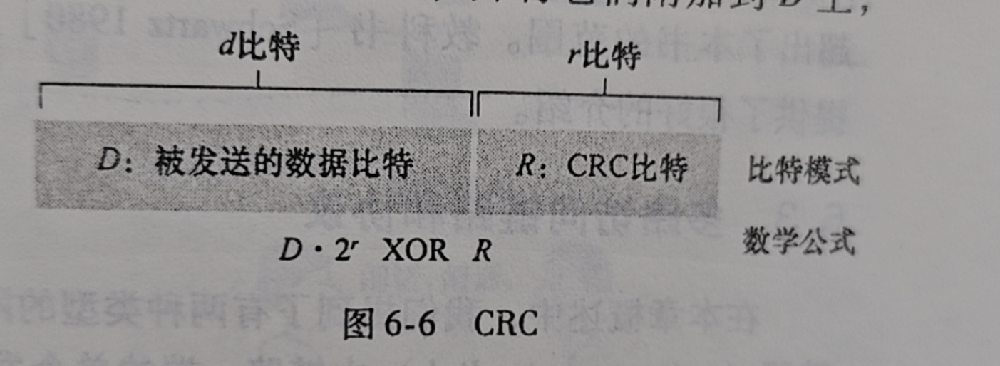

关键在于确定冗余位R，通过公式变化得，这里求得是余数


计算过程中的**减法操作**可以看作是**异或运算**

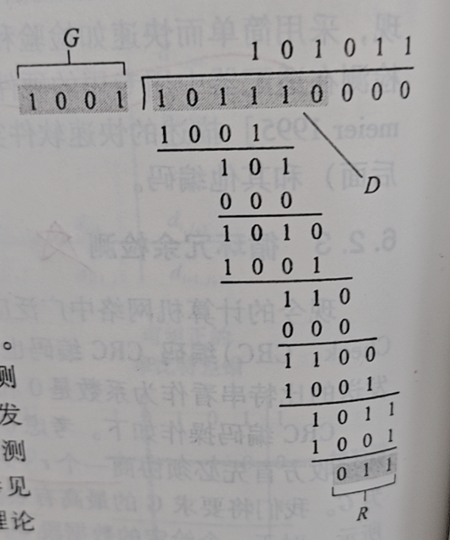


**奇偶校验位 Parity Bit** ，Even Parity保证数据中1(**加上校验位**)为偶数，奇检验反之，接收方重新计算校验位个数，这种方法无法检测出**偶数**个比特的错误。

多重奇偶检验

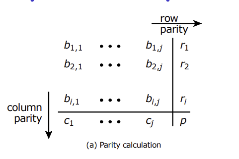


Checksum

**一补码操作 **Ones-complement operation：

- 一补码是对数据进行位**反转**，即将数据中的0替换为1，1替换为0。

**一补码加法** Ones-complement addition：

- 将两个数作为**无符号二进制整数进行加法运算**。
- 如果发生进位（即加法的结果超出了数据的位宽），则将进位加回到结果中，这种加法被称为 **环绕进位**（end-around carry）。

发送方累和，最后将结果进行**一补码**操作，作为**校验和**

接收方累和原始数据，并将结果与检验位**相加**，正确结果**应为全1**

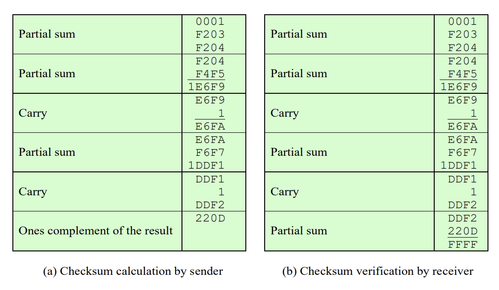


这些额外的检验和称为**checksum**


纠错过程**Error Correction process** 

将**长度为K**的数据块映射为一个**长度为n**的码字(codeword)传送给接收方，通过**FEC** forward error correction**无需重传**即可检测并纠正错误，FCS**只能检测错误，不能纠正错误**。

接收方将**码字**传入EFC解码器，**有的错误可以被检测出来，有的不能，错误不是都能被EFC纠正**。


**海明码**，在**2的幂次**处设置若干个**parity bit**，在这些位置的**间隔**中插入**实际数据**

```python
位置:    1  2  3  4  5  6  7  8  9 10 11
        p₁ p₂ d₁ p₄ d₂ d₃ d₄ p₈ d₅ d₆ d₇
```

每个**校验位**负责**二进制中该位为1的位置**，比如p1负责 1 3 5 7 位置，p2负责2,3,6,7,10 ...，校验位检测这些位置上**比特为1的和**的奇偶。


给定**k位**数据，海明码中**校验位的个数为r**，那么需满足
$$
2^r \geq k + r + 1
$$


以4位数据`1011`生成Hamming码(偶检验)

```
d1 = 1, d2 = 0, d3 = 1, d4 = 1
```

插入奇偶位p₁,p₂,p₄（因为有4位数据，最少需要3个奇偶位）：


| 位置 | 1    | 2    | 3     | 4    | 5     | 6     | 7     |
| ---- | ---- | ---- | ----- | ---- | ----- | ----- | ----- |
| 内容 | p₁   | p₂   | d₁(1) | p₄   | d₂(0) | d₃(1) | d₄(1) |


p₁负责（位置1，3，5，7）：

- **位置1(p₁)，位置3(d₁=1)，位置5(d₂=0)，位置7(d₄=1)**
- 检查这些位，数据是：`p₁ 1 0 1`
- **其中已有1两个（位置3和7）**
- **1的个数是2（偶数），所以p₁=0**

p₂负责（位置2，3，6，7）：

- 位置2(p₂)，位置3(d₁=1)，位置6(d₃=1)，位置7(d₄=1)
- 检查这些位，数据是：`p₂ 1 1 1`
- 其中已有1三个（位置3、6、7）
- 1的个数是3（奇数），所以p₂=1（补成偶数）

p₄负责（位置4，5，6，7）：

- 位置4(p₄)，位置5(d₂=0)，位置6(d₃=1)，位置7(d₄=1)
- 检查这些位，数据是：`p₄ 0 1 1`
- 其中已有1两个（位置6、7）
- 1的个数是2（偶数），所以p₄=0


最终结果是

| 位置 | 1    | 2    | 3    | 4    | 5    | 6    | 7    |
| :--- | :--- | :--- | :--- | :--- | :--- | :--- | :--- |
| 内容 | 0    | 1    | 1    | 0    | 0    | 1    | 1    |

接收方收到了码字011100101010，如果发现p₂和p₈校验失败，那么**错误位置就是8+2=10**，将第10位**反转**即可。
